# 2019年8月，座間味で小6の娘と親子ダイビング！その12…ダイビング3日目，1本目

📅 投稿日時: 2020-07-03 00:36:33

うーむ．

コロナウイルス，また都内で100人を超える

感染者が出たようで．

完全に落ち着くには，まだ時間が

かかりそうですね(涙)

ってか，アメリカではまだ一日5万人が

感染しているんですか…

…次のシーズン，スキー場が普通に営業

できるのかな…

…何か，

「実はコロナウイルス，スキー場では寒くて

　感染力が無くなることが判明しました！」

とか．

「スキーを滑る人は，免疫力でCOVID-19を発症

　しないことが明らかになりました！」

とか．

そんな都合のいい事態，起きないかなぁ…←ないから

ってなことで．

本日もダイビング日記です！

ーーーー

ということで．

1本目のダイビングポイント，

アゲナシクでのダイビングが始まりましたが…

今回のガイドは，ザマミセーリングのオーナーが

おん自ら案内です．

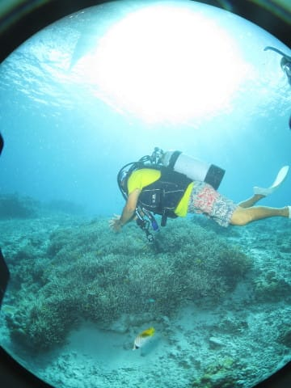

しかし，わが娘．

エントリーもガイドロープ無しで

普通に潜行するし．

耳抜きも全く問題ないみたいで．

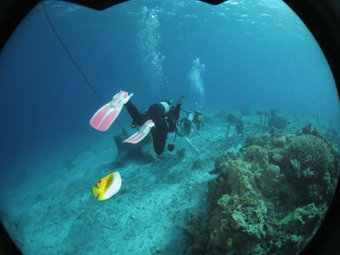

いつもながらに，小学生らしからぬ

安定度で潜ってます…

見事な水中姿勢でガイドについていく，

この余裕の姿…

やっぱり小学生に見えんぞ，お前．

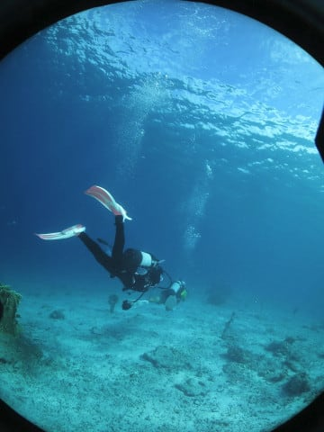

ガイド役のオーナーさんは，娘につきっきりで

いろいろ見せてくれてますね～．

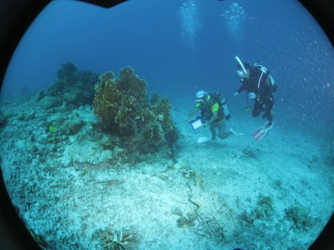

ポイント自体は，スロープにいくつか根が

あって．

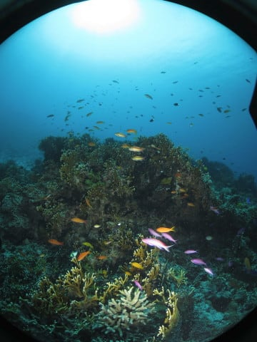

そこにきれいなハナゴイやキンギョハナダイが着く，

ゆったり癒しポイント．

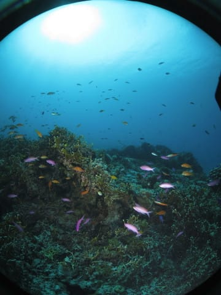

天気も良く，透明度も比較的良くて．

絶好のダイビング日和ですね…！

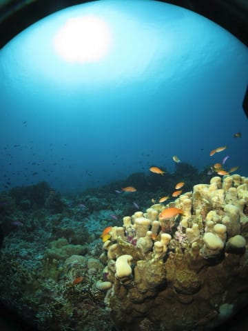

ポイントもそれほど深くなく．

浅いところで十分楽しめるので，

娘にはちょうどいいかな…

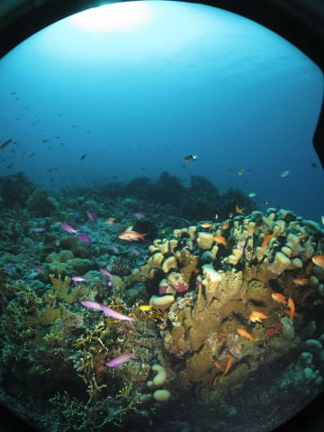

娘も何か，いろいろ見せてもらっているようです．

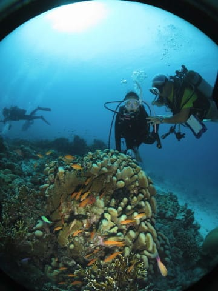

そして，相変わらずクマノミを見ると反射的に

撮影してしまう私(笑)．

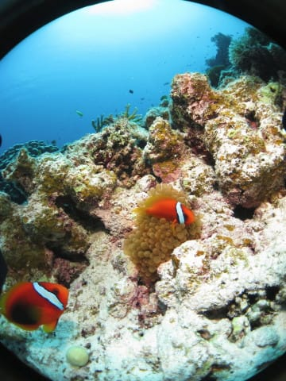

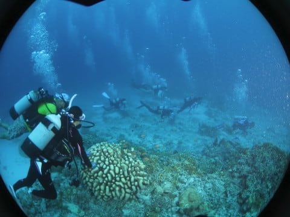

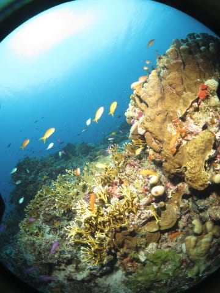

そして，後半は浅瀬に上がってきて．

デバスズメダイがびっしりついている

サンゴの群生の上を漂います…

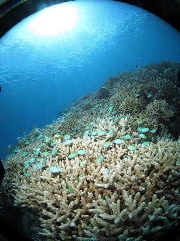

あぁ，これこれ．

これが，慶良間っぽい感じだよね…

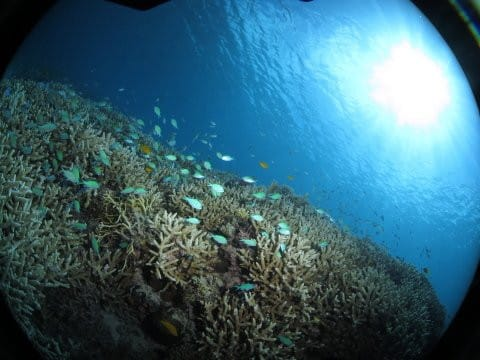

最後はボートの下の浅瀬でフリーとなりますが…

うは！

サンゴの陰に，巨大なイシガキダイの老成魚が！！

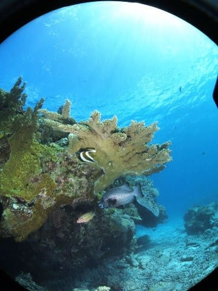

ってな感じで，エグジット．

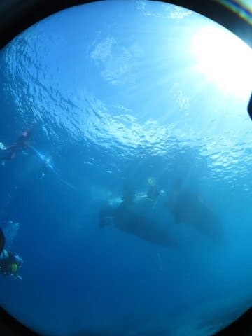

今日の1本目は，太陽光たっぷりの浅い海で，

のんびりヒーリングダイブを楽しんだ

1本でした～！

## 💬 コメント一覧

### 💬 コメント by (juntubaki)
**タイトル**: Unknown
**投稿日**: 2020-07-12 13:46:22

素晴らしいです!

美しいです！

私も座間味には一度言って魅了されました

### 💬 コメント by (Skier_S)
**タイトル**: ＞juntubakiさま
**投稿日**: 2020-07-13 01:03:20

ありがとうございます～！

座間味はいい海だと思います…

ぜひ，また座間味の海に行って堪能してきてください！

