# 9月連休石垣島ダイビングレポート　その3

📅 投稿日時: 2011-10-18 00:27:46

🏷️ カテゴリ: [ダイビング日記](ce3a7a8d424d112fce83ee85c81a0e344.md)

明けて2日目．

ホテルの窓から外を眺めると．

…残念ながら今日も太陽は雲に隠れ．

風も強く吹いてます．

がーーん．

港に行き，ボートに乗り込むと．

台風が通過した影響で，夏の石垣島ではありえない北風が強く吹き．

黒島，竹富方面に行くのは無理．

今日も島の南エリアでしか潜れないとのこと．

うーん．

残念．

曇天の中，まず1本目のポイントへ向かいます．

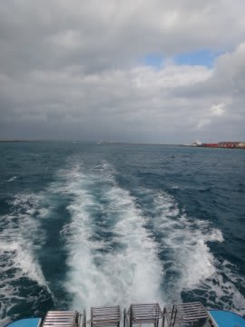

1本目は，「真栄里ケーブ」．

なんと．エントリー直前に，太陽が顔を出してきました！

これは期待できるか…？？

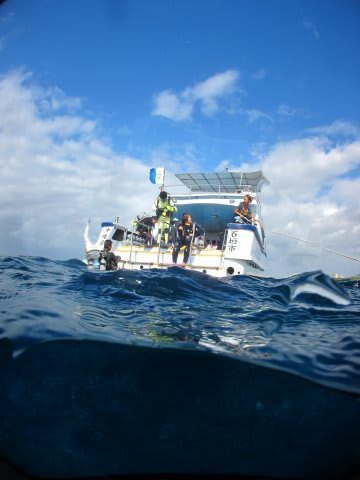

エントリーすると…

…

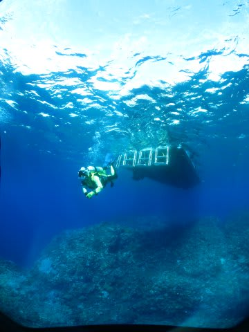

やっぱ，ここも珊瑚が死んでますけど…（涙)．

さらに，あっという間に太陽が隠れて，暗い海に…

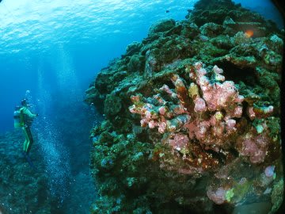

ここもこういう珊瑚の死骸が広がるポイントでしたが…

ちょっと珊瑚が生きてるところが数箇所あり，

「ああ，死なないでがんばっている珊瑚がいるんだなぁ…」

と涙を誘います．

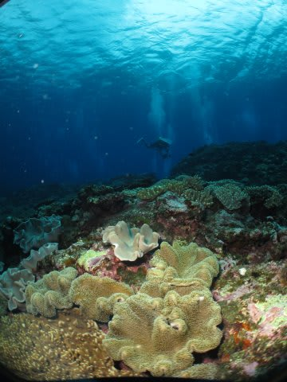

ソフトコーラルが多いですが．

とりあえず，こんな感じのところも．

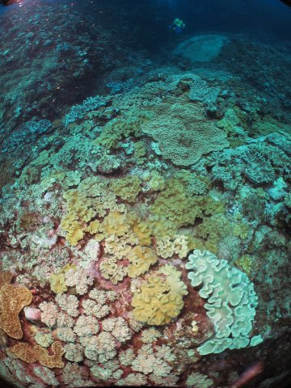

…これからの．

これからの珊瑚の回復に，期待しましょう…

で．

ポイント名のとおり，洞窟を探索して…

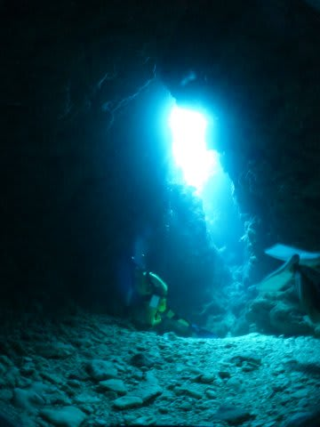

カクレクマノミなんかを見て…

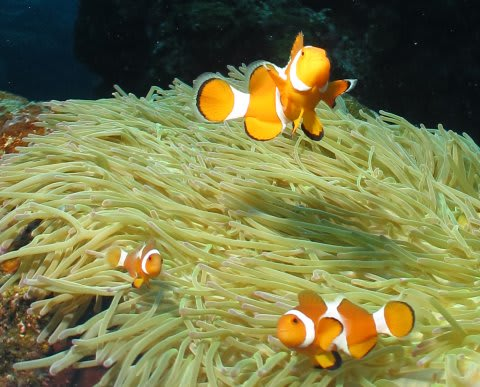

1本目終了．

しばしボートの上で休憩をして…

午前2本目のポイントは，「白保沖」．

石垣島のかの有名な「白保の珊瑚礁」．

Wikipediaによれば，

「このサンゴ礁には、世界有数の規模を誇り北半球最大とも言われるアオサンゴの大群落をはじめ、ハマサンゴの巨大な群落やマイクロアトール、ユビエダハマサンゴの群落が多数分布しており、30属70種以上の造礁サンゴが生息するとされている」

と書かれている，世界に誇る珊瑚群落がある白保．

この沖に潜るわけです．

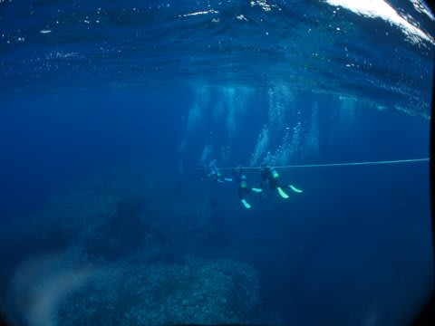

が．

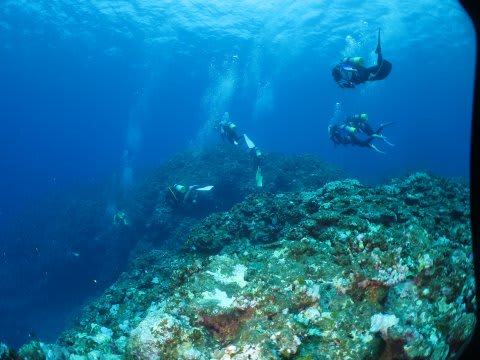

…

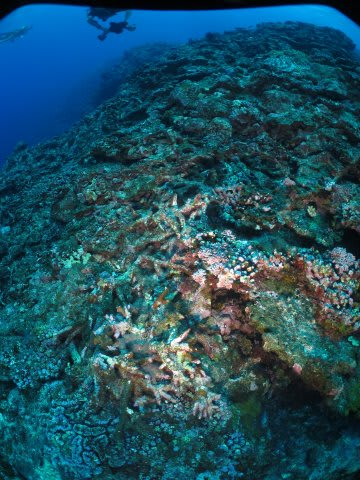

…あえて何も言うまい．

何も．

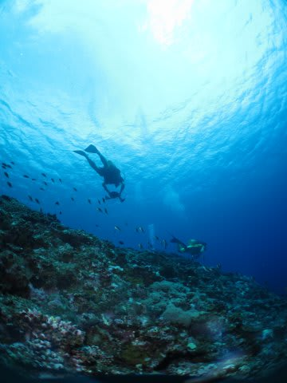

…タカサゴの群れが通りました…

…

…

2本目終了．

とりあえず．

とりあえず．

お昼ごはんで気分を戻そう！

お昼は…

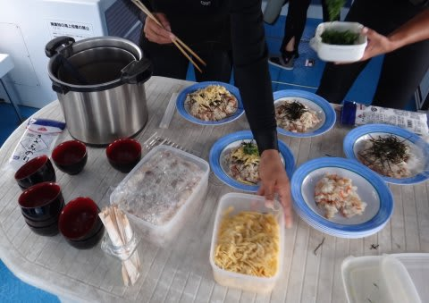

なんと．

船の上で，ちらし寿司を盛り付けて，

暖かいお吸い物を出してくれます．

ダイビングボートの上での昼食としては，すばらしい！

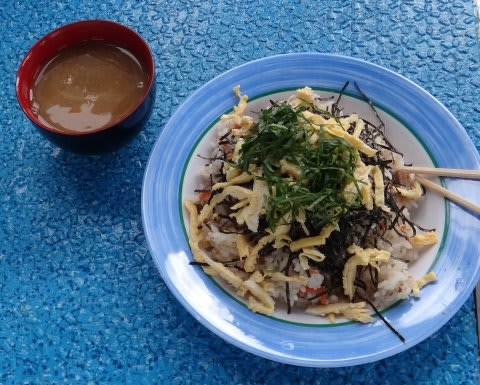

…これで．

天気がよければおいしさもさらに倍増なのに（泣）．

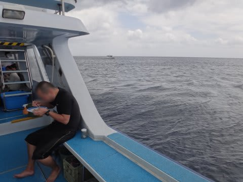

どんよりした雲の中，ボートの上で昼食後にお昼寝で1時間ほど過ごした後，

3本目．

ポイントは「宮良　トカキンの根」．

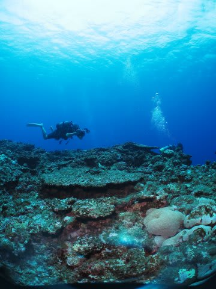

これも，立派なテーブル珊瑚だったんだろうなぁ…

…

…

もう，珊瑚は見ないでおこう．

ということで．

こんな写真を並べてみました．

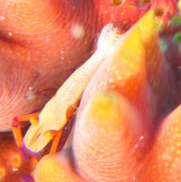

ウミウシカクレエビ

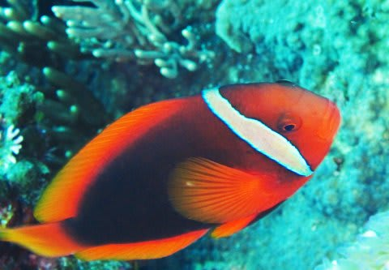

ハマクマノミ

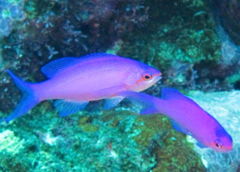

ハナゴイ

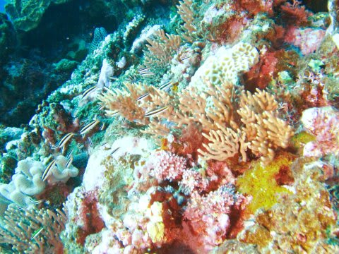

ちょっとカラフル

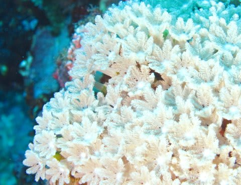

お花畑？

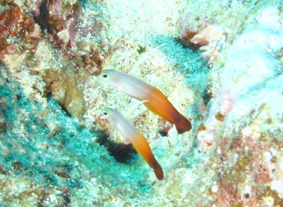

ハタタテハゼの夫婦

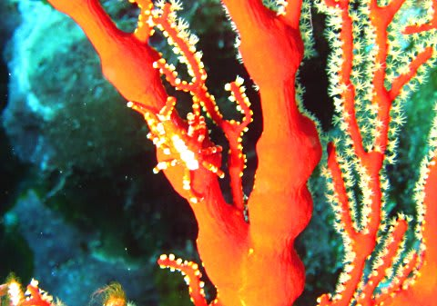

イソバナガニ

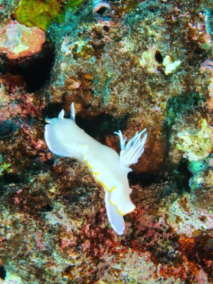

メレンゲウミウシ…

うはははは．

こうやって見れば，結構いろいろ楽しめる海じゃないですか．

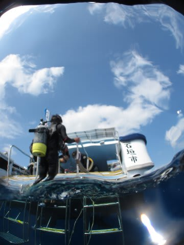

という感じで．

本日も3本のダイビング終了．

…しかし．

3本目のエグジットの時になって，やっと日が差してきたってどういうこと？

帰りは，悔しいくらいの日差しの中のクルージング．

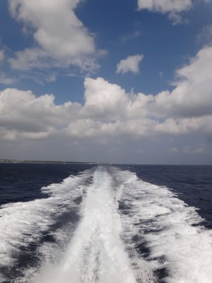

後はショップでログ付けの後．

宿に帰って，

一人寂しく寝たのでした…

＃しかし，自分のマクロ写真はひどい出来だなぁ…（涙）
