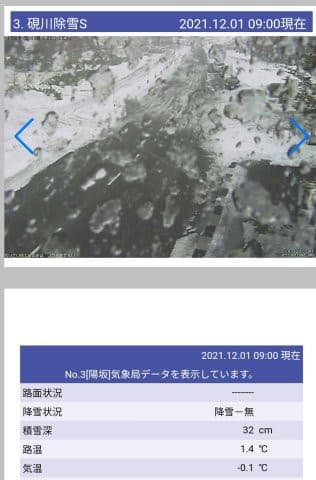
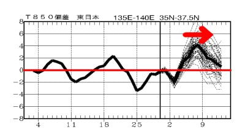

# 12月4，5日の週末までに志賀高原スキー場に雪は積もるのか？そして週末の天気は？今シーズン初の志賀高原天気予想！

📅 投稿日時: 2021-12-02 03:01:22

🏷️ カテゴリ: [スキー天気予想](c6554f5c3c106093b511a8daae23757e8.md)

えー．

昨晩から本日朝にかけて．

数日前に予想したように，やはり

志賀高原でも雨になったようです…(涙)

（[北信建設事務所道路状況カメラ](http://hokushin.pref-nagano-roadcamera.jp/)より）

ただ，これも予想通り，朝から雪に変わった

ようですが…

志賀高原に雪が積もらないパターンの

西風だったため．

特派員からの今日の横手山の写真を

見る限り，雪はほとんど積もらなかった

ようです…（涙）

でも．

雨もそれほどひどい降りではなかったので．

ゲレンデの雪が解けてないようで，良かった…！

ただ，完全天然雪の横手第2ゲレンデ，

ごく一部，雪が薄くなってきたところも

あったようですが…

惜しい．

この雨さえなければ…(涙）

とはいえ．

ここ数日の積雪のおかげで，

オープンするゲレンデは増えていき．

八方も，兎平と黒菱がオープンした

みたいです！！

（[白馬八方尾根スキー場ホームページ](https://www.happo-one.jp/news/22914/)より）

一の瀬ファミリーも，12月18日営業開始

予定だったファミリークワッド，

前倒しで12月4日オープンです！！

…でも，滑れるのは天狗コースのみですが…

（[志賀高原中央エリアホームページ](http://shigakogen.co.jp/archives/13127)より）

で．

これまたグッドニュース！！！

なんと．

なんと．

今週末からオープンの，わがホームゲレンデ

志賀高原の焼額山スキー場．

オープン日から，第2ゴンドラ営業ですっ！！

昨日のエキスパートコース復活に続き，

すばらしいニュースですっ！！

（[焼額山スキー場ホームページ](https://www.princehotels.co.jp/ski/shiga/winter/)より）

いやーー．

オープン日からゴンドラ営業って…

過去の記録をひっくり返すと，

2018シーズンイン（[2017/12/2](e5a43d623f13f9e7643dacd2cbdc49499.md)）以来ですね～！！

ってなことで．

今週末からホームゲレンデの志賀高原に

舞い戻る私としては．

この週末までに雪が積もるのか，

そして，週末の天気がどうなるのかが

気になって，寝ずにひたすら天気図を

読み続けてしまう今日この頃なわけで．

とりあえず．

今シーズン初の，今週末の志賀高原の

天気予想，行ってみましょう！

えー．

まず．

予想の前に．

…日付的には昨日，もうすでに過ぎ去った

12月1日の天気図を見てみましょう…

朝に雨から雪に変わって，かなり積もる，

と予想した本日．

予想通り日本海側に降水域がかかっていて．

これが志賀にかかれば雪だったはずですが．

この天気図を拡大すると．

寒気の北からの流れ込みに対応する

JPCZによる雪雲も出てるし．

いかにも雪が積もりそうな感じですが…

このJPCZによる雲の流れ．

西風に吹かれて，赤矢印で示すように，

新潟から東北方面へ流れちゃってます…

この西風パターンの場合は，緑で示す

北アルプスに雪雲がせき止められ．

緑線の東側…志賀高原のある側に

雪雲が流れてません（涙）

…西風で志賀に雪が降らない場合の，

典型的な天気図です…←1日は雪が降るといったのに，

あんまり降らなかった言い訳を一生懸命している

これは，かなりの雪が降った27日の

天気図ですが．

JPCZがこんな感じで能登半島より西に

流れていれば，志賀高原に雪が降ります…

と．

雪が降らなかった言い訳をした後は．

早速天気予想に移るわけで．

12月2日（木）の850hpa図を見てみると…

ををを！！

赤い0℃線は太平洋側．

志賀には水色の-6℃線がかかっているので…

これは結構冷えますね！！

で，この日の地上天気図は．

うーん．

わずかに日本海側に降水域がかかってるけど．

西風なので，志賀はそんなに降らなさそう…

積もっても，朝までにうっすら数cmかな．

午後は高気圧が西から張り出してきて，

晴れそう…

そして．

続いて12月3日の金曜の850hpa図を見てみると．

一応，赤い0℃線は志賀高原より南．

だもんで，人工降雪機は余裕で動かせますね！

ただ，地上天気図を見ると…

微妙…まぁ，降水域が志賀にかかって

ないので，この日も雪は積もらなさそう

です（涙）

まぁ，気温的には人工降雪機が動かせ

そうなので，いいかな…

で．

肝心な週末，12月4日（土）の850hpa図ですが．

赤い0℃線は一応太平洋側まで下がってますが．

志賀は水色の-3℃線がかかるかどうか程度．

激冷え，ってほどではないですね．

…ただ，日本海の中国大陸に近いところ．

水色で囲ったように，-12℃とか-18℃

とかの，かなり強い寒気が入ってます…

だもんで．

地上天気図を見ると．

をを！

日本海のほぼ全域を覆うように

寒気の吹き出しの雪雲が出てるよ！

専門的に言えば，離岸距離が短めの

寒気の吹き出しの雲！

日本海上空に大陸からの冷たい空気に

触れて，暖かい日本海からの水蒸気が

雲になっているのがよく分かる天気図です！

…これは．

4日は降る．

というか，3日の夜中から降る．

4日は一日中降りそうですね…

そして．

5日の日曜の850hpa図は．

うーむ．

なんだか，志賀にギリギリ0℃線が

かかるかってところ…

微妙．

地上天気図は高気圧に覆われているので．

朝まで雪雲は残るかもしれないけど…

昼ごろには晴れてくるかな？？

…ってな感じで．

まとめると．

12月2日(木)：冷えるけど西風で雪は積もらず．

　終日冷え冷え，人工降雪機フル稼働！

　朝は曇り，昼から晴れそう．

12月3日(金)：朝はそこそこ冷えるけど，

　昼間は0℃近くまで上がりそう．

　天気は終日曇り空かな．

12月4日(土)：3日の深夜から降り出した雪が

　朝までに積もって…朝は10cmくらいの積雪？

　朝は-9℃程度まで冷えそう．

　昼間も-5℃をわずかに上回る程度か…

　雪は終日降り続け，根性の無いスキーヤー

　振り落とし機能が発動．

　昼間もひたすら雪が降り続ける．

　夜までにトータル20～30cmは積もってくれるか？

12月5日(日)：朝はそこそこ冷えて，朝イチは

　冷え冷え圧雪バーンにうっすら新雪！

　この日はコンディション良さそう！

　朝のうち雪が残るけど，昼には止む．

　午後には日も射してくるか…

…って感じでしょうか．

いや．

この週末，4日に結構雪が積もってくれそうで．

雪質的にはいい週末になりそう！

（4日は冷えて雪が降り続けるので，

　スキーするには辛いかも…)

で．

この，いい感じの週末が終わった後ですが…

…なんだ！？？

これは？？

6，7，8日の3日間．

ずっと赤い0℃線が北海道くらいに

上がったままなんですけど！？？(涙）

そして…

地上天気図を見ると…

…7.8日．ヤバい．降る．

これは…液体が降りそうな予感…(泣）

2週間予想を見ても…

5日以降はしばらく，平年比プラスの気温が

続きそうです(激涙)

これは…

もしかすると，今週末の方が

来週末よりいいということに

なるのか！？？

…ただ．

また11日あたり冷えて降って

くれそうなので…

11月27日，今週末，来週と．

3週連続，土曜にかなりの積雪が

ある週が続いてくれて．

来週末も何とかなるかも？

## 💬 コメント一覧

### 💬 コメント by (northfox)
**タイトル**: Unknown
**投稿日**: 2021-12-02 13:02:16

雨ですか。。。

降るのが週末でないだけラッキーと考える事にします😅

### 💬 コメント by (レインボー74)
**タイトル**: Unknown
**投稿日**: 2021-12-02 13:51:42

木曜日の中央エリア情報

空いてました。昼前までで、ファミリー約30人、高天4人という貸し切りバーン。朝の上林-3℃　蓮池-6℃。隊員２名が初滑りなので、はじめから昼あがりと決めてました。

ファミリーペアは長い方が動いてくれているので助かります。週末にはクワッドが動くようですが、コースは天狗だけだとか。

曇りのち雨で視界は良好。前日と違って滑る雪で快適なんだけど、下部では水路か何かの段差に何度か足をとられました。10時前には晴れてきたけど、かなりのコロコロが発生。でも固くないので普通に滑れちゃうレベル。

コロコロを避けたければ、左端がお勧め。

高天からクロアチアの人が移動してきたけど、無事に戻っていけたようですので、参考にしてくださいね。

### 💬 コメント by (ozuriski)
**タイトル**: Unknown
**投稿日**: 2021-12-02 15:38:31

月曜に日本気象協会から「ラニーニャ現象の冬　当初とは違う見解が出てきました」として「ヨーロッパ中期予報センターの資料では、今のところ、4日頃の寒気が抜けると、2022年1月上旬にかけて、日本付近で2つの偏西風がともに南へ大きく蛇行する傾向はみられず、日本に強い寒気や寒波をもたらすサインはありません。」という記事が出て、暗い気分になっています。順調な滑り出しだと思っていたのに…。

https://tenki.jp/lite/forecaster/k_shiraishi/2021/11/29/15059.html#sub-title-a

気象庁の2週間気温予報でも、12/10-14は全国的に真っ赤（かなり高い）だし…。

https://www.data.jma.go.jp/gmd/cpd/twoweek/

ドカッときた白馬はいいかもしれないけど、大半はまだまだこれからなのに…。

せめて平年並みになってほしい…。

### 💬 コメント by (アリス)
**タイトル**: 焼額山エキスパート
**投稿日**: 2021-12-02 16:06:03

S様

ヤケビオープン初日に、パノラマ～サウスのロングコースが滑れるってラッキーですね♪

志賀高原新参者の私は焼額山エキスパートは見たこともないのですが、出口はミドルコースのコブ斜面でしょうか？

### 💬 コメント by (レインボー74)
**タイトル**: Unknown
**投稿日**: 2021-12-02 17:26:37

さしでがましいですが、アリスさま。

エキスパートは40度の急斜面で、しかも片斜面。スーパーに入っていって右折するとスーパー。まっすぐ行って、そのままロープをくぐるとエキスパートです。ヤケビの従業員を知りすぎてからはロープくぐりをやめた善良な私は、今は行ってません。

最近はオリンピックから右に折れても行けますが、スーパーからの方が断然お得です。

### 💬 コメント by (アリス)
**タイトル**: お礼申し上げます
**投稿日**: 2021-12-02 21:04:15

S様

失礼ですがお借りします。

レインボー74様

ご無沙汰しております。

その節はお世話になりました♪

ご教示ありがとうございます。

来週から志賀高原に参戦予定ですので、その際はご挨拶申し上げる予定です。

### 💬 コメント by (Skier_S)
**タイトル**: この冬は…暖冬！？？
**投稿日**: 2021-12-03 01:06:58

＞northfoxさま

雨だったようです…（涙）

でも，7，8日の雨の確率は下がりました！！

＞レインボー74さま

すごい…それだけしか人がいないと，ほぼ貸し切りバーンですね．

そして，予定より早くファミリークワッドを動かすとは珍しい…

でも，ダイヤが4日オープン予定だったのは伸びたみたいです（涙）

＞ozuriskiさま

今日の記事に書きましたが…12月，一気に暖冬予想に変わってきました（涙）

1月になって冷えてくれればいいんですが…

ここまで予想が変わるとは（泣）

まぁ，気象庁の1か月予想は外れることも多いので，

いい方に外れてほしいと願ってます…

＞アリスさま

そうです！

ミドルの上に出ます．

パウダーが積もった日はミドルもパウダーなので，

エキスパート⇒ミドルと新雪を滑って行けるコースです．

