# 10月21日（土），2018シーズン開始から2週間，再オープンのイエティは…雨，雨，雨（涙）

📅 投稿日時: 2017-10-22 00:15:09

🏷️ カテゴリ: [2018スキー滑走日記](c11b88dc181f34079ab41db74a3587646.md)

ということで．

本日．

逝って行ってきましたよ．

雨の中のYetiへ…

いや．

だって，スキー場がオープンしてるんですもの．

そして，仕事は休みですもの．

そこはやっぱり，滑りに行かないといけません←義務じゃないから，そこ

ってことで…

まず，朝．

8時のオープン前に駐車場へ入りますが．

第2駐車場，ガラガラだよ…

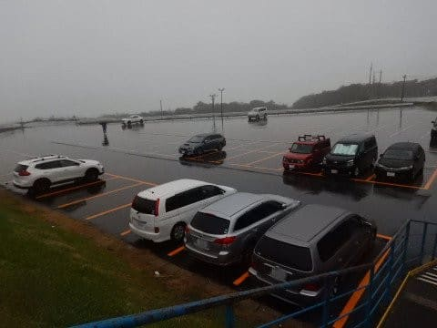

まぁ，こんな天気の日にわざわざ滑ろうってのは．

おかしい人と逝ってしまった人と終わってしまった人だけなので．

そんな人たちだけが来てる感じですね…

…あ，私はまだ終わってないし，逝ってしまってない人なので．

例外ですが←いや，あなたが一番おかしくて逝ってしまってて終わってるから

で．

当然，普段ならかなりの列になる，

オープン前のゲートも誰も並んでないし…

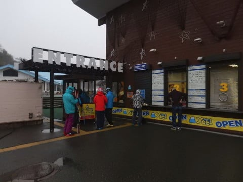

そして．

ゲレンデに出ても．

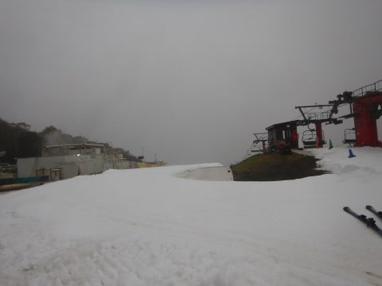

誰もいない！

人っ子一人滑ってないっ！！

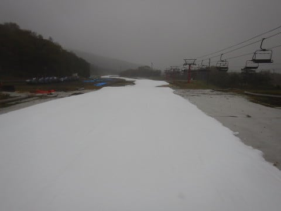

コース終了まで，完全貸し切りコースっ！！

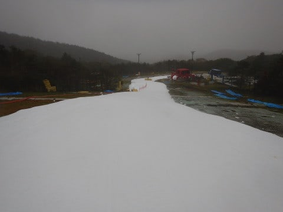

雪は硫安でコース全体しっかり固まってて，

雨なのに全然緩んでないよ！

…コース幅は，オープン直後より

ちょっと狭くなったかな…

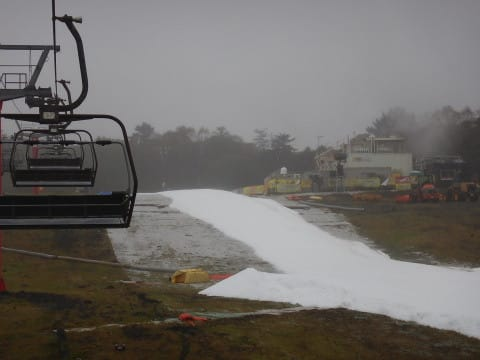

その代り，すぐに融けないように厚みを

稼いでいる感じ．

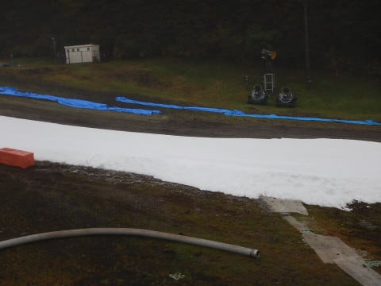

って感じで…

あ，やっとコース上に他の人がいましたね．

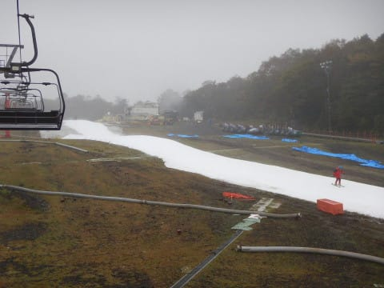

ってくらいのガラガラさ．

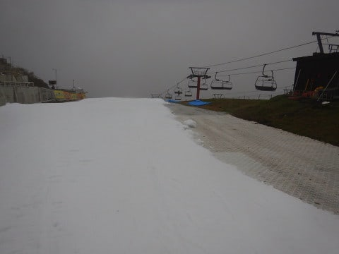

当然リフトは飛び乗りですよ～！

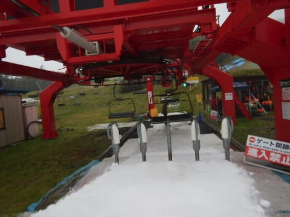

…とはいえ．

こんな雨ですから（涙）．

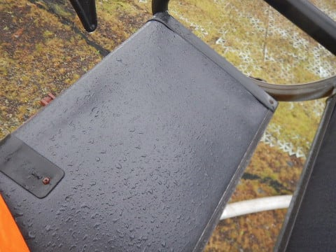

当然と言えば当然のガラガラさ…

まぁ，レインウェアを着ないとずぶぬれに

なりますが．

ザーザーぶりではなく，シトシト…といった降り．

んで．

スタートから1時間半くらいは，ホントに

ガラガラで．

リフトの搬器も人が乗ってないのが多いくらい…

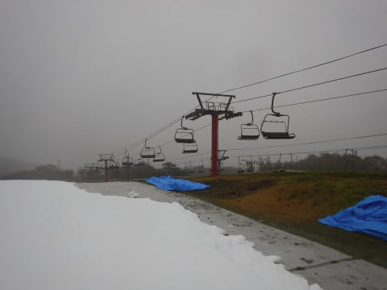

普段のイエティではありえない…っ！

10時ごろになってきて，やっと人が増えてきたけど…

でも，まだ普段のイエティに比べれば，

全然マシかな．

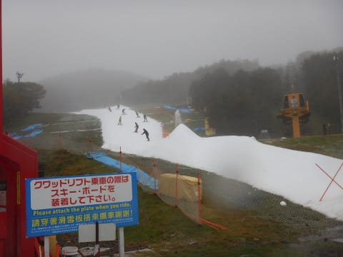

時折タイミングによっては，コース上に

人が集まるところもあったけど…

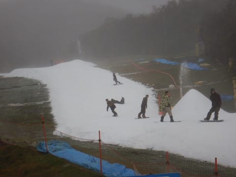

んでも．

全く止むことなく，ひたすらシトシト降り続ける

雨の中滑ろうって終わった人（あるいは逝ってしまった人）

はそんなに多くなく…

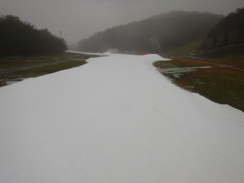

昼を過ぎても結構クリアラップが取れるよ！

なんてすばらしいんだろう…！！←いや，雨の中滑ることが素晴らしいとは思えないから．普通．

時折，うっすらガスが出たりしたけど…

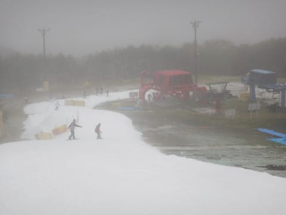

もとからゴーグルに大量に水滴がついて，

前が見にくい状態なので．

いまさら多少のガスがでても，

どうってことはないよ！←狂ってる．何かが狂ってる

昼を過ぎると．

ちょっと人が増えてきた感もあるけど…

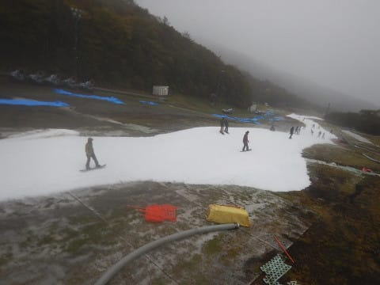

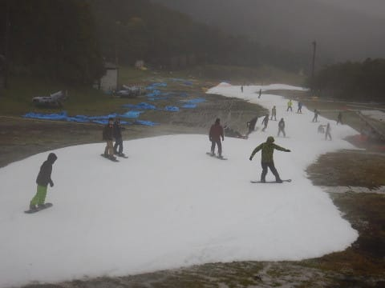

でも，リフトは相変わらず飛び乗り状態！

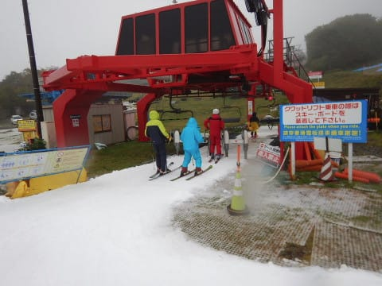

だもんで…

昼過ぎには帰ろうと思っていたのに．

もう1本，もう1本と…

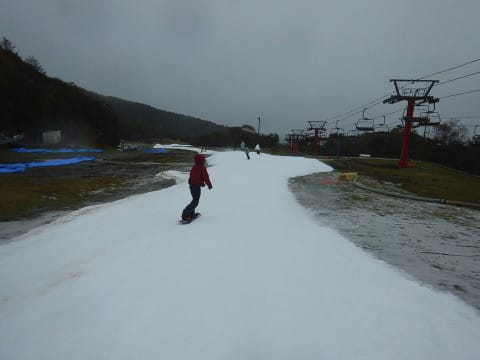

気づくと，最後の1本を10本以上

滑ってしまい．

気づくと，もうコース整備開始の16時近くまで

滑ってしまったのでした…

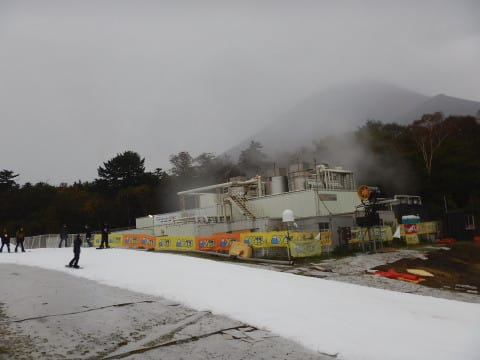

ただ，午後3時を過ぎたころから，雨も

強くなりはじめ．

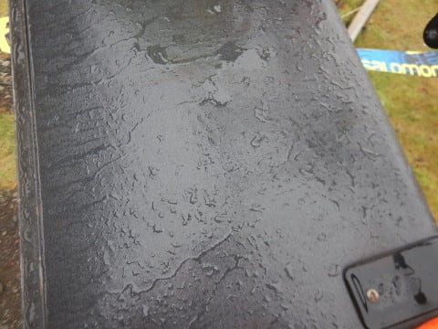

コース上の雪はまだ穴が開いたり

してないけど．

朝より雪が薄くなってきたかな～．

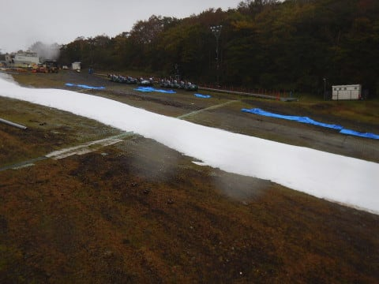

午後4時前に雨がかなりザーザーぶりに

なってきたので．

さすがの私も，今日はナイターを滑らずに退散です．

うーん．大人の判断！←違う．断じて違う．今日滑っている時点で大人の対応とは違う

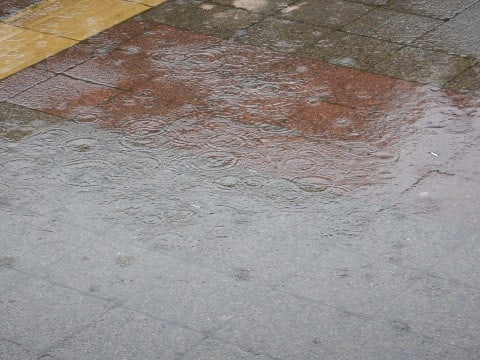

とりあえず．

この雨に負けず．台風以降も営業できるように，

雨で融けていく以上の雪を大量に製造するのだ！

ガンバレ！！アイスクラッシュシステムっ！！！

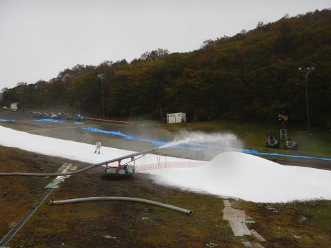

…そう．

噂によると．

このアイスクラッシュシステムの建物の中では．

氷を作る巨大冷凍庫の前に．

どこかから連れ去られた，大量の男たちがぎっしり並んで，

汗だくになりながら，ひたすらかき氷機を回しているという…

そう．

この建物から出る湯気は．

その男たちの流す汗が，

蒸気となって噴き出している

ものだったのです！！（嘘）

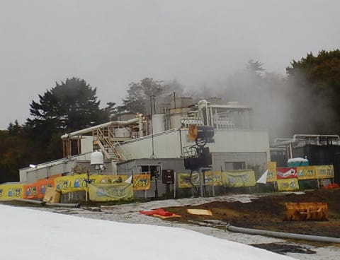

ということで．

雪が解けるのが早いか．

それとも，

大量の男たちの汗の結晶の，このアイスクラッシュの雪が

溜まるのが早いか…←ホントに男たちの汗が凍ったのがばらまかれてたら嫌だな…

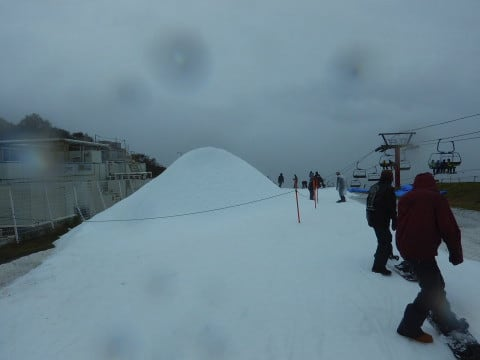

月曜の台風が過ぎた後，勝負の結果が分かるのだ…！！

＃本日の記事の一部はフィクションであり，

＃実在のシステムとは関係がありません（笑）

## 💬 コメント一覧

### 💬 コメント by (yama)
**タイトル**: 台風
**投稿日**: 2017-10-22 11:16:28

昨日は雨の中よく１日滑りましたね。くに～さんでさえ佐山に変えたのに。さすが20000メートルクラブ会長ですね。今日はSさんの近くまできましたが、台風接近のため昼過ぎに撤収します。また、再来週ぐらいにはイエティでご一緒させて下さい。

### 💬 コメント by (Skier_S)
**タイトル**: yamaさま
**投稿日**: 2017-10-22 19:40:02

いや…

雨が降ったからガラガラだし，

板が滑っていいだろうと思って…

リフト飛び乗りで，それなりに楽しかったですよ（笑）．

再来週の3連休は，土日に予定があり，

月曜に滑りに行ける予定です～．

またよろしくお願いします！

### 💬 コメント by (yama)
**タイトル**: １１月５日?
**投稿日**: 2017-10-22 20:05:07

３連休は５日の日曜日で良いのでしょうか。その日がちょうど都合が良いのでまたご一緒させて下さい。

ps柚子コショウの味はどうですか｡もう少し辛い方が良ければ持って行きます。味見して下さい。今年は１本の木に実がつき過ぎなので適果するため青いうちに取っています。捨てるのももったいないので柚子コショウを作っています。柚子は少し黄色に色付いてきました。

### 💬 コメント by (Skier_S)
**タイトル**: yamaさま
**投稿日**: 2017-10-22 22:52:48

すいません…金土日の3連休でしたね．

日曜が都合がいい日です！

柚子胡椒は，私はちょうどいい感じですが．

もう少し辛くても大丈夫です…

娘は「ちょっと苦い」らしく，辛さを足した方が

苦みが薄まって良いかも？？？

今度は辛いバージョンも試してみてください！

### 💬 コメント by (yama)
**タイトル**: 柚子コショウ
**投稿日**: 2017-10-23 06:29:12

実は柚子コショウが苦い(≧ω≦)と思っていました。娘さんと同じ感想で、柚子の皮が多いためかもしれません。もしくは、適果しているので小さいせいかもしれません。

### 💬 コメント by (Skjer_S)
**タイトル**: yamaさま
**投稿日**: 2017-10-24 01:27:06

あら…やはり苦いと感じてたんですね．

あの苦みも悪くないんですが…（＾＾

