# 2月11日祭日の志賀高原詳細レポート…ってか，時間がないので写真をいっぱい！

📅 投稿日時: 2015-02-13 22:27:39

うーーん…

…やっぱり，この週末．

天気は悪そうだな～（残念）．

土曜から日曜朝にかけて，吹雪になりそう…

まぁ．ぱふぱふに期待かな！

っつーことで．

あと5時間ほどで，また志賀に舞い戻るために出発するので．

早く寝なくてはならないというのに．

昨日は天気予想をしたために，お送りできなかった

水曜の志賀高原詳細レポートをお送りします…

＃そんなの書いてる暇あるのか

えー．

朝イチは，多少雲が多けれども．

日が射す状況で始まってくれて…

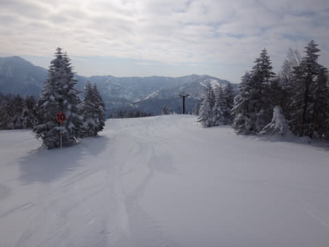

山頂の気温は，-10℃と，結構冷え冷え！

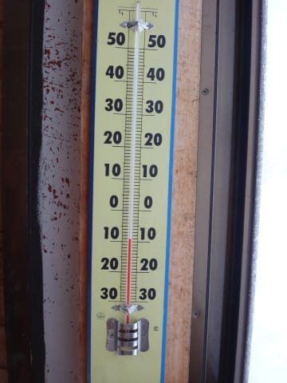

昨日からの積雪もなく，斜面はちょうど気持ちいい感じ．

しっかりがっつりエッジが食い込む，快楽系シマシマ

ピカピカバーンです！！

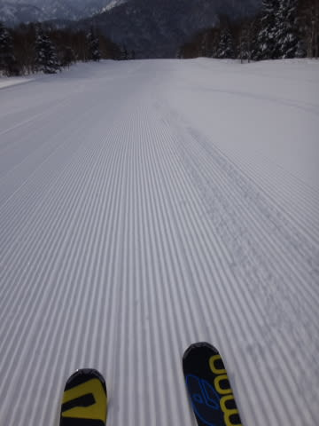

うははははははっ！

シマシマだっ！

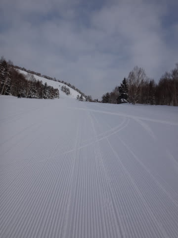

エッジを立てて行っても，板が潜ってしまわないのに．

でも，しっかり板が食い込んでいくという．

官能の斜面っ！！

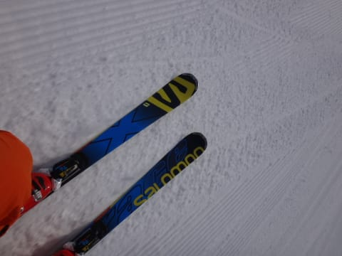

（写真では分かりにくいけど…かなりスピード出して傾いてるところ）

そして…

コースには，誰もいないよっ！

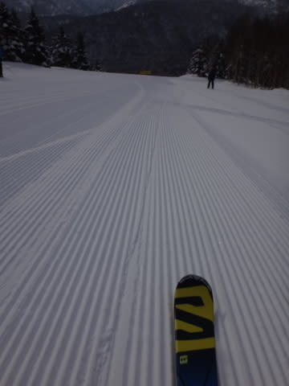

…この，人の少なさ…ってか，誰もいないゲレンデ状況．

貸し切りバーン状態なんですけどっ！？？

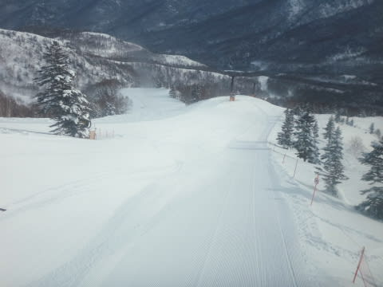

こんなきれいなシマシマバーンを，貸し切り状態で

飛ばしたい放題って…

これは．

これって．

恵まれすぎてないかい？？

こんなシアワセで，いいのか～っ！！

そして．

9時過ぎにはピカピカ快晴になってきたよ～！

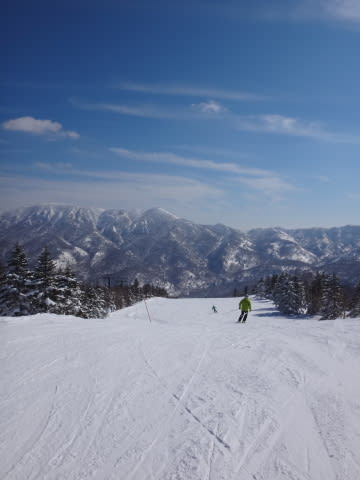

で，いつもならゴンドラが混む10時を過ぎても，

「平日かっ！！」

って突っ込みたくなる空き具合．

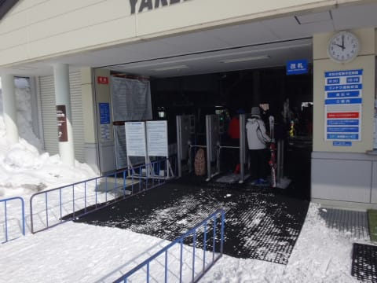

いや．

ホントに．

コース上に誰もいないんですけど…

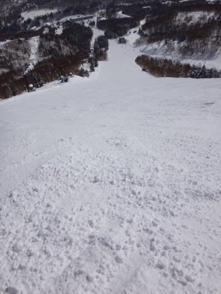

そして．

気温は昼間でも，0℃を上回ることなく．

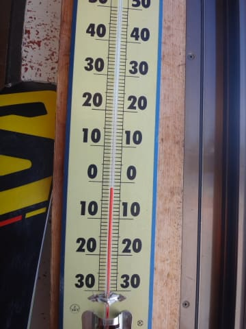

昼間でも，雪質は最高のままなんですけど．

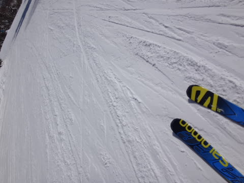

っつーか，人が少なすぎて．

午後になっても，まだシマシマな部分が残ってるくらいなんですが．

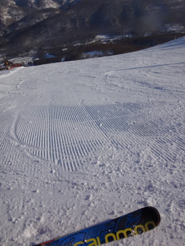

晴天の，気持ちよく日差しが射す中…

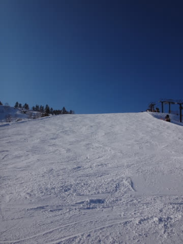

午後になっても，こんなに雪質が良くて…

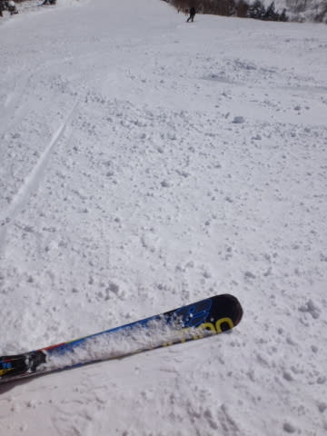

そして，誰もいないゲレンデを，気持ちよく滑ることが

できて．

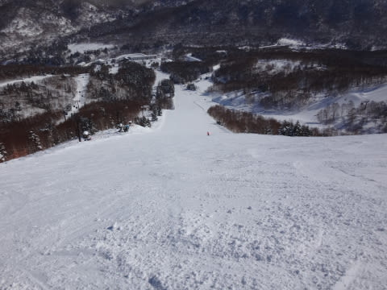

夕方のリフトストップが近づいてきても…

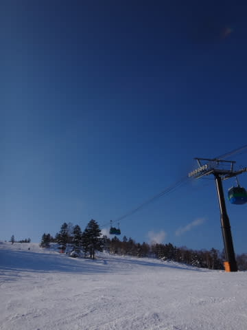

バーンコンディションはフラットなまま！！！

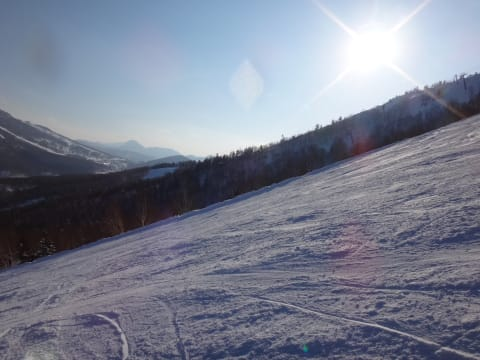

ガンガン大回りができるんですけど！？？？

で，

日が暮れるまで，ずっと大回り用のSALOMON X-RACEを

履き続けていたんですけど！？？

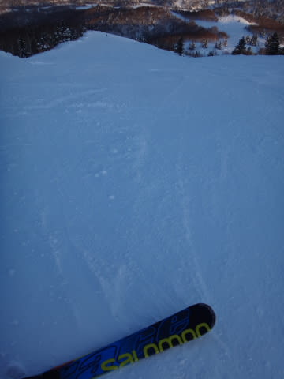

…って感じで．

天気よし．

雪よし，

空き具合よし，

という，3拍子がここまで揃うことは，シーズン中

そうそうないよなぁ…

と，超満足しつつ．

営業終了まで滑り続けたのでした…

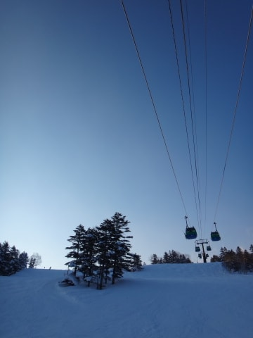

うーむ．

この週末は，残念ながら，ピカピカシマシマバーンは

滑れなさそうだけど…

また，こんなシアワセな日がやってこないかなぁ…

と，強く念じるSkier_Sなのだった…
