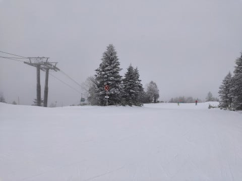
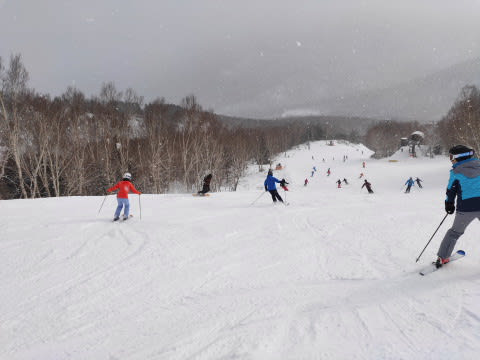

# 2020/1/13(月・祝）の志賀高原・焼額山スキー場詳細レポート！…午前中は混んだけど，午後はガラガラ！終日雪が荒れず，意外と良かったよ

📅 投稿日時: 2020-01-15 03:36:08

🏷️ カテゴリ: [2020スキー滑走日記](c282e9230de179e245c7334eabeb0a3b3.md)

ということで．

本日は，3連休最終日の，

1月13日の志賀高原・焼額山スキー場の

詳細レポートです！

えー．

まず．

朝，いつも通り8:30の焼額の第1ゴンドラ

営業開始を待って並ぶわけですが…

3連休最終日で，人も減るかと思ったところ．

意外と朝イチに並ぶ人は多かったですね…

んで．

朝，宿を出てくるとき，山のてっぺんが

雲の中に隠れて見えなかったので．

「これは…もしかしたら，山頂はガスで

　視界悪いかも…（涙）」

と心配してたのですが．

ゴンドラで山頂に登ると…

曇り空ながら，ガスはかかって無くて

一安心！

そして．

山頂の気温は-8℃と，

意外と冷え冷え！

…なんですが．

　13日（月・祝）：朝は，運が良ければ10cm

　くらいつもってるかも？？

という予想は見事に裏切られ．

積雪は1cm未満…（涙）

なんということか…（激泣）

とはいえ．

ゲレンデは見事なシマシマっ！

では，あさイチシマシマ，いただきま～す！！

と，1本目は気持ちよくシマシマを

滑れたけど…

第1ゴンドラ側のGSコース．

しばらく新雪が積もっていないからか，

人工雪が入っているからか，

足元が崩れていくような固めの

シマシマで．

しばらく滑っていると，そこかしこに

コロコロの溜まり場が…（涙）

あさイチのGSコース，ガラガラで

飛ばし放題だっただけに，ちと

残念…（涙）

でも．

第2ゴンドラ側のパノラマ・サウスコースや…

白樺コースはコロコロもなく，エッジがしっかり

食いつく圧雪で．

朝のうちはいい感じ！

…だったのだけど．

一の瀬から人が流れ込んでくる

第2高速リフトは，朝9時半を待たずして，

混み始めてきました…（涙）

そして．

人気の第2ゴンドラ側，パノラマ-サウスコースは，

かなりの人口密度になり，快感度急降下（泣）

…残念…

ただ，1ゴン側のGSコースも，午前10時ごろには

ちょっと人が増えてきたけど．

2ゴン側のパノラマ-サウスほどひどくはなく．

さらに，1ゴンの待ち時間は，ピークの

朝10時過ぎでも，ゲートの外まで並ぶか

どうかという程度で，昨日に比べれば

全然ガラガラ！

そして，急斜面のオリンピックコースは

滑る人も少なく，雪もいい感じで締まって

いたので．

この日の午前中は，待ちのそれほどない

1ゴンで，ガラガラのオリンピックコースを

グルグルして．

昨日の超絶リフト＆ゴンドラ待ち＆

絶望的人口密度に比べれば．

…あぁ…シアワセ…

そして，3連休最終日．

午後は滑らずに早めに帰ろう…

という人が多かったようで．

午後になると，午前中のにぎやかさが

ウソのように，ゲレンデ上に

人がいなくなっていきます…

いや，昨日とはうって変わってガラガラ！

人がいないゲレンデ，好きなように

飛ばしたい放題！！

…なんだけど．

これだけ人がいないと，逆に

ちょっと心配になるレベル…

基本的に，この日の天気は，

午前中は時折雪がちらついたり．

一瞬，ちょっとガスが出たり

昼間に日が射す瞬間もあったけど．

基本的には曇りベースで，

最高気温-4℃程度と，それほど上がらず．

だもんで．

終日雪は冷え冷えのいい感じのまま！

それでいて，12時を過ぎると，

ゲレンデはゴーストタウン化して，

コースが荒れなかったので．

夕方になっても，一番荒れた部分が

せいぜいこの程度の凸凹で，

最後まで大回りで飛ばせる状況

なのですが！？？

だもんで．

今日は小回り用のSXを履くことなく．

終日大回り用のX-RACEを履いて，

思う存分大回りを好きなだけ

カマすことができるのですが！？？

昨日は人が多くてゲレンデが荒れ荒れ，

ところどころ浮石も出ていたので．

今朝，積雪が無かった時点で，

今日のゲレンデコンディションは

ダメだろうなぁ…

と諦めてたけど．

いやいやいやいや．

GSコースに人工雪を打ち足したのか．

ゲレンデ整備のおかげで予想以上に

コンディションは回復して．

人が少なかった今日は，午後まで

それほど荒れず，いいコンディションの

ままでいてくれて．

…そして，午後3時を過ぎてくると，

すっきり晴れるというおまけまでついてきて．

…いや．

満足．

予想以上に満足じゃ…

と．

日が暮れるラストまで，

大回り板を履いてひたすら

かっ飛び続けたのでした…

…とはいうものの．

午後になると，白樺コースにはちょいと浮石エリアが

出てきたりしていたので．

やはり，もう少し積雪が欲しいところ．

なので…

果たして，今後，雪は積もるのか？？？

また，空から液体が降ってくる危機が

やってきたりしないのか？？

というところを占うべく，

これから1週間の850hpa気温図を見ると…

　

うむ．

16日から21日までの間．

赤い0℃線は全て志賀高原より南なので

（ギリギリの日もあるけど…），

空から液体が降ってくる危機はなさそうだな…

となると．

降ってくれれば雪なので．

ガンガン降ってほしいところだけど．

まずは明日（というより，日付が変わっているので今日），

15日水曜夜9時の地上天気図を見ると…

この天気図なら，日本海側に水色に塗った

降水域がかかってるし．

等圧線が北西ー南東に傾いた西風パターンでもないので．

ドサドサではないけど，志賀は雪が

降ってくれそう…！

でも，この天気図の前後，

15日朝9時の天気図や，

16日夜9時の天気図では，

雪が降らなさそうな天気図だったので，

雪が降るのは15日夕方から夜中にかけての

短い時間です(涙）

積雪は，多くても10cmかな（泣）．

15日夜以降だと．

冬型の天気図になるのは，この下の天気図に

赤く印した2日間．

18日と20日．

この2日間は，ちょっと降ってくれそう…

でも．

どちらも強烈な冬型ってわけじゃないので．

ドサドサ積もることは無いです．

過大な期待は抱かない方がよいかと…

とりあえず．

雨になって雪が解けることは無さそうなので．

わずかとはいえ，雪が増える方向に

進んでくれているだけ，

良しとせねばなるまい…

きっと．

そう，きっと．

12月，１月に雪が少なかった分．

その反動で3月，4月にドサドサ雪が降って．

GWまで毎日冷え冷えのサラサラ

パウダーで滑れるはずなのだからっ！！！！（根拠のない願望）

## 💬 コメント一覧

### 💬 コメント by (Northfox)
**タイトル**: Unknown
**投稿日**: 2020-01-15 12:18:08

Yumiさんとは第三高速のリフトで偶々乗り合わせたんです。

板に20000mクラブのステッカーが貼ってあったので話しかけてみたらYumiさんとの事でした。凄い偶然です。焼額オールスターズとかのグループの事とか色々教えてもらいました。

ゴンドラでも20000mのステッカー貼った方々と乗り合わせました。大人3人+小学生の小さな女の子。

話しかけるタイミングが有りませんでしたが、後でこの方々をGSコースで見かけたとき、目の錯覚なのか女の子も大人と同じスピードで下って行ったような。。。

志賀高原には殆ど単独で滑りに行くのですが、20000mクラブのステッカーを見つけると仲間がいるようで嬉しく感じます。

次の志賀高原行きは2月の予定です。1ゴン前の朝礼にも出てみますかね（笑）

### 💬 コメント by (つーちゃん)
**タイトル**: Unknown
**投稿日**: 2020-01-15 13:51:27

１月なのになんで雨の心配をせねばならぬのだと

つくづく思う今日この頃。

２２日の予想図に戦慄しております((((；ﾟДﾟ)))))))

降水域は掛かってないしまだ先の事だから

きっと平年並みに落ち着くはずだ。うん、そうに違いない((((；ﾟДﾟ)))))))

>> Northfox様

それはきっと目の錯覚で、

実際は女の子と同じスピードで大人が滑ってるんです。

気づくと先に滑り出していて大人達を急かします(^^;

### 💬 コメント by (レインボー１隊員)
**タイトル**: Unknown
**投稿日**: 2020-01-15 16:08:12

nothfox様、私は2万会員なのに、貴方がお見かけしたであろう小２のなおちゃんのビデオをみて、いまだに勉強させていただいている未熟者です。志賀高原は、とりわけヤケビは最高ですよ。毎日ばかみたいに、いや、ばかですけど、ひたすら滑りつづけています。このスキー場が存続するためにも、貴方様のようなかたのご来訪が必要なのです。是非お会いしたいものです。レインボーのシールを貼っていますので、見かけたらお声掛け願います。

### 💬 コメント by (Northfox)
**タイトル**: Unknown
**投稿日**: 2020-01-15 18:50:59

管理人のS様以外からレスを頂けるとは感激です。

S様、恐縮ですがコメント欄をお借りします。

私が見た女の子は“なおちゃん”というのですか。ヘルメットに20000mクラブの「監視員」と書かれたステッカーが貼っていました。

よく話題に出る爆走小学生の一人なのでしょうか？

>つーちゃん様

やや、認識違いをしていました。みんなすぐに見えなくなったので、てっきり大人達が引っ張っているとものだと。

今でも幻を見たのでは？と思うようなシュールな光景でした。(^^;

>レインボー１隊員様

ありがとうございます。

2月の志賀行きは8日～の予定です。レインボーのシール、チェックします。お見かけしましたら声掛けさせて頂きます！

微力ながら志賀高原（焼額山）の繁栄に寄与できるよう頑張ります。

### 💬 コメント by (西館)
**タイトル**: 皆様凄い人ばかりですね！
**投稿日**: 2020-01-15 23:26:55

2000ｍ、超高速で滑降していく方々は皆様でしたか。ステッカー格好良いですね！。

Skier_S様のお名前、Skiline上で記憶にあります。

上位を占めている方々は、地元の皆さんだと思っていました。

私は西館斜面途中の宿が定宿で、西館フーディか東館ゴンドラ、ジャイアントリフトが動き出さないと脱出できないのです。なので焼額朝礼には間に合わない...

西館フーディ→高天原→ダイアモンド→焼額ゴンドラ→奥志賀　と移動していくので、焼額でお姿を見られたら嬉しいです。

今夜は天気予報の日ですね、楽しみにしてま～す。

滑走中のＳ様は恐らく弾丸の如し、あっっという間に疾走していかれるのでしょうね。ドップラー効果で遊んだ幼少時を思い出します。

### 💬 コメント by (Skier_S)
**タイトル**: コミュニケーションの場になってる…
**投稿日**: 2020-01-16 07:06:14

＞Northfoxさま

20000mステッカーが，いろいろな出会いの媒体になってくれているようで，嬉しいですね…

監視員のステッカーを貼っているのは，世界でも3人しかいないので（笑）．

見たのはyoutubeのnaoちゃんねるのこの子かと．

https://www.youtube.com/channel/UC4h8jCqOLdiJoA09G5q3F5g

最新動画を見てもらうと分かりますが，焼額1ゴンのGSコースを山頂からふもとまで

ノンストップでトップスピードで滑り降りる，恐怖の小学生です．

2級所持者です（ジュニア2級じゃなく，大人の2級です！）

とても小学校低学年とは思えません（恐怖）

ちなみに，同じ学年でもう一人，naoちゃんと同じスピードで滑り降りていく，

かっとび女の子が焼額には出現します（笑）．

あと，レインボー1隊員さんはゴールド保持者ですので，

レインボー&ゴールドステッカーを目印にお探しください（笑）．

＞つーちゃんさま

22日は，降水域がかかってないので気温が上がっても

液体は降らないと信じてます．

とりあえず，しっかり踊っておけば液体は降りませんので，引き続き踊っておきましょう．

＞レインボー1隊員さま

naoちゃんの滑り，最近ものすごくレベルアップしましたよね…

焼額はかなりヤバいスキー好きが集まってきてる気がします（笑）．

最近お会いしてないので，また今週末お会いしましょう！

＞西館さま

あら．

Skilineもやってらしたのですか．

Skilineのトップ10は，ほとんどが関東か中京地区からやってくる方々でしたね…

ちなみに，私も宿は一の瀬かビワ池近辺ですが，

宿の目の前のゲレンデで滑らず，車で毎朝焼額まで上がってきてます．

今週末も志賀高原にいらっしゃるなら，1ゴングルグルしている私を探して

みてください…

というより，朝イチの1ゴンに並べば，ほぼ100%私を発見できます．

