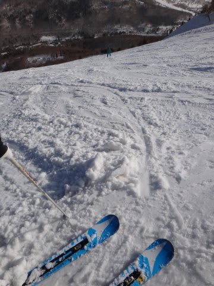
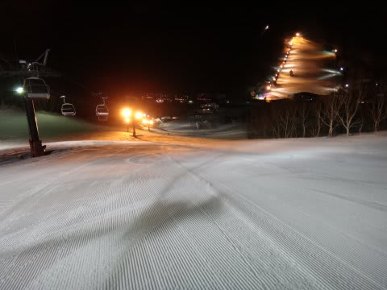

# 3月9日の志賀高原は…聞くも涙，語るも涙の黄砂＆春の雪

📅 投稿日時: 2013-03-09 22:05:18

🏷️ カテゴリ: [2013スキー滑走日記](c91dbe557f9a69230b1600e48622fdd61.md)

とゆー感じで．

ひどかったです(涙)

以上．

…で，終わらせると，読者の「ふんがー！」という怒りが

聞こえそうなので．

状況の詳細を涙ながらに語ってみましょう…

まず．

朝．

凍結していると思った道路が，ウェットのまま，凍ってない時点で

すでにいろんな危険を感じたわけで…

ここでちょっとテンションダウン．

しかーし．

山頂に出ると，一応マイナス4度．

をを．よかった！そこそこ冷え込んではいるようだな…

と，ちょっとテンション復活…

と，思った出鼻をいきなりくじく，第2ゴンドラ運休(涙）

朝のうちは確かにちょっと風が強かったけど…(悲）．

再びテンションダウン．

しかし，ゲレンデに出てみると

ををを！晴天！

そして，雪もシマシマ！

いいじゃないかっ！

と，テンションピークへアップ↑！

しかし．

天気予想通り，昨晩からわずかに雪が積もったらしいオリンピックコースへ

入ると…

な，なんだか雪が張り付くんですけど…（驚）．

そして．

なんだ？この汚れた雪はっ！（驚愕）

はうぁっ！こ，黄砂が！ゲレンデが黄色い…ってか，茶色いよっ！！！

なんだこりゃーーーーっ！（涙)（涙)（涙)

…テンション一気に↓

フィリピン海溝より深く，テンションが落ちていく音が聞こえる…

圧雪バーンも，2本滑ったらもうこんな荒れ荒れ状況で…

しばらくたったら．

もう，どぼどぼのまっ茶色に…

板が張り付いてすべりが悪い…

うおおおっ！

私が何か悪いことをしたのだろうかっ！

なぜ…なぜ高温だけでなく，黄砂まで…

そして．

さらに追い討ち

停電って…（泣）．第2高速と第4ロマンスが，朝9時前から停電で停止．

ふがーっ！

踏んだりけったりとは，まさにこのことっ！

午後1時ごろまで，ヤケビ第2高速，第4ロマンス，山の神，

一の瀬クワッドが停電で停止．

…せめてもの救いは，一の瀬からヤケビ方面へのリフトが

止まったので，第1ゴンドラはまったく混まなかったってことでしょうか…

気温も，昼間にはプラス5度以上．

日差しもあり，暑いくらい…

雪はどんどん悪くなっていくなか．

こんな感じの，荒れ荒れ張り付く雪を．

終日滑ってました…

夕方は，こんな感じで天カスみたいに固まった雪に…（泣）．

うーーん．

明日も，コンディションは今日と同じくらいなんだよな～（涙）

だれだ～！

日ごろの行いが悪いのは～っ！！！←おまえだろ（定番のツッコミ）

…

だけど．

ナイターが．

雪はちょっと固めだけど，アイスバーンってほどじゃない，圧雪で．

ぼちぼち楽しめたのが．

せめてもの救いだったのだ…

## 💬 コメント一覧

### 💬 コメント by (いか)
**タイトル**: Unknown
**投稿日**: 2013-03-09 23:43:11

うわー、やっぱひどいですね…。

特に黄砂で雪がこれだけ茶色になるのはもっと後からと思っていたのですが(-。-;

来週は少しくらい良くなってほしいものです…

と願いながら、ストック改造に励んでいた私は正解だったのでしょうか？

### 💬 コメント by (gokuraku skier)
**タイトル**: Unknown
**投稿日**: 2013-03-10 00:42:43

金曜日の夜まさかの黄砂襲来で今日は最悪でしたね(T_T)

私は朝イチ１ゴンで上がってそのまま奥志賀に逃げました。

お昼前にヤケビに戻った時、なんで２ゴンが動いてないのにこんなに１ゴン空いてるの？って、まさか停電であちらが動いていなかったとは知りませんでした。

それにしても３月第２週の志賀とは思えないコンディションに私もすっかりテンションダウンのまま帰宅しました。

でも、でも、このままじゃ終わらないのが志賀高原！ですよね。

### 💬 コメント by (ゆうこ)
**タイトル**: 横手山→第一ゴンドラ
**投稿日**: 2013-03-10 22:39:42

今日は朝は横手山にいってきました。

でも、Skier_Sさんの予想通り強風で上のリフトが動かなくてイヌには会えず。

さらに吹雪になってきて、ゴンドラに飼いならされた私には耐えられなかったです。

11時には、荷物をまとめて第一ゴンドラに退散。

その後はずっと16時くらいまで第一ゴンドラをグルグルしてました。

残念ながらSkier_Sさんには会えませんでしたが。

今日の雪で少しはコンディション回復してきてよかったです。

まだアイスバーンも残ってましたが。

次回は4月になってしまいそうなので、少しでもいい雪が残っていて欲しいです。

### 💬 コメント by (Skier_S)
**タイトル**: 今日はまだましだったかな？
**投稿日**: 2013-03-11 00:51:48

>いかさま

いやーーーー．

3月上旬として，ありえないほどひどかったですよ．

志賀高原の3月の週末として，史上最悪じゃないですかね～？

私も来週に期待…

で，ストック改良って一体何をなさってたんでしょうか？

>gokuraku skierさま

土曜は高温・悪雪・黄砂・強風・停電と，ストレートフラッシュな感じでしたね…

これで，雨＆ガスがくれば最悪のロイヤルストレートフラッシュでしょうか．

おそらく，今後また状況が改善してくれるのでは…

と，思っているんですが．

今後に期待！

>ゆうこさま

…やっぱり，山頂リフト動きませんでしたか…．

吹雪は，午後遅くからの予定だったんですが，

想像より天気の悪化が早かったです…

でも，おかげで雪が積もってコンディションが少しはましになりましたね…

私は，14:00～16:00までは第1ゴンドラぐるぐる

でしたよ～．

また，4月にお会いしましょう～！

