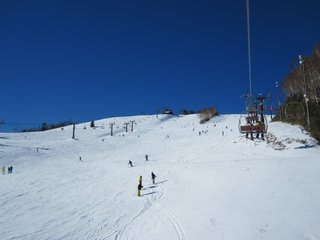

# この週末の志賀は…

📅 投稿日時: 2010-12-20 00:55:46

12月18，19日の土日で，行ってきました志賀高原．

うーーーん．

雪が少ない！

写真で見ると一見真っ白で雪がいっぱいありそうに見えるんですが…

一の瀬方面で滑れるのは，

高天ヶ原（山頂からOK)

西舘の高天ヶ原側，

一の瀬（山頂からは天狗コースのみ）

ダイヤモンド（ほぼ全面可能）

山の神

焼額（第2ゴンドラ，第2高速，第4ロマンス）

奥志賀（第2，第3高速ペア）

高天ヶ原，一の瀬下半分，焼額第2高速，第4ロマンス沿いは

人工雪がたっぷりつけてあるので大丈夫ですけど，

それ以外は結構な地雷原…

ブッシュさんがいっぱい出ています．

気温自体は結構冷えたので，積雪を期待したんですが．

土曜は一日雪が降ったものの，積もるほどの雪ではなく

ほとんど積雪の積み増しなし．

日曜は一日晴天…

気温は低かったので，雪が溶けることはなかったですけど．

雪が積もってほしい…

雪質は，高天ヶ原はかなりのアイスバーン．

一の瀬下半分は結構いい感じだけど，リフト待ちが…

上半分は天狗だけだし．

ダイヤモンドはそこそこいいけど，ブッシュあり．

焼額第2高速は朝のうち氷のごろごろが多数．

焼額ゴンドラ山頂付近は，かなり派手なブッシュ．

焼額第4ロマンス沿いが，人が多いけど一番ましですかね～．

一の瀬ペアリフト（5分程度）以外，ほとんどリフト待ちはなかったです．

道路は凍結！！！

帰り道，車が一台事故してましたので，注意していったほうがいいと思います…

うーーーーん．

もっと雪がほしい！！！！！
