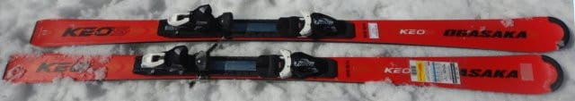
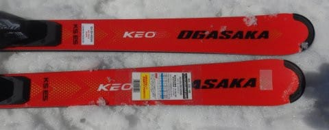
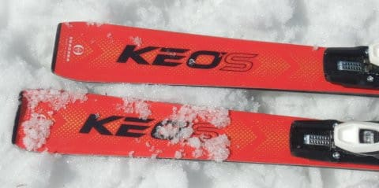
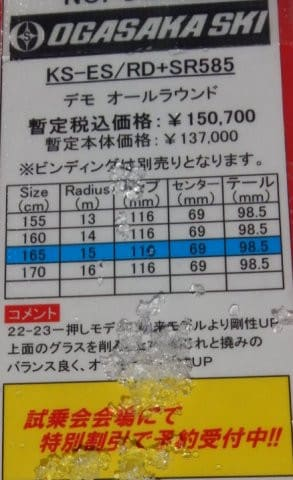
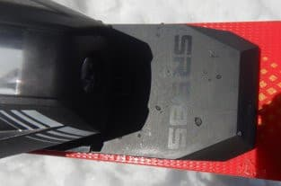
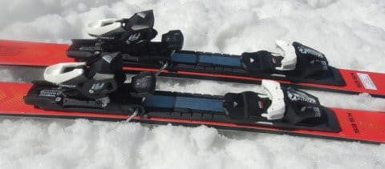

# 2023シーズンモデルのスキー板，試乗レポートその22…OGASAKA KEO's ES + SR585

📅 投稿日時: 2022-07-04 05:18:05

🏷️ カテゴリ: [スキー板試乗](c0bd8048615710cee890e403a36cc9a2b.md)

えー．

この土日も，家に籠って仕事をしていた

わけですが(涙)

…そして，今日も更新がこんな時間(泣)

さすがに全く運動をしないと体が腐りそうだし，

精神的にも極めてよろしくないのと．

おそらく後日書くであろうもう一つの理由で，

土曜午前中だけ，ちょっと運動に

山歩きをしてきました～！

…午前中だけでさっと帰って来れる

近場に行こうと，某K奈川県にある←我が家の所在地を隠すために伏字になってる…って全く意味がないけど

丹沢山に軽く登ってきたんですが．

さすがに普通に皆さんがスタートポイント

とする大倉スタートだと午前中に

帰ってくるのは難しいかな…と，

ちょっと短距離になる戸沢スタートに

しました．

絶対暑くなるから，午前中で帰ってこようと

距離も短めにして，さらにスタートも早めの

朝5時に登り始めたけど…

やっぱり暑かった(泣)

本格的に気温が上がる前，9時半過ぎには

下山してたんだけど，着ていたシャツが

絞れるほど汗をかきました…

とりあえず．

猛暑が予告されてる日に，標高1500m程度の

低い山に登るものじゃない

というのがよく分かった一日でしたが．

こんな猛暑が予告されて，外出を控えたほうが

いいと言われている日に，結構登山客がいて

びっくり！

やっぱり丹沢って，メジャーな山なんだなぁ…

それも，私が下山している時に登ってくる

人が多くて．

この人たちはみんな，私が歩いていたより

もっとスゲー暑くなる昼間に，

ずっと山歩きすることになるはず…

みんな，熱中症に注意しようね！！

ってなことで，本題へ．

今日も2023シーズンモデルのスキー板の試乗レポート．

今回もオガサカ編です．

では，どうぞ～！

○OGASAKA KEO's ES + SR585 165cm

基礎オールラウンド

長さ165cmなのにR=15という比較的

大き目なサイドカーブをもった，

サンドイッチ構造のオールラウンド板．

この板も，プレート無しとFMプレート，

SRプレートの3種類が選べるのかな…？

試乗したのはSRプレート付き．

ビンディングはチロリアのテスト用

ビンディングがついてました．

滑ってみたところ…

なんだこれは！！

これもかなりいい板だよ！！

ガッツリグリップして気持ちよくたわむけど，

R=15というのが効いていて，

スピードを出してたわませていっても，

たわみすぎて小回りになっちゃうことは無く

ちょうどいい感じの旋回半径で回ってくれて．

たわみに沿って，板が進みたい方向に

スパーンと切れて走っていくという，

キレキレの感じの脳内麻薬系の板です．

切替もかなりオートマチック感があり，

楽なのに雪面に食い込んでスパスパ

切って行けるという，私が大好きな

系統の板です．

オガサカの板らしく，低速でずらして行っても

高いコントロール性はありますが．

スピードを出していくと，ずらして滑ろうとは

これっぽっちも思わない，気持ちいい

オートマチックキレキレカービング板です．

で，R=15とサイドカーブが大きめなので，

スピードでたわみすぎて強制小回りに

なってしまうことは無く．

傾かなければ縦目に落として行けるし．

逆に意図して傾きを大きく取っていくと，

しっかりカービング小回りにまで

もっていけます．

踏んでたわませていけば，しっかり

グリップしたカービング小回りが

決められます！

スピードを出しても，大回りから小回りまで

かなり自由度が高く滑れる，まさにオール

ラウンドな板．

荒れた斜面でも安定感があって，板が

叩かれたり流されたりせず，

足元グリップに不安感なくキレキレで

滑って行けるし．

それでいて低速のズラシの滑りも

無難にこなすし…

とはいえ．

やっぱりこの板はガンガンにカービングすると

脳内麻薬で気持ちよくなれるような板．

あんまりずらそうと思いません．

私の大好きな感じの，スピードを出しても

気持ちよくたわみに乗ってオートマチックで

切れていく，いい感じの板なので．

うん．

この板．

買ってもいいな…

と思うほど，気に入りました！！

いや…

来年のオガサカの板，これまでの3本とも

(KEO's ES，XX，TC-SU)

どれもいい板ですね…！！

## 💬 コメント一覧

### 💬 コメント by (アツシ)
**タイトル**: Unknown
**投稿日**: 2022-07-04 23:27:07

標高1,500mもあればかなり涼しいのでは？？私がよく行く生駒山系の飯盛山は標高317mなので、夏場なら1回の登頂でもサウナ並みに発汗できますよ♫ちなみに登山口(標高8m)までは自宅から自転車で15分！そして真夏の昼下がりなら山頂でも気温が35℃前後あるので、空いててイイですよ😁

飯盛山は登山道がいくつもあるので、山頂から麓に降りても違うルートでまた山頂を目指す楽しみ方もできます。私も昨夏は多い日で1日3往復したこともありました。

### 💬 コメント by (Skier_S)
**タイトル**: ＞アツシさま
**投稿日**: 2022-07-06 03:09:23

コメント回答遅れてすみません～！

標高1500mでも，気温はかなり高かったです…（涙）

ベースは600mくらいだし，

35度以上まで上がったこの日は1000mでも余裕で30℃超えてたかと…

しかし，山頂で35℃の山って確かに登りたくないですね（笑）．

混まなくて良さそう．

でも，それを一日3往復するとは…

