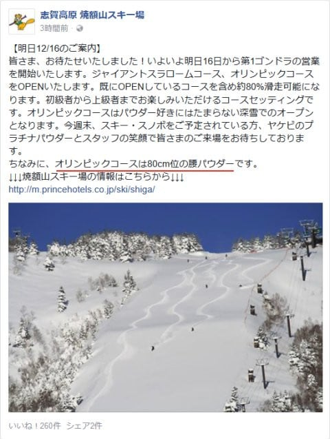
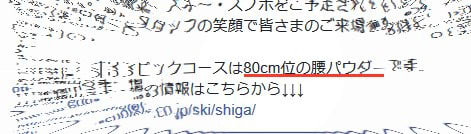

# 明日からヤケビ1ゴン運転！それもオリンピックコースは新雪80cm？？？…ってことで，明日から志賀高原で滑ってます～！

📅 投稿日時: 2017-12-16 00:00:31

えー．

木曜にドサドサ雪が降ってくれたおかげで．

そうです．

明日から，焼額の第1ゴンドラが動き出します～！

ついに．

わが生息地である1ゴンが営業開始です！←だから，1ゴンに住んでるわけじゃないから

それどころか…

え？GSコースだけじゃなく，

オリンピックコースもオープン？？？

で…

ええ？？

！！！！！！！

こ，腰パフ！？？？

…これは．

みんなには秘密にしておかないと．

コースが荒らされてしまう！

ナイショにしておいて，朝イチに

パウダーを攻めに行かねば…っ！！←ここに書いている時点でみんなにばれてるから

…でも．

明日の朝イチ，雪が重くなければいいんだけど…

木曜に降った雪だし．

土曜は気温が上がるので．

さらさらパウダーってわけに行かない気がするんだけど…

とりあえず．

ついに．太板デビューかな？？

この土日の天気は，水曜予想から大きくは変わらず，

土曜：朝は雲があるものの，日が射すかな？

　朝イチは，雪も良くいい感じの圧雪バーン！！

　昼ごろから雲が増え始め，気温が0℃程度まで上がる．

　午後は雪がちらつき始めるか？

　夜は雪が降り続ける．

日曜：朝の山頂は-10℃以下．激冷え．

　昨晩からの積雪は10～20cm．

　朝のゲレンデは柔らかい圧雪の上に新雪が乗っている感じ．

　朝から雪が降ったりやんだり．時折強く降るかも．

　昼間も-10℃程度で，寒いよ！！

　風向きによって，雪雲の切れ間にわずかに日が射す

　タイミングもあるかも．

　終日雪がぱらつき，昼間も5～10cm積もるかも．

　昼ごろのゲレンデは新雪が蹴散らされた

　荒れ気味バーンかな．

　

って感じです…

日本海側は，日曜朝はむっちゃ積もってると思うので．

パウダーねらい目です．

…多少荒れ気味の天気なので，風に弱いゴンドラは

ヤバいかも．

あ，志賀は大丈夫だと思います．ゴンドラが止まるほどの

風にはならないと思います…

ってことで．

あと2時間後に出発です～！

今週末も，志賀高原でお会いしましょう！

1時間半しか寝れない（涙）

## 💬 コメント一覧

### 💬 コメント by (いか＠白馬)
**タイトル**: Unknown
**投稿日**: 2017-12-16 01:27:36

新雪は、、、育ちます！最初降ったのが重くても何日か経てば極上です(^^)

### 💬 コメント by (さち)
**タイトル**: Unknown
**投稿日**: 2017-12-16 21:33:03

いつも楽しく拝見させていただいております！

23日から上がり、今年も常駐しますので今シーズンもよろしくお願いいたします(*^^*)

### 💬 コメント by (Skier_S)
**タイトル**: 今日も最高だったよ！
**投稿日**: 2017-12-16 23:07:08

＞いかさま

新雪，育ちませんでした（涙）

予想通り，クラスト気味のブーツパフ…

太板の本格デビューは持ち越しです（泣）

＞さちさま

23日から志賀常駐ですか…

うらやましいです…

今シーズンもよろしくお願いします~！

