# 11月23，24日の週末のイエティ・軽井沢スキー場の天気は…土日ともおおむね晴れ，気温は冷えるよ！

📅 投稿日時: 2024-11-21 02:21:27

ということで．

17日の深夜から始まった冷え込みは

20日の朝まで続き，人工降雪機も

フル稼働できたようですが…

20日，かぐらのライブカメラを見ると．

やはり予想通り，人工降雪機が動かせた

のは朝のうちだけで，朝7時ごろには

人工降雪機を止めてましたね…

このあと次に冷えるのは22日深夜から．

やはり21，22日は人工降雪が厳しそうな

感じです（泣）

ってなことで．

本日は水曜深夜恒例，スキー場の天気予想です！！

まず，21日(木)の地上天気図を見ると．

日本海側にわずかに降水域がありますが．

まぁ，これならイエティも軽井沢も晴れ～

曇り．

イエティは雲が多いかも．

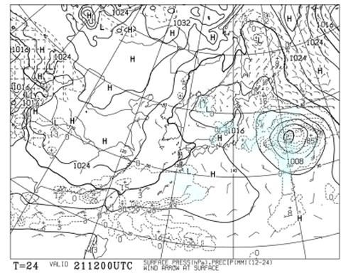

この日の850hPa気温図は，

うーん…赤い0℃線は東北まで行っちゃう

ので，人工降雪は厳しい感じ…

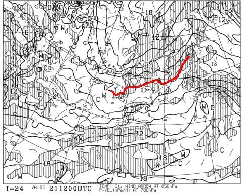

で，翌22日(金)の地上天気図は．

おっと．夜9時の段階では，西高東低の

縦縞っぽい天気図になって，日本海側に

寒気の吹き出しの雲っぽい降水域が

見えます…！

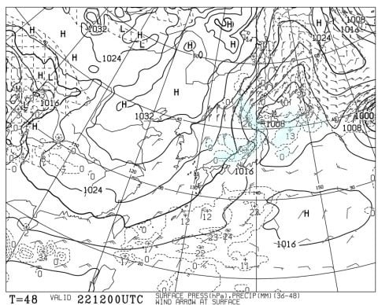

この日の夜9時の850hPa図で，ちょうど

志賀高原を赤い0℃線が世区切るくらい

なので…

この日の夜から冷え込み始めそう…！

22日の夜から人工降雪が打てますね！

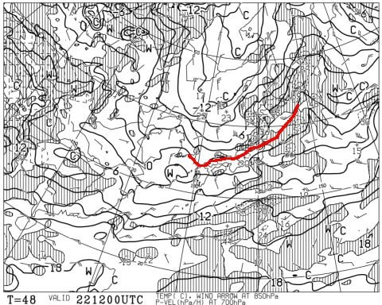

そして，肝心の週末，23日土曜の

地上天気図は…

おおお！！

これは完全な冬型…

日本海側に見事に降水域がかかってます！

雪が降りそうな天気図ですっ！！！

あ，冬型だと軽井沢とイエティは晴れます．

晴れ時々曇りくらいかな…

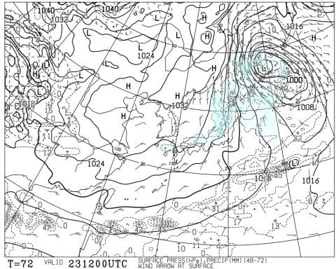

土曜の850hPa気温図を見ると．

赤い0℃線は太平洋側にまで下がり，

-3℃線も志賀高原より南なので…

この日は冷えます！

軽井沢でも人工降雪が打てるし．

熊・横手も人工降雪フル稼働！

…ただ，23日に冷えても，23日オープンには

間に合わないか…

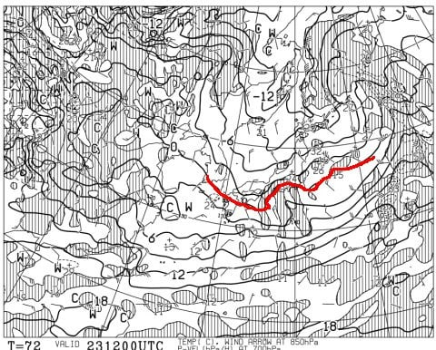

続いて24日(日)の地上天気図は．

この日は早くも冬型が緩み，

日本海側にかすかに雪雲が残るかも

しれないけど，日本は全国的に晴れそう．

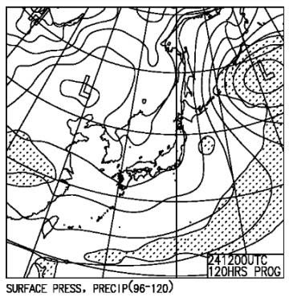

ただ…

この日も0℃線は太平洋側まで下がって

いるので．気温は冷えて人工降雪機は

フル稼働できそうですね…！

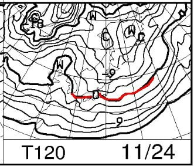

ってなことで．

まとめると．

21日(木)：軽井沢，イエティともに晴れ～曇り．

　イエティは雲が多めか．

　運が悪いと霧雨みたいになる瞬間もあるか？

　気温は平年並み．

　志賀・新潟の人工降雪は厳しい．

22日(金)：軽井沢，イエティともに晴れ．

　昼間は平年並みだけど，夜は冷える

　この日も昼間は人工降雪は厳しい．

23日(土)：朝から激冷え．日本海側は積雪

　10～20cm．

　志賀では人工降雪機も終日フル稼働！

　軽井沢，イエティは晴れ時々曇りだけど，

　かなり寒いので注意．

　イエティも朝晩は路面凍結を気にした方がよい

　

24日(日)：朝からかなり寒い．

　日本海側・志賀は朝まで雪が降る．

　イエティ・軽井沢は晴れで気温が下がって，

　運が良ければ人工雪も．

　志賀は人工降雪機フル稼働！

　この日も路面凍結に注意！

ってな感じでしょうか…

うーん．

23，24日の冷え込みが終わったら，熊の湯・

横手山がオープンできそうだけど．

あと2日冷え込みが早ければ，週末に

間に合ったのに…

まぁ，運が良ければ23日に結構積もって，

24日にはゲレンデオープンできるかも？？？

…でも

だけども．

…うん？？

なんだ，この1週間の珍しい冷え込みの

あとの，27日の怪しい飛び出しは…！？？

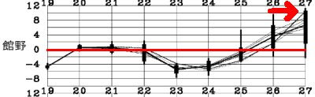

気になる来週水曜日，11月27日の850hPaの

予想気温を見ると…

…

え？？

志賀高原に+9℃線…？？

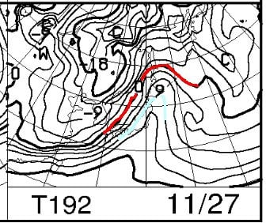

え？これって…

降ったら液体なんだけど…

まさか…

…

…

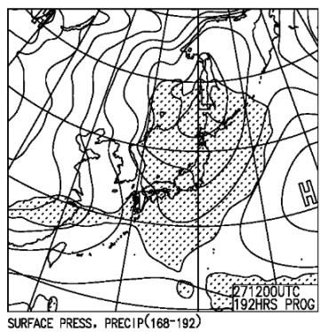

どかーーーん！！！！

ダメだ～！！！

せっかく23，24日で積もっても，

27日，超高温の雨が降ります…

うーん．

せっかく24日にスキー場がオープンしても，

今シーズンのイエティみたいに，一瞬で

クローズになるのは避けたい…(涙)

…ただ，まだ27日の予想はスプレッド0.93と

かなりムチャクチャ結構大きく．

特定高度線もかなりばらついていて，

予想精度が著しく低いし．

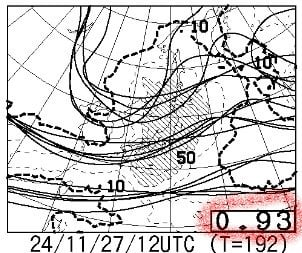

また，27日以降は冬型になって冷えそうなので．

そこまで心配しなくてよいと信じたい…

…とりあえず．

予告通り，23，24日は冷えてくれそうなので．

あとは27日の雨が，壊滅的な土砂降りにならないことを

祈るばかり…
