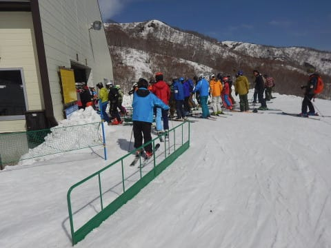
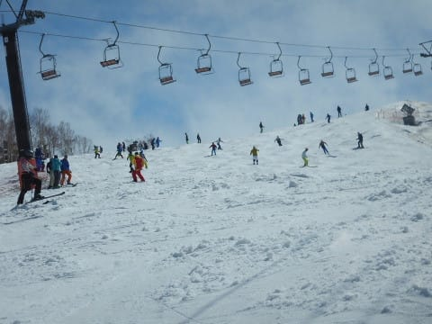
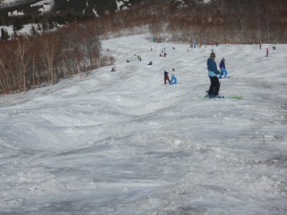

# 2019/5/11(土)かぐらスキー場，詳細レポート！…終日晴天の暑い一日だけど，雪はたっぷり．混んでるけど，例年のこの時期に比べればかなりマシ！

📅 投稿日時: 2019-05-13 01:07:20

ということで．

昨日行ってきたかぐらスキー場，

詳細レポートです～！

えー．

まず．

土日は7:30の営業開始にちょっと出遅れて．

7:45くらいにロープウェーに乗りますが．

この時点でロープウェー3台待ちくらいですか…

ここから山頂のかぐらリフトに

達するまでの，長い道のりが

続くわけですが…

ロープウェーを降りた後は，

次はみつまたリフトに乗りますが．

みつまたリフト乗り場までも，

まだ雪がちゃんとついてますね…

ただ，みつまたの雪は結構

消えちゃっていて．

下山用の廊下分しか雪が

残ってませんね…（ちょっと残念）

でも，下山用のコースは，

まだしっかり雪がつけてあるので．

来週くらいまではPislabを滑らずに

済みそうかな…

そして．

みつまたリフトを降りたら，

ゴンドラ側に滑って降りるわけですけど．

ここも完全廊下状ながら，まだ

雪に穴が開いたりしておらず．

問題なく滑っていけますね…

そして，ゴンドラに乗って約10分．

ようやっと到着したのが，かぐら

ゲレンデ！

いやーーー．

まだ，全面真っ白じゃないですか！！

雪が少ない年はかなりヤバくなる，

ゴンドラ降り場から高速リフト乗り場

までも全面雪がついてますし．

リフトを乗ってから目の前に見える

テクニカルコースも，まだまだ

土が出てきている気配はありませんよ！！

かぐらメインバーンは，いつもは

土が出始めるコース端もまだまだ

雪がたっぷりで．

コース幅全面全く問題なく

滑れます！！

高速リフト降り場付近も，

まだまだ雪が多いですね～！！

いや，GW過ぎの景色と思えない

雪の量ですよ！！

ってことで．

駐車場からの遥かなる旅路を乗り越えて，

やっとかぐらメインゲレンデを滑るわけですが．

…GW過ぎの朝イチなのに．

焼額のトップシーズンより人が多いかも…

朝から気温は高く，

ウェアのジャケットを着ていると

暑くて溶けそうなほどだったので．

あさイチから雪はゆるめでしたが…

でも，朝はフラットバーン！

GWを過ぎているというのに．

晴天の気持ちいい天気のもと，

雪がたっぷりのゲレンデを滑れる

このシアワセ…っ！！

朝9時ごろには，リフト待ちも

ほとんどなく．

いや…なんて素晴らしい！

…と，思っていたら．

10時に近づくと．

…ううーーむ．

この時期のかぐららしい混雑になって

来ましたね…（涙）

これで，リフト10分待ち弱でしょうか．

…あぁ．

これから，いつも通りの10分を超える

待ちになるんだろうな…（涙）

と，思っていたら．

高速リフトと並行にかかるペアリフトが

動き出し．

高速リフトの混雑が減りましたよ！？？

いや，

いつもはペアリフトが動いても．

ここまでリフト待ちが減ることは少ないのに…

今日は例年に比べ，人が少ないようです…！

が．

やはりゲレンデの人口密度は

わがホームゲレンデ，焼額と

比較にならないくらいで…

…っていうより．

かぐらはトップシーズンよりも，

今が一番混むという．

不思議なスキー場ですよね…

…この世に，スキー○カが

こんなにいるんだなぁ…

で．

今週はまだ第4ロマンスの

パノラマコースが滑れます！

ちょいとリフト待ちが出てますが．

まだほとんどブッシュも

出てきてませんね～！

おそらく，これなら次の週末も

滑れそう！

今週，高速リフトの混雑が少なかったのは．

第4ロマンスが動いてくれて，人が分散

したのもちょっとあったかも…

ってことで．

気温も余裕で+10℃を超えてきた本日．

天気も良くて…

かなりの人が長袖Tシャツやら

薄手の服で滑っているほどの

ポカポカ陽気の春スキーで．

そのせいで，昼には，ちょいと雪の

滑りが悪くなってきましたが…

その代り．

人が減ってきたのか，

リフトは飛び乗りに近いタイミングも！！

いや…

いつものこの時期のかぐら．

リフト待ちが長いのが辛いんだけど…

こんな天気が良くて．

雪がたっぷりあるのに．

リフト待ちが無いなんて．

なんてシアワセなんでしょう…！！！

ちなみに，今日はかぐら第1ロマンスも

この程度の混雑で．

全体的にリフト待ちは少ない一日

でしたね～．

ただ．

ゲレンデの人はそこそこいたので．

昼を過ぎてくると，メインバーンは

だんだん凸凹になっていきます…

でも．

いつもなら，昼ごろにはコース

全面盛大なコブ祭りになることを

考えると．

今日はまだまだコブは

浅いですね…

でも．

メインバーンが荒れてきて．

フラットバーンでなくなってきたので．

ならば，コブを攻めるのだ！

…と．

全面にコブが作られている

テクニカルコースへ行ってみますが．

テクニカルコースも，まだまだコース

全然問題なく行けそうですよ～！

中間部分も，まだコブ溝にブッシュが

出てきてるところも見当たらないし…

一番下も，まだまだ大丈夫！

GWを過ぎて，テクニカルの一番下が

全くブッシュの気配もないのは

恵まれてますね～！

…ただ，コブが例年より浅い気が…

次は，ジャイアントコースへ行ってみますが．

いや．

ジャイアントコースも，ほぼ全面まっしろ！！

いやーー．

今年は恵まれてる！！

…でも，こっちもコブが例年より

浅い気が…？？

いつもなら，GW後はかなり土が

出ている一番下も，まだまだ全然

大丈夫ですよ～！

ただ，最後の部分，ちょっと土が

出始めてますが…

まぁ，例年に比べれば

全然まだまだ雪が多いですね～．

ってな感じで滑ってると．

午後2時を過ぎたころ．

メインバーンも全面コブに

なってきます…

でも，やっぱり．

例年の全面超凸凹コブ祭りに比べれば，

営業終了直線でも，コブは浅めですね…！

ってなことで．

午後はひたすらコブを滑り続け…

15:45に，かぐらエリアのリフト営業終了！！

…って，ちょっと早くない？？

…ってことで．

ゴンドラコースを滑って降りますが．

ゴンドラコースもまだ雪が多いので，

来週も問題なく滑って降りられそう

ですね～…

ゴンドラ乗り場前もまだまだ

雪はいっぱい残ってるし．

みつまたも，まだ滑って降りれますが…

ちょっとみつまたはさすがに

コース幅いっぱいには雪が残って無くて．

廊下になってましたが…

でも．

GWの翌週としては．

雪がいっぱい残ってるし．

人も少なかったし．

結構楽しめた，かぐらでした～！

## 💬 コメント一覧

### 💬 コメント by (NorthFox)
**タイトル**: Unknown
**投稿日**: 2019-05-14 00:21:48

私はGW初日に横手山で滑ってシーズン終了してしまいましたが、これだけ雪があるならもう少し頑張っても良かったかなぁと思います。

そんな訳で今は部屋に飾ったスキーを眺め、今シーズンを振り返りつつ来シーズンの滑走に思いを馳せています。

しかし一年で随分とスキー道具が増殖してしまいました。。。。

### 💬 コメント by (Skier_S)
**タイトル**: ＞NorthFoxさま
**投稿日**: 2019-05-14 01:47:32

まだまだ頑張るべきでしたよ…

雪がいっぱいある今シーズンは（笑）．

しかし，スキー道具は勝手に増殖する運命にあるので，

知らぬ間に殖えていくのは仕方ないことです…

