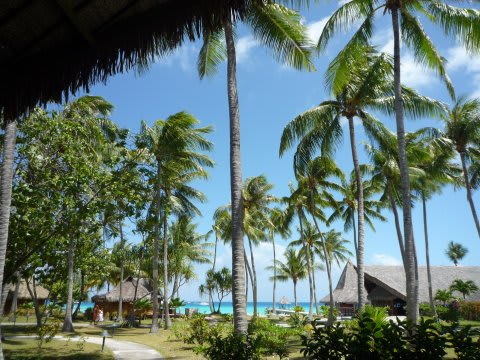
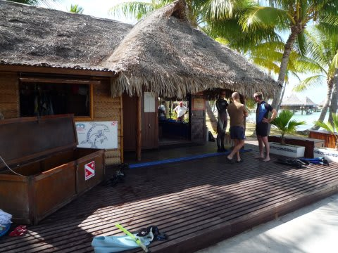
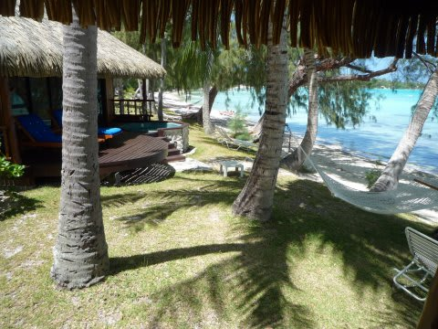
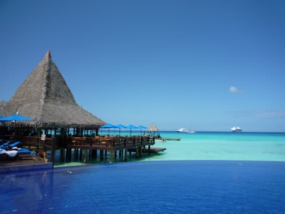
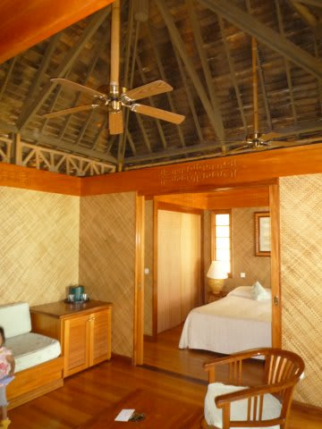
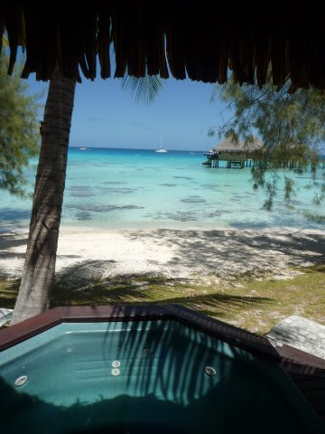
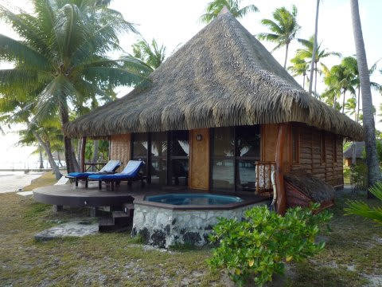
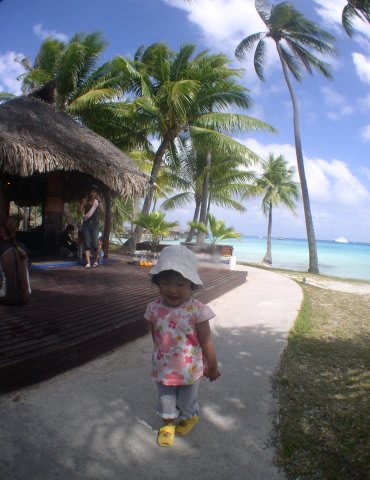

# 2009年　初の海外子連れダイビング旅行記　14　Hotel Kia-Ora

📅 投稿日時: 2012-09-11 00:39:06

さて．到着したのは，

ランギロア最大のホテル，ホテル・キアオラです．

…っていうより，この島唯一のリゾートホテルかと．

中にダイビングショップ「blue dolphines」が併設されてます．

このショップ，日本人ガイドのジュンコさんが事実上のマネージャーで，

ショップを仕切っています．

ランギロア唯一の日本人ガイドのいるショップですね．

(これら情報は2009年時点)

…はっきり言って，ランギロアにはペンションがいっぱいありますが，

いろんな話を総合すると，キアオラに泊まるか泊まらないかで

ランギロアの充実度は全く変わります．

特に，ダイブショップとしてブルードルフィンを使う場合，

昼間はペンションに帰る事ができず，荷物一式持ってきて，

ダイビングのインターバルにずーーーーっとホテルの

プールサイドかバーかどこかで途方にくれてないといけないので

かなり厳しいです．

(キアオラステイじゃなければ，ダイビングの合間はこのプールサイドで

ずーっと待つことになるかな～）

ちょっと高くなっても，ランギロアはキアオラステイをお勧めしておきます．

＃子連れダイバーなら特に

とりあえず．

ダイビングショップで説明を聞いてから，部屋に入ってみると．

なんと．

リビングと寝室の2部屋あるじゃないですかっ！

んで，テラスには，海が見えるジャグジーが…．

な，なんて贅沢なんだ…

多分，私が住んでいる今の家より広いぞ(涙)．

…んで．

ホテルの部屋に入ったのがすでに12時半で．

1時15分にダイビングショップに集合ってことなので…

うげげげ．もう30分ちょいしかないじゃないか．

このショップ，基本的には…

午前1本（7時15分集合…朝はやっ！）

午後1本（1時15分集合）．

の2本が基本．

お客さんが多ければ，午前にもう1本（9時15分集合）行きます．

…でも，潮周りの関係でこの時間が変更されることも多いです．

＃まぁ，基本的にがんがん本数をもぐりたい人が行く場所ではない，って感じ

で．今回は時間が無かったので，昼飯を抜いて1時15分にダイビングショップへ．

この日は私がダイビング，妻は昼食をとってゆっくり子供とお留守番となりました．
