# 2月6，7日の週末の志賀高原スキー場の天気は？…土曜は曇り～晴れで気温高め，日曜は冷え冷え曇り空，時折雪もぱらつく天気かな？

📅 投稿日時: 2021-02-04 01:40:11

ということで．

雨のあと，昨日一日雪が降り続き．

今日の志賀高原は，ゲレンデ状況

回復したかな…？

と，特派員情報を見てみると…

今日の朝の積雪は，いつもの対おこみん人形比

で行けば，5cm弱というところでしょうか．

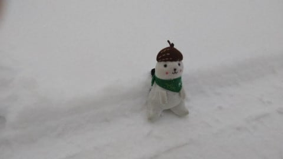

そして，朝の気温は-10℃と，

結構冷え冷えだったようです！

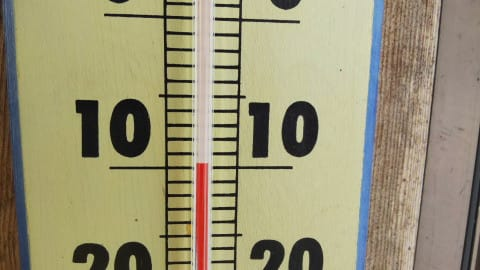

朝のうちは，山頂がガス気味で

ちょっと視界が悪かったようですが…

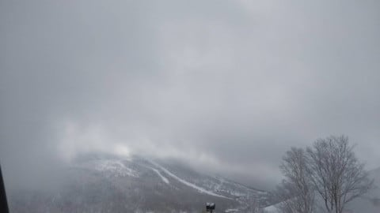

でも，圧雪の上に積雪1-2cmで，

朝は結構滑り良かったようです！

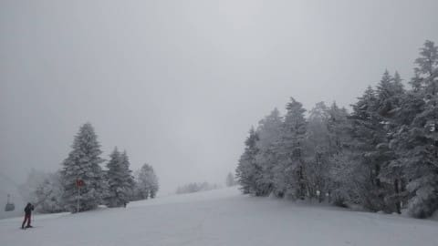

下地は硬めながらもカリカリという

ほどではなく．

まぁまぁ快適だったようですね…

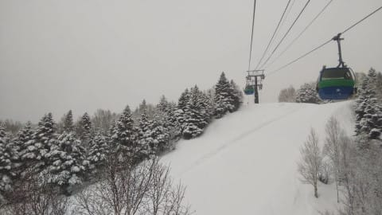

そして，昼近くになったら青空も

みえはじめてきたようで．

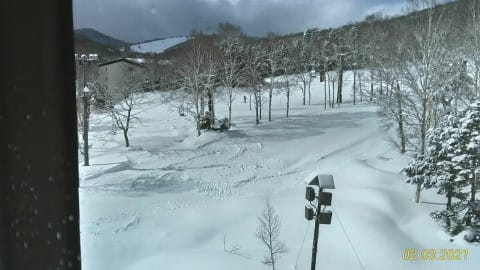

人が少なかったので，昼過ぎになっても

バーンは比較的フラットで．

下地もガリガリのアイスバーンではなく，

結構良かったようですね…！

ってなことで．

この週末に向けて，さらにゲレンデ状況は

改善するのかな…？

ということで，水曜深夜定番の天気予想です！

…まぁ，どうせ私はスキーに行けないこの週末．

天気図の読み込みに気合が入らず，精度が

低いかもしれませんが…←外れた時の予防線を張ってないか？

まずは4日（木）の850hpa気温ですが…

おっと．水色の-9℃線が志賀高原に

近づいてます！

これはかなり冷え冷えになりそうですね…！

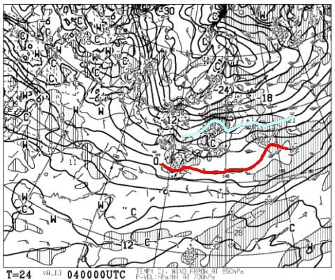

ただ．低気圧が日本海側のすぐそばを

通過するので．

4日は天気が悪く，風も強そう…

ちょいと荒れ気味の木曜に

なりそうです．

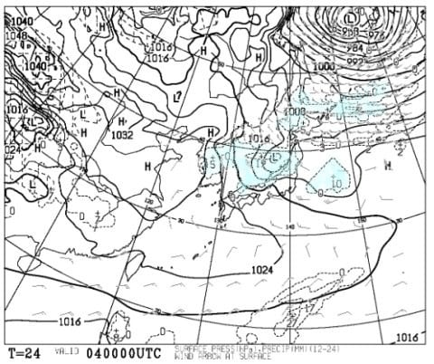

そして5日（金）の850hpa図を見ると．

この日も，水色の-9℃線がかかってます！

志賀は金曜も，朝は-10℃を下回る

冷え冷えの一日になりそうですね…

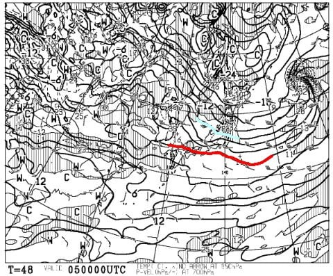

そして，地上天気図は…

うむ．この日は高気圧に覆われているので．

朝は雲が多いかもしれないけど．

午前中にはすっきり晴れになり．

太陽のもと冷え冷え雪で滑れる，

けっこういい一日になりそう！

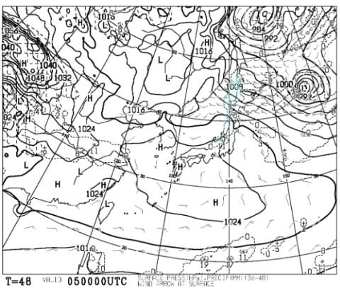

で．肝心な週末，6日（土）ですが…

850hpa図では，赤い0℃線が結構

志賀高原に近づいてます．

うーん．この日は気温はちょっと上がりそう．

昼間は0℃を超えるくらいまで上がるかも？

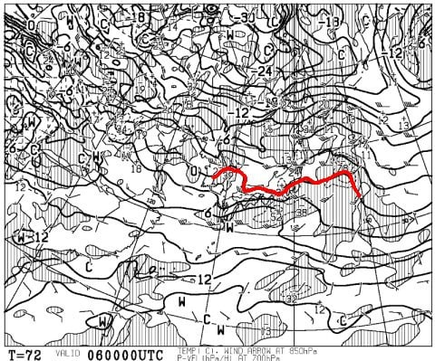

そして，地上天気図を見ると．

うーむ．

なんとか志賀高原には降水域が

ギリギリかからないでいてくれるので．

この日は，朝のうち曇り，

午後になると晴れてくるか…

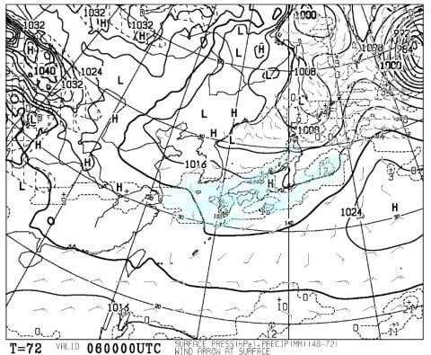

そして，7日（日）の850hpa気温を見ると．

をを！

またまた冷えてます！

-6℃線が志賀高原にかかるので．

そこそこ冷えた一日！

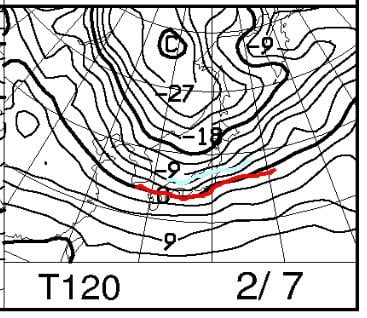

そして，地上天気図を見ると…

うーむ．

あまり志賀高原に降水域がかかってる

ようには見えないけど．

縦縞の冬型気圧配置なので，

中野の町中は晴れても，

山沿いは曇り～雪っぽい感じ…

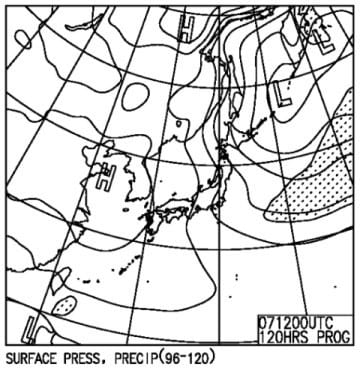

ってなことで．

まとめると．

4日(木)：朝の気温は-8℃程度かな？

　終日曇り，時折雪がぱらつく．

　風が時折強まり，ゴンドラが減速運転

　したりするかも…

　気温自体は終日そこそこ冷え，雪質は

　いいはず．

5日(金)：朝は曇り～雪がぱらつくかも？

　朝の気温は-10℃を下回る冷え冷え！

　午前中に日が射し，徐々に晴れ間が広がる．

　最高気温も-3℃くらいまでしか上がらず，

　急斜面の下地の硬いのが出てくる以外は，

　天気も良く雪も良くいい一日のはず！

6日(土)：朝は-3～4℃と比較的高めの気温

　朝のうちは曇り～雪がぱらつく？

　朝はたぶんいい感じのシマシマバーンで

　スタートのはず！

　昼間は気温が0℃を上回りそう．

　午後…というか，午前中から日が射して，

　晴れると思うけど…どのタイミングで晴れるか

　ちょっと予想しにくい．

　運がよければ一日晴れ，運が悪ければ

　一日曇り空だけど…

　曇りでも空は明るいはず．

　この日も急斜面は下地がちょっと

　硬く，硬いのと柔らかいのがまだらに

　出てくるバーンになりそうなので注意．

7日(日)：朝は冷え冷え！-10℃ほど．

　天気は終日曇り～雪がぱらつく．

　雪はぱらつく程度で，積もっても1-2cm．

　あさイチはいい感じのシマシマバーン．

　この日は終日冷え冷え，もしかしたら

　時折日も射し，雪質はGood．

　この日も急斜面はちょっと下地の硬いのが

　出てきそうだけど…

　でも，硬くてもツルツルというより

　ザラザラした感じのバーンだと思うので，

　それほど悪くないかな？

という感じで．

新雪パウダーはなさそうですが．

下地のちょっと硬いのが出てこなければ，

結構いい感じで楽しめそうな週末です…

…でも．

最近，志賀高原に行っておらず．

先週の雨で下地がどの程度かたまって

いるかとか，そういうのを現地で

見ていないので．

雪質の予想精度は低いかも…

ということで．

今週末も遠くK奈川の地から，

遠く志賀高原に思いを馳せてます…（涙）

## 💬 コメント一覧

### 💬 コメント by (レインボー73)
**タイトル**: Unknown
**投稿日**: 2021-02-04 15:36:32

木曜日の志賀高原情報

朝の上林ー４℃、蓮池ー８℃。強風で体感温度はずっと低い。滑っていると、マスクなどで覆われているはずの、鏡で見たくもない私のお顔が寒すぎ。雪は硬めだけどアイスではない。しっかり食い込むほど柔らかくもない。

今日はヘッドのネブラ　177センチＲ14.3の頂きものの板。

うーん、昨日の板に比べると、なんか物足りない。くるくる回りすぎる。私の腕ではキーンと抜ける感覚が味わえない。以前履いた時には『素晴らしい』と感激したのに。

相変わらず気づくのが遅すぎるんだけど、小回り板で大回りばかりしてたのだから、気持ちよくないのが当たり前だったんですね。最後の一本、小回りしたらやっぱりいい板だったとわかりました。私って、最低！

お気に入りの高天の銀嶺が、明日まで団体貸切なので、仲間のプリンスの部屋で、早めの小休止。

雪が降ってきて、ますます寒そうな中、根性のすわった我らは、いざ出陣。１ゴン上の非圧雪は、視界が悪いので老人向きではない。しかし、こういう所を毎日延々と同じ板で滑り続けている76歳爺がこの世には存在するのです。でも、お手本にはしたくない。

午後はオリンピックとＧＳ回し。どちらも風と雪でリセットされて快適バーンだったけど、下部の緩斜面はややストップ雪。本当は根性なしの我らは、レインボー手前でリタイア。

まだ30分滑れるのに、エス教祖様のご尊顔を思い浮かべながら（これ、本当）、終了。寒いから夜は赤から鍋だ。

帰路、１号トンネルを抜けるとき、隊員と『こんなに寒いのにジャイアントリフトに乗ってる兵（ツワモノ）はいないに１万両』と言ったら、いました。寒いのに！

『明日は太板が正解』に１万両！

### 💬 コメント by (レインボー73)
**タイトル**: Unknown
**投稿日**: 2021-02-04 18:30:51

『世の中に絶えてコロナのなかりせばエス様の心はのどけからまし』

どなたかおっしゃってましたよね。

エス様のいないヤケビなんて、クリープのないコーヒーみたい

１億３千万信者が、三顧の礼を持って、お待ち申しておりますです。こっそり変装して志賀に！

変装ウエアなら沢山ありますよ。

エス様が狂い死にしないかと、心配でなりません。

みんなお待ち申しておりますぜ。親分！

### 💬 コメント by (西舘)
**タイトル**: 初音ミクは男に1万両！
**投稿日**: 2021-02-05 02:40:44

昨シーズンは奥志賀にいた初音ミクさん、今シーズンは1ゴンでたまにお目にかかりますね。

ピカチューは1ゴン回してますね。

ルパンⅢ世どうですか、細身なので格好良くきまると思いますよ。

いっそのこと、おこみん貸りられませんかねぇ。

スバルのメット被るとかフルフェイス被るとかでもウケるわぁ。

### 💬 コメント by (Skier_S)
**タイトル**: 仕事で死にそう
**投稿日**: 2021-02-05 03:34:41

＞レインボー73さま

今日は寒かったようですね…！

でも，冷え冷えトップシーズン雪，うらやましいです．

そして，今日も違う板を履いたのですね（笑）．

177cmというと大回り板っぽいのですが，R=15以下なら

ミドル~小回りが得意なスペックですね！

…で，明日は太板の出番になるほど積もらないと思います…

そして私は，おそらく緊急事態宣言が出てなくてもスキーに

行ってられないほど仕事がヤバいです（涙）

仕事しておかないと，スキーに行く資金が無くなるので，

ここしばらくは泣きながら仕事しておきます…

＞西舘さま

あ，みくさん，今シーズンはイチゴン率高いんですね．

私は変装して滑るなら，修学旅行生みたいな「一見すごい素人っぽい」

格好なのに，滑り出すとすごいんです…みたいなのがやってみたいです（笑）．

…でも，板で素人じゃないってばれますね（笑）

### 💬 コメント by (Northfox)
**タイトル**: Unknown
**投稿日**: 2021-02-05 13:21:12

>「一見すごい素人っぽい」格好なのに，滑り出すとすごいんです

一度目にしたことがあります。

板やブーツ（グレーの2バックル）はおそらくレンタル品。ウェアも地味な初心者風の高齢シニアの二人組。

ところがお二人とも上手いんです。スピードは出さず休み休みだけれど急斜面でも不整地でも難無くきれいに滑っていき、挙句はコブのコースも滑っていました。

かつてインストラクターとか相当な腕前だったのでは？と思いました。

なんだかとても恰好良かったです。

