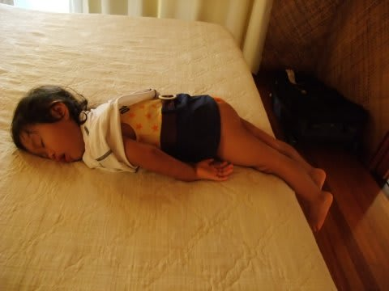
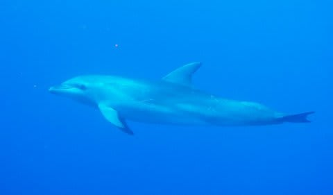

# 2009年　初の海外子連れダイビング旅行記　20　Encountering with dolphins

📅 投稿日時: 2012-09-18 00:19:02

とりあえず.

妻のイルカとの遭遇の羨ましい話を聞いたあとは，部屋に帰って一休み．

ダイビング終了後，すぐに部屋に帰って休めるのがキアオラのいいところ．

娘はプールで疲れたのか，ベッドに着いたとたん，

水着を着替えさせる間もなく即寝．

なんか，よっぽど疲れたのか，不自然な格好でも起きることなく寝てます…

大人たちはバーのサンドイッチを部屋にもって帰って，

デッキチェアに座ってのんびり昼食．

そして，各部屋の前につってあるハンモックで，ゆっくりと

波の音を聴いて過ごします．

あああ．幸せ．

午後のダイビングは，私が潜る番．

潮周りの関係で午後2時15分集合．

さぁ．

午後のダイビングでは，私もイルカを見ることができるのか？？？ 

ポイントはいつもどおりのティプタパス．

パスの外洋側でエントリー．

エントリー後すぐ…

イルカの声が聞こえる！！

これは期待が高まるぞっ！

エントリー後，5分ほどで，ガイドのジュンコさんが海面を見ながら

仰向けで泳ぎ始めました…

最初仰向けで泳いでる意味が分からなかったけど，海面を見てみると…

ををををっ！

キターッ！！！！

水面にうっすらイルカのシルエット．

そのまま1-2分平行して泳いでいると…

我々チームのそばに近づいてきました．

チームの周り，3mほどのそばをぐるぐると2-3周回ってます．

その後も，遠ざかったり近づいたり，数分間視界の中を

ぐるぐる泳ぎ続けてくれました．

もう，こっちもイルカにあわせてぐるぐる回ってしまいます（笑）．

たっぷりと5分間以上はイルカと一緒に泳いでいたでしょうか．

一瞬の通過ではなく，これほどじっくりとイルカと泳げるとはっ！

…しかし．

しかし．

午前中，妻から聞いたような，「ボディータッチ」レベルの

遭遇ではなかった…（涙）．

もう少し近づければ…

でも，普通のダイビングでこんなに長時間，ぐるぐる回ってくれる

イルカを見られたら，すごい超感動もののはず．

なにぶん，午前中に聞いた話と見た写真がすごすぎたのが不運だった…．

その後は，全然逃げないまばらなバラクーダなどを見つつ…

ダイビングが進んでいきましたが，イルカしか印象に残ってない…

とりあえず，ある程度の目的は果たしたなぁ，って感じで．

本日のダイビング，終了！
