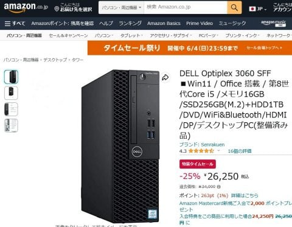

# メインのデスクトップPCを買い替えた…リース落ちの格安中古PCは使えるのか？？その1

📅 投稿日時: 2023-08-17 03:37:19

🏷️ カテゴリ: [PC,カメラ&小物](c0d8caed13e597efe97b661a8ae56bed0.md)

えー．

このBlogを書いている，私のメインPC．

[大雪でスキーに行けなかった2014年の週末に
くみ上げた自作機](e8e612c03340a9027de7b4fc50d4421d1.md)を，かれこれ9年の

長きに渡って使っていたわけですが…

組み上げてからもう9年にもなるし，

さらにこいつはWin8.1マシンなので，

サポート切れのWin8.1をいつまでも使って

いるのもヤバい．

そして．

CPUも古いCorei3-4130という，第4世代CPU．

4k映像のハードウェアデコーダーを持っておらず，

4k映像再生がコマ送りになってしまうという，

今となっては悲しいほど非力なマシン．

まぁ，Blogを書いたりする分には不足はないけど．

どうせなら，Win8.1のサポート切れを機に，

新しいマシンに置き換えようか，

と思ったわけなんですが…

ただ．

スキー用具以外にはお金をかけないという

信念の私．←スキー用具ならお金をかけていいってことなのか？

物欲選手権に負けることを正当化してないか…？

前回同様，マザーとCPU，メモリだけ交換して

安く上げようかと思ったけど…

マザーボードを変えると，OEM版の私の

Windowsのライセンスが使えなくなるので．

これにプラスして，Windowsも買う必要が

出てきます．

Windows，買うとかなり高いんですよね…

ってなことで．

調べてみると…

CPU/マザー/メモリ＋Windowsをバラで買う

よりも，ケースやら電源，キーボードに

マウスまでついて，Windowsがインストール

されている格安メーカー製PCを買ったほうが

安いという事実…

うーん．

なら，格安完成品を買おうか？

と思って調べて始めると…

新品を買わなくても，Amazonとかで

リース落ちの格安中古PCがいっぱい

出てますね…！！

で．

Win8.1のサポート切れで，Win10に置き換えても

いいけど…

Win10にしたところで，Win10もあと2年後の

2025年にはサポート期限が切れてしまうという

悲しさ．

だったら，Win11対応にしたいところ．

Windows11は第8世代以降のCPUが必須なので…

ならば，狙うは第8世代以降のCPUを

積んだPCですね．

ということで，第8世代以降の格安中古PCを

探すと…

うむ．

3万円以下で出てきますね…！！

こいつは，CPUはCore i5 8500で，第8世代．

4コアだった7500からコア数が2個増え

6コアになってて，CPU性能は十分以上．

メモリも16G以上あれば，私の使い方と

しては問題ないし．

SSDも256Gあれば，あとは今使っている

HDDをつなげて使えばいいし…

さらにこれ，Win11インストール済みだけじゃなく，

Office2019のライセンス付き！？？

いや…これ，安すぎない？？

ただ．

DVDが，DVD-R対応の書き込み可能じゃなく．

読みだしだけの，DVD-ROMドライブか…

TVチューナーカードを挿す関係上，

録画番組を書き出せるDVD-RW対応がいいんだけど…

これは，別途DVD-RWドライブに換えればいいかな．

と．

まぁ，3万以下でPCを買えればいいよね…

と，このリース落ちの格安PCを買ってみたのでした．

（[続く](e181d1dcb2a3fba65586254e7a4e907e7.md)）

## 💬 コメント一覧

### 💬 コメント by (Unknown)
**タイトル**: Unknown
**投稿日**: 2023-08-20 22:02:03

第4世代i5に無理矢理Windows11インストールして使っております

まぁ動画エンコードとかは遅くて既に諦めたので、速くは無いけど性能的には不満なし

### 💬 コメント by (Skier_S)
**タイトル**: ＞Unknownさま
**投稿日**: 2023-08-20 23:00:16

最初は第7世代くらいのPCにして，CPUチェックを抜けてWin11インストール

仕様かと思ったのですが…

なんだか，それをやった人が一度「CPUが適合してません」みたいな表示が出てきたような

話を聞いたので…

今回，第7世代より安いくらいの値段で第8世代のPCが出ていたので，第8世代を素直に買いました．

しかし，さすがに第4世代にWin11を入れようとは思わなかったです…

まさか第4世代にインストールしている人がいらっしゃるとは！！

### 💬 コメント by (Unknown)
**タイトル**: 試してみては？
**投稿日**: 2023-08-23 21:55:55

旧PC、SSDも1GのHDDもある訳ですからWindows11をインストールしてみては？

まだまだ動いていたPCを廃棄物にしてしまうのは忍びない

8.1から11って直接あげられるのかな？

### 💬 コメント by (Skier_S)
**タイトル**: ＞Unknownさま
**投稿日**: 2023-08-25 06:01:12

うーん．

もう1台のデスクトップPCを置いておく場所がないんです…

