# 丹沢山に登ってみたその3…下山は1時間半を狙ったけど…丹沢山頂から戸沢まで1時間40分で下山

📅 投稿日時: 2022-08-14 04:55:41

えー．

今回で

丹沢山登山レポート，最終回です！

ってなことで．

戸沢の駐車場から約2時間半で丹沢山頂に到着し．

山頂で20分ちょい休憩タイムをとったら…

8時前に，下山スタート！

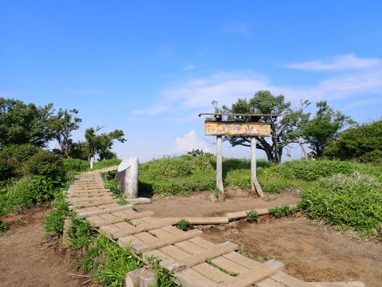

冬に向けてのトレーニングのための登山なので

下りでも心拍数150を狙いますが．

下りで心拍数を上げるには，結構なペースで

歩く（走る？）ことになります…

山頂から1.5kmの日高に到着すると…

山頂からの時間，14分28秒．

キロ10分以下のハイペースで下ってますね．

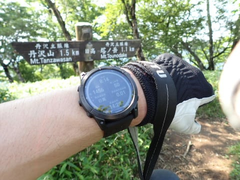

そして，塔の岳への結構な登り返しを

上がると…

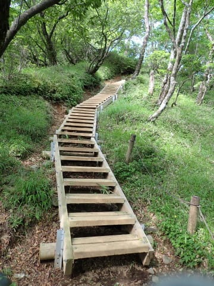

丹沢山から30分ほどで，塔の岳へ到着！

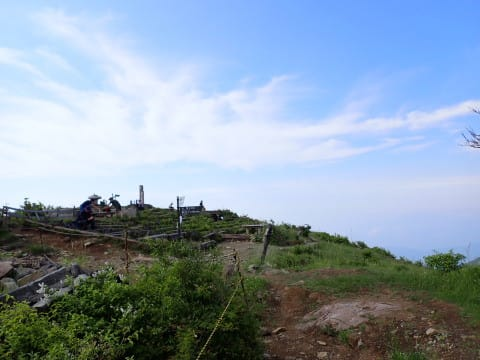

ちなみに，Garminさんは設定で画面表示を

いろいろカスタマイズできるのですが．

この時は3画面自動切り替えに設定してて，

数秒ごとに，

情報画面→地図画面→ポイントまでの残距離表示

と切り替えていました…

ポイントまでの残距離表示はこんな感じで．

塔の岳まであと14m，

その次の金冷しまで605m，

さらにその次の花立山荘まで1.1km…

と，通過ポイントまでの距離が順番に

表示されています．

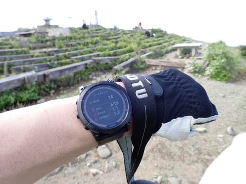

この数字が減っていって，

「あぁ，あと14mで次のポイントだ…」

と分かるのが心強い！

いや，むっちゃ便利！

そして，数秒ごとの切替で地図も

表示されるので…

走りながらでも地図を確認できて，

表示されている予定コースからずれて

ないか確認できるのも心強い限り！

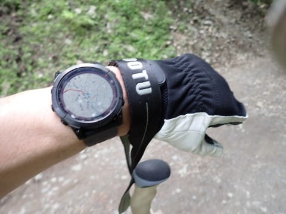

自分が予定したルートからずれると，

バイブレーションと画面表示で

「コースアウト」と教えてくれるので，

地図を見なくてもオンコースかコース外か

すぐ分かります．

…今までコース上で何度もスマホを出して

地図を確認してましたが．

立ち止まってスマホを見なくてよくなったのは，

むちゃくちゃ便利！！

ホントに，これは山登りの必須デバイスでは

なかろうか…？？

ってなことで．

塔の岳山頂に到着したけど…

下山開始してからまだ30分しか経ってないので，

塔の岳山頂では休まず通過して，

さらに下山を続けます…

しかし．

天気がよくていいんですが．

標高が下がってくると，気温が30℃を

余裕で超えてきて，強い日差しがかなり

辛い感じに…（涙）

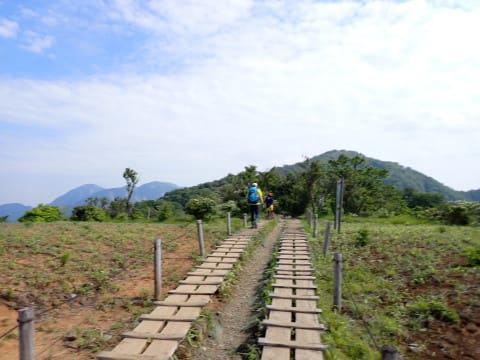

晴天の日差しが体力を奪っていく…（泣）

でも，このあたりは景色もいいし．

まだ気持ちよく下っていきます…

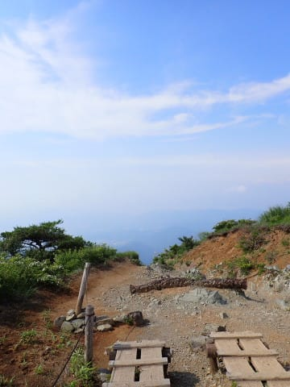

塔の岳から18分で，

花立山荘通過！

右手にはAmazfit Pace君を付けていたのですが…

駐車場スタートから3時間47分経過と

表示されてますね．

ちなみに心拍数はこちらのAmazfit Pace君で

見てましたが，心拍164ってちょっと

上げすぎかな？

通過ポイントが近くなって，ペースを

上げすぎちゃったみたい…

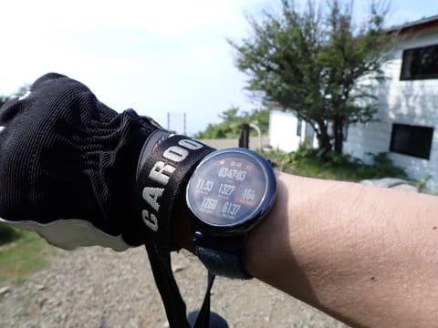

そして．

左手はGarminさん．

やっぱり時計で地図が見れるのは便利！

予定ルートの赤いラインに乗っていて，

オンコースなのが確認できるし．

この写真じゃ分かりにくいけど，地図画面の

下の部分にも，次のポイントまでの距離が

表示されてます…

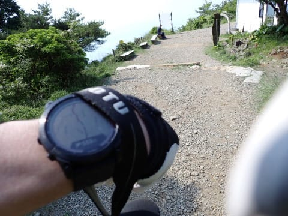

さらにガンガン下山！

ゆるやかな木道が続くので，

快調に飛ばせるのですが…

階段も結構多くて．

階段は自分の歩幅で歩けないので，

ちょいとツライ…

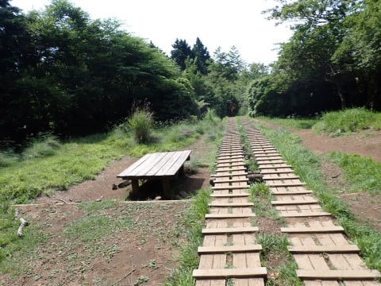

そして．

駐車場から3時間59分．

丹沢山頂から1時間の9時ちょうどに，

天神尾根と大倉尾根の分岐点へ到着！

心拍は153．

だいたい心拍150前後キープで．

良いペースで降りてきてますね…！

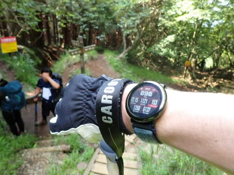

さて．

ここから駐車場までは，ヤマレコなら

標準コースタイム1時間ちょい．

今までのペースなら，コースタイムの半分，

30分で降りられるかな？

だとすると…山頂から1時間半で駐車場に

着けそうな感じ！

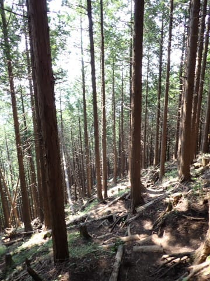

と思っていたけど．

標高を下げていくとともに

気温が33℃越えと酷暑になってきました…（泣）

被っていた帽子が汗まみれになって，

帽子のつばから汗がぽたぽた滴ってくる

という，自分も経験したことのないほどの

大量の汗をかいて，体力がかなりの勢いで

削がれていきます…（涙）

さらに天神尾根はかなりの急な下り坂で．

1歩1歩，かなりの落差がある足場の悪い

下り坂．

こんなところをハイペースで歩き続けて

いると，結構乳酸が溜まってきたようで…

ペースが上げられなくなってきた感じ（泣）

ちょっと前半飛ばしすぎたか…

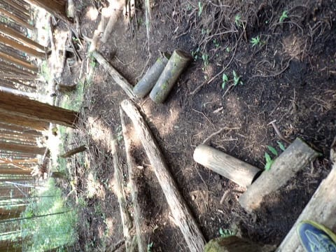

30℃を大きく超える気温と高い湿度の中，

かなり大量に水分と塩タブレットを

摂取しつつ．

何度か足が止まったものの…

スタートしてから4時間41分．

山頂から1時間41分で，戸沢の

小屋の前まで戻ってきました～！！

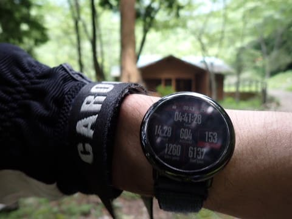

最後のセクション，大倉尾根分岐から

30分のつもりが，40分かかったけど…

休憩含め，4時間41分で丹沢山頂まで

ピストンしてきました～！！

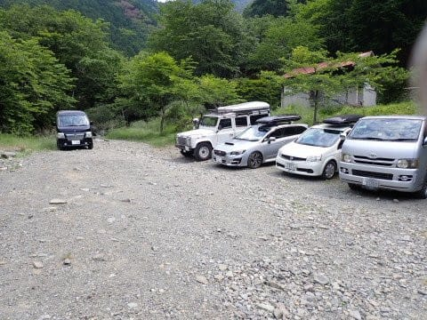

ってなことで．

9時40分過ぎには車に到着し．

11時には帰宅できたので．

午後は家で仕事ができたのでした…

丹沢山．

初めて登りましたが．

家から近いのに，よく整備されている山で

意外と良かったし．

午前中半日仕事を休めば，登って家まで

戻って来れることが分かったので．

このあとまた2週続けて，

丹沢山系を登ってしまったのでした…

でも．標高が低くて暑いので．

酷暑の夏に登るのには向いてないかも…
