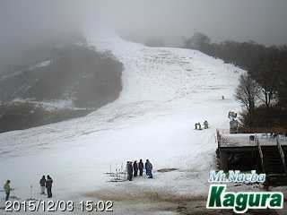
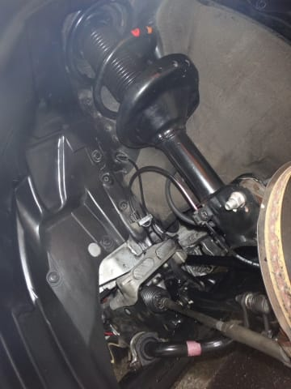

# ということで，通販で買ったタイヤを持ち込み交換してみた

📅 投稿日時: 2015-12-04 00:55:37

えー．

どうやら，予想通り．

昼ごろまで雨になってしまった本日．

…な，なんだ，これはっ！！

かぐら，雪が減っちゃってるんですが…っ！！！！

この時期に，雪が減るって…

どういうこと！？？

…でも，予想通り，午後から雪になり．

（かぐらは午後3時からと，ちょっと予想よりは降り始めは

　遅かったけど…）

夜になって，積もり始めているみたいです．

志賀でも，現在，雪が降ってるようです…

さーて．

明日のうちに，どれだけ積もるかっ！？？

ってことで．

本題．

[一昨日の，スタッドレス購入](ed37f79b998c2bb8649b52639399bb425.md)の続きです…

…通販で買った，ホイール無しのスタッドレスタイヤ．

普通のタイヤ屋に持ち込みで交換してもらうと，

交換工賃が一本5000円とか，ありえない値段が

取られちゃうみたいだし．

＃それでもタイヤ屋で新品スタッドレス

＃買うより安いけど…

さて．

どこでつけてもらうのが，一番安いのか…？？

今回．

とりあえず．

とある作戦をもって，ディーラーへ向かったわけですね．

そうそう，

古いスタッドレスは，あらかじめ自前で

交換して，すでに車に装着済み．

こうしておけば，

自前タイヤ交換の際に，一緒に車の

下周りのメンテもできるし…

（防錆塗装，錆防止のグリス塗布等）

（メンテ前）

　

（メンテ後）

　

（メンテ前）

（メンテ後）

さらに，タイヤ交換の際に．

古いスタッドレス（ホイール付き）4本と，

新しいスタッドレス4本，計8本のタイヤを車に

積んで行かなくても済む…というのが，その理由．

ということで．

古いスタッドレスに履き替えた後．

ホイール無しのスタッドレスを車に積んで．

ディーラーへ向かいます…

Skier_S「すいません．タイヤ交換お願いします」

Dラー「持ち込みタイヤのホイール組み換えで，廃タイヤ処理ですか…」

S「そうです」

D「取り外し，ホイール組み付け＆バランス，取り付け，廃タイヤ処理で

　一本6000円になります」

S（な，なに？？4本で2万円超えるじゃないかっ！！！）

　「ちょっと…高いんですけど…っ！！」

D「既定の工賃ですので…」

ここで．

当初の作戦発動！

S「じゃ，オイル＆エレメント交換，F&Rデフオイル交換，

　ATF交換，エアコンフィルタもセットでお願いするので，

　安くしてください」

D「…」

S「安くならないなら，タイヤ交換もオイル交換もよそでやります」

D「…少々，お待ちください…」

ということで，待つことしばし

D「…このくらいでいかがでしょう…」

S（やったー！タイヤ交換半額っ！廃タイヤ費用込みで一本3000円ちょい！）

D「うちでやらせてくれますか？」

S「エアコンフィルタは自分で換えるので，工賃削ってください」

D「…エアコンフィルタ，サービスで交換させてもらいます…」

S（え？悪いなぁ…エアコンフィルタもタダでやってくれるんだ…）

ってことで．

エアコンフィルタやオイル，ATFも，ディーラーの方が，

実は黄色帽子や自動バックスより安いので．

結果的に，かなり安く上がったよ…

結局，スタッドレスタイヤは，送料＆交換工賃込みで

4本6万5000円くらいで済みました…

ラッキー！

さて．

YOKOHAMAタイヤの実力や，いかに？

ということで．

車の冬準備も終わったし．

今週末からは，志賀高原通いが始まるのだ！

## 💬 コメント一覧

### 💬 コメント by (megalith)
**タイトル**: Unknown
**投稿日**: 2015-12-05 20:49:17

ディーラーだからと言っても1本6,000円は高すぎですね。

こちらでは持込の場合GSや個人の自動車販売会社等でタイヤ組み換え&バランス取り&廃棄料金込で1本2,500円～3,000円位でやってくれます。

もちろん雪が降る前での話で、タイヤ交換込になるともう少し高くなります。

ちなみに今回自分が買ったホイール&タイヤセットの場合、最初からバランスまでとって発送してくれるので、余分な費用は発生しませんでした。

### 💬 コメント by (Skier_S)
**タイトル**: megalithさま
**投稿日**: 2015-12-05 21:07:50

うちの場合は，近くの個人経営のタイヤ屋も，

持ち込み交換は嫌がられ，かなりの高額を

吹っ掛けられました…（涙）

今回はディーラーで1本3000円にしてくれたので，

まぁ良かったかな，って結果です．

しかし，ホイール付き，バランス調整済みで

買うという手がありましたね…

それなら，自前でタイヤ交換すればタダだし…

しかし，通販でホイール付きってあるんですね．

### 💬 コメント by (アルフィン)
**タイトル**: Unknown
**投稿日**: 2015-12-06 01:51:25

Amazonで購入したタイヤは宇佐美石油で安価で組み替えしてもらえるそうです。時にこの年末年始は志賀高原も行こうかと思っているのですが、何分前回行ったのが30年ほど前でして、どの辺りに宿を取るのが無難でしょうか？

### 💬 コメント by (Unknown)
**タイトル**: Unknown
**投稿日**: 2015-12-06 11:35:20

自分は以前BPでそこで車検をしてもらい、車検ついでに夏タイヤの組み換えをしてもらったら、1本コミコミで2,000円という破格値でしてもらいました。

ネット通販でセットだとそうなんですよね。

ちなみに、自分が買ったのはここです。

フジ・コーポーレーション

http://www.fujicorporation.com/shop/

ここでしたらセットで買うと確実に組み込み&バランス調整込で、たまに送料3,000円引きなんてこともあります。

また、たまに数量限定でセール品が出ることもあるので、要注意です。

フリーダイヤルもあるので相談もできますし、今回自分が買った時インチダウンのため、サイズ違いのための確認のメールが来たりと、サポートもまあまあ良かったりします。

### 💬 コメント by (megalith)
**タイトル**: Unknown
**投稿日**: 2015-12-06 13:38:48

上の書き込みは自分です。(^_^;)

### 💬 コメント by (Skier_S)
**タイトル**: アルフィンさま
**投稿日**: 2015-12-07 01:03:17

宇佐美石油と，そんな提携があるんですね…

ところで，志賀高原の宿ですが．

何泊するのか，ガンガン滑りたいのか…

等によりますが．

蓮池に宿をとっておけば，サンバレーから

一の瀬方面を経由して，

焼額，奥志賀まで滑っていけますし．

バスで横手・熊にも出やすいですし．

いいかもしれません…

でも，今から年末年始の宿はもう厳しい

気がするのですが（＾＾；

### 💬 コメント by (Skier_S)
**タイトル**: megalithさま
**投稿日**: 2015-12-07 01:06:17

お店情報ありがとうございます！

ホイール込みで次は考えてみます．

YOKOHAMAの走りを，

この週末の志賀高原で試してみましたが．

うーん．圧雪路面だと，そんなにREVO GZから

「進化してるな～」って感じではなかったです…

### 💬 コメント by (アルフィン)
**タイトル**: Unknown
**投稿日**: 2015-12-08 09:55:12

情報ありがとうございます。

年末年始と書きましたが正確には１月３日～６日を予定しておりまして、

よくよく考えるとこの期間にヤケビに行ってもお会いできないなあとｗ

３日に白樺湖に行って４日の宿を白馬方面にするか渋温泉にするか悩んでおります。

ヨコハマのスタッドレスは普段の舗装路でのロードノイズがＢＳよりも少ないので愛用しております。確かにＢＳは氷上では利くイメージですが割高なので...雪上ではほとんど変わらないですしね。

### 💬 コメント by (Skier_S)
**タイトル**: アルフィンさま
**投稿日**: 2015-12-09 00:08:13

3日からですか…

丁度空いてる時期に滑れて，いいですね～．

ぜひ志賀高原へ…

ヨコハマのスタッドレスですが，確かに

アスファルト路面での性能はかなりいいですね～．

圧雪路面は，REVO GZとあんまり変わらないか，

ちょっと落ちるかも…という印象でした．

もう少し走りこまないと，まだわからないですが…

正月以外に，志賀高原に行かれる予定はないんですか？？

週末に焼額を滑っていれば，ほぼ100％私と

遭遇するかと思います（笑）．

