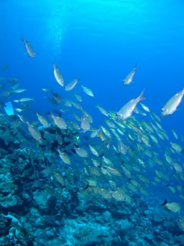

# 2009年　初の海外子連れダイビング旅行記　8　Beautiful...Second dive

📅 投稿日時: 2012-09-04 00:04:55

なんだか，このブログ．

普段，夏モードは読者がぐぐぐぐぐぐぐっと減るんですが．

ここしばらく，スキーシーズンに近い数のPVがあるなぁ…

一体何があったのか？？

とりあえず，タヒチ旅行記続きます…

----

…で.

ボートは2本目のポイントへ移動．

ポイント名は「タプー」って名前です．

2005年に来たときも潜ったところですね～．

かつてシャークフィーディングポイントだったらしく，

サメがうようよいた思い出が…

ここは，結構面白いポイントだったという印象が残ってますけど．

＃ノンダイバーには信じられないみたいですが，

＃ダイバーはダイビング中にサメを見れたら喜んじゃう

さて．今回はいかに？

ということで，2本目へGO！

このポイントは，見渡す限りの珊瑚の平原のような広いエリアにサメがぐるぐるしているところ．

エントリー後，いきなりサメ様のお出まし！

ぷりぷりに太ったレモンシャーク．

体長4mほどはあるかなぁ…

結構近くをゆったり泳いでいってくれます．

…でも，以前来たときは，もっと4-5匹以上が常に

視界の中でぐるぐる回っていた気がするけど…

今回は，同時に視界に入るのはせいぜい1匹．

サメ，ちょっと減ったのかな…？

あとは，大量のアカモンガラとスダレチョウチョウウオ．

ノコギリダイの群れ．

頭の上には，カマスの結構でっかい群れもいます．

スダレチョウチョウウオは，ダイバーにずーっとくっついてきます．

オクトのパージボタンを押してエアをちょっと噴き出してやると，

それをえさと思うのか大量にスダレチョウチョウウオが集まってきます．

魚ダンゴに囲まれながら泳ぐようなポイント…

この人は，チョウチョウウオじゃなくアカモンガラに好かれているようで（笑）．

カレントも無く，のんびりとした平原を，サメをみつつ

スダレチョウチョウに囲まれつつ漂っている1本でした．

というわけで，ボラボラのダイビングはこれで終了．

2本目は結構面白かったけど，前回来たときはもう少し面白かった気が…

ガイドさんにいろいろ話を聞いてみると，ここ2年ほどで

オニヒトデにやられて珊瑚がかなり減ったり，

1本目に潜った「パス」ポイントはマンタポイントだったのに今では全く現れなくなったり，

トビエイの50枚以上の大群が見られたポイントでトビエイが見れなくなったり…

ボラボラのダイビング環境はちょいと悪化してきてるようで…

うーん．ちと残念だのお． 

ってことで，2本目のダイビングのあとは，ボートでショップへ．

帰り道では…水中で忘れかけていた娘のことが急に心配になってきます． 

…娘，泣いてないかな…
