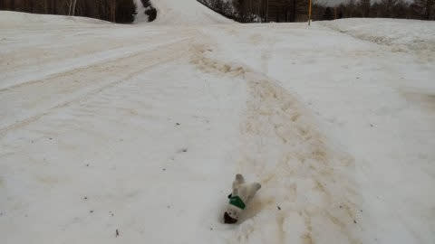
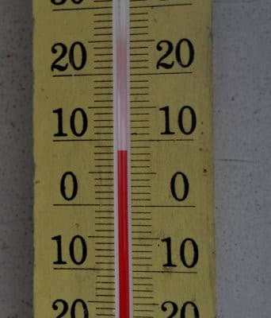

# GW，5/2～5日の中間は天気は悪くなさそう…

📅 投稿日時: 2022-04-28 06:14:48

とりあえず．

今日もBlogを更新する暇などない状況の

はずですが…

でも，更新！！

今日…というか，もう昨日の水曜ですね．

いつものおこみん特派員からのレポートによれば．

昨晩からの雨は結構すごかったようで，

かなり雪が融けたようです(涙）

そのせいで，朝からゲレンデはひどく荒れて，

あさイチから雪はまっ茶色…(泣)

おこみんちゃんもふてくされて

ひっくり返っているとのこと…

焼額が休みの水曜だったので，

焼額の状況は分からないのですが．

奥志賀はゴンドラ側ダウンヒルコースに

一部土が出てきたところがあるとか…(涙）

気温も高く，雪解けが進みそうです（泣）

このあと，29日，5月1日と天気は崩れそうですが…

まぁ，5月2日と3日～5日の3連休，GWの中間は

雨も降らず，気温も平年並みよりちょっと

低いくらいまで冷えて．

前半よりはコンディション良さそうです～！！
