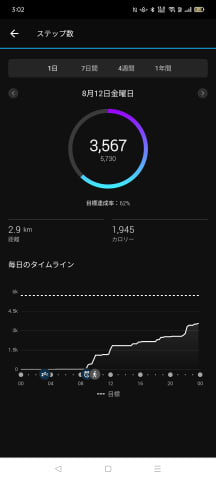

# 新しいスマートウォッチ，Garmin Fenix7Xを買ったよ！その7…スマホアプリ，Garmin Connectを使ってみる：前編

📅 投稿日時: 2022-08-23 04:52:06

（Garmin Fenix7Xのレポート全16回のもくじ

機能説明，登山用地図の作り方，登山で使ってみた…など

は[ここをクリック](e516b23a4874189de2e9208be87fa5184.md)）

えー

今日も更新がとんでもない時間になってます（涙）

でも，今日も長い記事を書いてしまった…

塔の岳の山歩きレポートが，まだ終わってませんが．

ここで再び，Garminの紹介記事の

続きをいかせてもらいましょう．

今回はスマホアプリの説明です！

いやー．こいつも多機能ですよ～！！

Garminのスマホアプリは，[以前紹介した](ef34cedf8cbb4e1022526a5fe27de254a.md)，

ウォッチにアプリをインストール＆設定するための

Gamin IQ（赤色矢印）と，

各種情報を見たり基本設定をするための

Garmin Connect（水色矢印）の

ふたつのアプリがありますが．

今回は，Garmin Connectの方の説明です．

まずはこのアプリを起動すると…

こんな基本画面が表示されて，

本日の心拍数データやら，

後述のボディーバッテリー，

ストレスレベルや歩数，

消費カロリーに睡眠といった，

ウォッチで計測された基本情報が

このアプリで見ることができます．

…基本的にこれらの情報はウォッチ本体でも

見ることができますが，やっぱりスマホ画面で

見た方が見やすいですね．

まずは基本の心拍数を見てみると…

一日の心拍変化グラフに，安静時心拍数も

確認できます．

ちなみに，画面をスワイプしていけば，

過去の心拍数グラフも確認できるのですが．

これらのデータはクラウドに保存されて

いるので，ネットが繋がってないと

見れないことに注意！

一日の消費カロリーも確認できるし…

こいつは血中酸素濃度ですね．

一日の変化グラフが下にありますが，

こいつは安静時しか測定できないので，

実質寝ている間だけの測定で，

起きている時間の測定値はありません…

さらには一日の呼吸数のグラフやら…

一日の積算歩数グラフも見れます．

これは歩数の週ごとデータですが…

だいたいのデータは，その日一日のグラフ

だけじゃなく，週の変化グラフや

4週間の変化グラフなども見られるように

なってます．

で．

こいつが睡眠データ．

総睡眠時間と，深い眠りや浅い眠り，

レム睡眠がどのくらいだったかとかを

確認できます…

ちなみに，睡眠中の血中酸素濃度の変化とかも

見れますが．

うーん．どうも，寝てる姿勢で腕に血流が

行かなくなると数字が低くなるのか…

寝てる間に血中酸素濃度が91%くらいまで

落ちてることになってるので，あんまり

測定精度は高くなさそう．

さらに，寝ている間の呼吸数も確認

できます．

これ，どんな仕掛けで測ってるのか，

気になる…

そしてこれは，週の睡眠時間ですね．

…週平均の睡眠時間が4時間58分って…

不健全ですね（涙）

で．

「睡眠スコア」

ってのも出るんですが…

そうですか．

悪いですか．

短いですか．

そうですよね（涙）

あと，これが面白いんですが．

最近のスマートウォッチで流行りの，

「ストレスレベル」ってのがあります！

これ，ストレスが低い・高いがグラフで

確認できるんですが…

たとえばこれだと，寝ている夜中から

朝にかけてはストレスが低く，

朝7時以降，起きてからはずっと夜中まで

仕事が続いてストレスが高め（涙）

ってのが分かります

（夕食の前後だけちょっとストレス低い…）

このストレススコア，

交感神経と副交感神経のどちらが支配的かを

示していて…交感神経が支配的だと

ストレス値が高くなって，副交感神経が

支配的だとストレス値が低くなります．

寝てる時，休んでいる時，落ち着いている時は

副交感神経が支配的で．

肉体的・精神的ストレスによって交感神経が

アクティブな時間が続くと疲れるよ…

という目安ですね．

どうやって測っているのかが気になってので，

ちょろっと調べてみると．

交感神経が支配的になると，心拍タイミングが

リズム正しく一定になり，

副交感神経が支配的になると，心拍タイミングの

揺らぎが発生する（HRV：Heart Rate Variabilityが

大きくなる）ということで．

心拍タイミングばらつきを基に測ってる

みたいですね．

そして．

実はこのFenix7Xで一番面白いと思ったのが

こいつ．

このストレスレベルと連携した，

ボディーバッテリー．

これが何かの説明は…

次回に続きます！

（続く）
