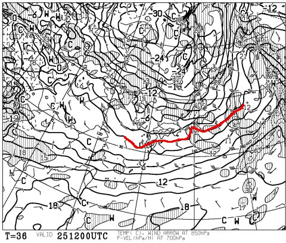
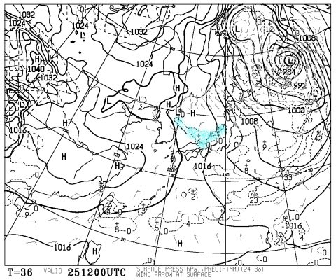
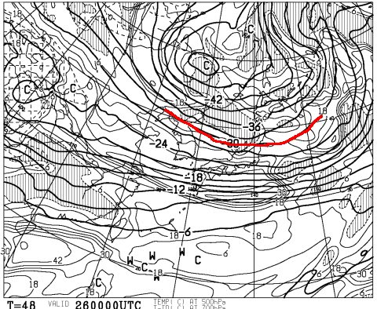
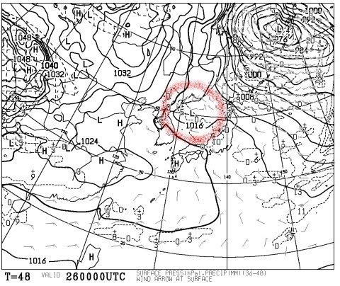
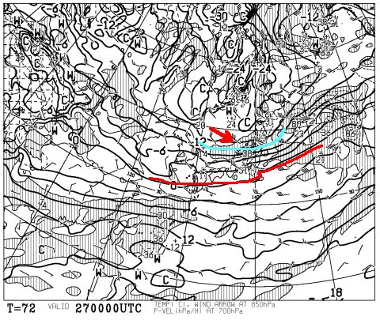
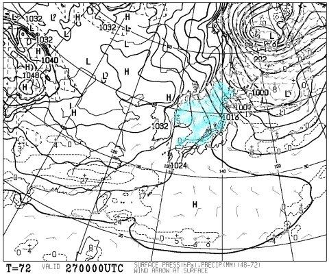
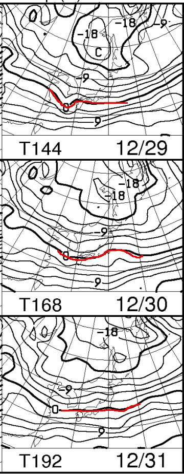
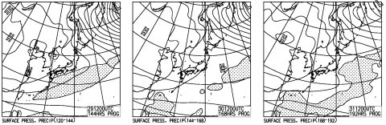

# この週末から年末の志賀高原の天気は…積もるけど，ドサドサってほどではないか…

📅 投稿日時: 2015-12-25 01:18:33

えー．

今日の志賀高原ですが．

予想通り，昼間の気温がぐぐぐっと

プラスまで上がったものの，

なんとか雨は降らずに済んだようで…

とりあえず一安心した今日この頃，

皆様いかがお過ごしでしょうか．

いやー．

昼間の志賀高原，プラス3℃を超えていたので．

この気温で降られたら，危ないところだった…

で．

そうなんですよ．

今週末が終わると．

なんと．

もう年末ですよっ！

ね，ん，ま，つっ！！！

…こんな雪の状況で，年末とは信じられないところではありますが．

そろそろ，年末年始の雪の状況が気になるところ．

だもんで．

本日は．

今週末だけではなく，

31日までの天気＆雪の状況を，

予想してみようじゃありませんか…

えー．

まず，今週末ですけど…

ふむ．

ふーーーむ．

金曜25日，夜9時の850hpa図を見ると．

0℃線，かなり日本の南まで下がって．

かなり冷えそうな感じっ！

そして，地上天気図にはこんな感じで，

水色に示した降水域が，

「日本海側からの吹き出した雲」の形になってますね～．

これは…25日，朝から降ります！

雪です！冷えた雪です！

…が．

残念なのは，西風で．

…日本海側のスキー場は積もりそうだけど．

志賀高原は，雪になるとはいえ，バサバサ積もるほどの

感じじゃないのが惜しい…

そして．

26日の土曜ですが．

500hpa天気図を見ると．

ニュースなんかでよく言う，

「上空5000mのマイナス30度の寒気」

が，志賀高原に近づいてます！

これは…土曜も冷えて，終日雪になりそうな予感！

地上天気図を見ると…

うーーむ．

赤くマークした，プチ低気圧が発生する

形になっていて…

これは，予想が難しい形だ…

この低気圧のわずかな発達度合いや位置のずれによって，

風向きや雪が降るエリアが変わるので．

ドサドサ降るか，パラパラしか降らないか，微妙な感じ…

うーむ．

まぁ，おそらく．

土曜は昼間も終日雪が降り積もる感じかな．

そして，この雪は，27日の日曜まで続きますね～．

27日朝9時の850hpa気温図はこんな感じで．

赤くマークした0℃線は，日本の南まで下がり．

それどころか，青くマークした-12度線が志賀高原に

近づいてます！

これは…日曜朝，山頂では-15度くらいまで冷えますね．

冷え冷えですね．

激さむの一日ですね．

そして，日曜の地上天気図は…

をを！

日本海全域に，水色に塗った降水域が広がってます！

これは…日本海に冷たい空気がガンガン入って，

雪雲が日本海側に吹き付けるパターン！

27日朝は，おそらく．

日本海側は，かなり深いパウダーを楽しめそう！

…でも．

2枚前の850hpa図の赤矢印で示したように．

風向きが…

志賀高原に積もらないパターンの，見事な西風（涙）．

うーむ．

志賀高原も，パウダーは積もるけど．

太ももパフとかにはならなさそう…

でも，ブーツパフくらいの，そこそこの

パウダーは楽しめるかな～！

で．

そのあとの天気は．

29～31日は，こんな感じで0℃線も信州の南まで下がっているので．

まぁ，雨が降るとかの心配はいらない，

平年並みの気温の日が続きそう．

だけど．

地上天気図を見ると…

あれれれれれれれ．

29～31日の3日間，全く雪が降らなさそうなんですが．

積もらなさそうなんですが．

うーーん．

このままだと，ゲレンデの雪はかなり薄くなる感じ…

年末，ブッシュがところどころに出てくる状況に

ならなきゃいいんだけど…

ってことで．

まとめると．

土曜：先日からの雪で，道はしっかり雪道！

　結構冷える．寒いよ！

　前日からの積雪が10cm程度あり，朝イチは

　柔らかい冷えた圧雪の上に，うっすら新雪．

　天気は終日ちらちら雪降り．時折強く降る．

　雪が柔らかいので，午後に向かってゲレンデは

　荒れていきそう…

日曜：前日からかなり雪が積もる．シーズン初のパウダーデー！

　ただ，今のままの風向きだと…志賀は20～30cm，ブーツパフくらいか？

　天気は終日雪降り．かなりの勢いで降るタイミングも．

　昼間も-10℃程度までしか上がらない激寒な一日．

　ゲレンデはモサモサで，昼過ぎには荒れた感じになっていくでしょう．

28日：まだ確定ではないけど…おそらくこの日も朝はパウダーデーか．

　朝から雪は止み，昼には天気は回復．晴れ間も広がる．

　気温は平年並み．志賀は昼間も-5度程度をキープするでしょう．

29～31日：気温は平年並み．天気は3日とも曇りベース．

　時折チラチラ雪が舞うけど，今のところ積もったり，

　パウダーになりそうにはないなぁ…

　

…って感じでしょうか．

今週末に焼額第1ゴンドラが動くのか．

金曜からの積雪に期待ですね…

土曜夜から日曜朝にかけての，どっさり積雪は

期待度が高いので．

最悪でも，日曜には動いてくれると信じたい…（祈念）．

…でも，そのあと，積雪がなさそうなのが，

ちょっと，どうしたことかという感じ…（ちと残念）．

寒気さんに，もう少し本気を出してもらわないと…．
