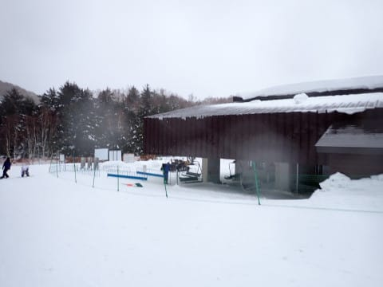

# 2024/1/21(日)の志賀高原焼額山スキー場，速報レポート…朝は強風で全リフト・ゴンドラ動かず．午後に向かってすべてのリフトが動いたけど，雨＆湿雪が降り続く一日(涙)

📅 投稿日時: 2024-01-22 02:29:25

えー．

本日もラストまで滑って帰宅が深夜という

日曜定番パターンなので．

今日の志賀高原，速報モードにて…

まず．

今日の朝はものすごい強風で始まり．

明け方，宿の部屋からものすごい風の

音が聞こえるくらいで，ヤバいかな…

と思っていたら．

朝8時の段階で，志賀高原のほぼ全リフトが

営業見合わせ

という，なんじゃこりゃ状態（涙）

このまま風が弱まらず，リフトが動かない

可能性もあり，

せっかく宿泊代金を払ったのに，日曜滑らずに

帰るのか…！？？

と，嘆いていたところ．

朝8時半過ぎには一ノ瀬ファミリーの

ペアリフトが動き出し．

8時45分には一ノ瀬クワッドも動いて…

9時過ぎには，焼額も第4ロマンスと

第2高速が動き出すという情報が

流れ，何とか9時半過ぎに，通常より

1時間ほど遅れて焼額に参戦！

でも．

天気は限りなく雨に近いみぞれが

時折強く降る，かなり悲しい天気で…

雪質も，とても1月と思えない

水をたっぷり吸った重い雪（涙）

こんな天気ながらも．

滑れないよりはマシ…

と，滑りに来る人がそこそこいたのか．

ゲレンデは予想より多くの人が

出てきてましたね…

しかし．

午前中はゴンドラが動いてないので，

限りなく雨に近いみぞれでびしょ濡れに

なりながらリフトに乗る，かなり修行な

感じで．

12時ごろには雨から雪に変わったけど，

ウェアに着くとびしょ濡れになる雪が

かなり激しく降り，前が見にくいほど

になったりと．

かなり修行感が高い午前中でした（涙）

でも．

12時ごろにかなり強い雪が降って，

1-2㎝積もったおかげで，ゲレンデはちょうど

滑りよい感じになってくれて…

さらに，午後1時になると第1ゴンドラ，

午後1時20分には第2ゴンドラが動き，

焼額の全リフトが動き出しました～！！

午前中の修行状態にくじけて帰った人が

多かったようで，ゴンドラが動き出した後の

GSコースやパノラマコース，白樺コースは

滑る人も少なく．

特にゴンドラが動き出した直後の1本は，

まだ誰も滑ってないフラットコースで．

「これは午後まで我慢して滑っていた

人へのご褒美に違いない！！！」

というご褒美バーン！！

午後3時ごろには，雪もほぼ止んで．

コースは人も少なく，それほど荒れな

かったので…

最後の2時間ほどは予想以上に楽しめたの

でした～！！

…午前中はかなりの修行だったけど（涙）

いや．

午後のご褒美がなければ，何のために

滑っているのか，哲学的な問いを発し

続けなくてはならない一日で．

午後2時間だけでも，コンディションが

良くなってくれて良かった…

で．

明日以降冷え込んだら，今日の雨で融けた

雪がガチガチに固まったアイスバーンに

なりそうだけど…

23，24日に結構雪が積もりそうなので，

それで隠れてくれるかな？？

来週末には，ゲレンデコンディションは

改善しているはず…！！

## 💬 コメント一覧

### 💬 コメント by (レインボー76)
**タイトル**: Unknown
**投稿日**: 2024-01-22 14:11:38

月曜日の志賀高原情報

暖かい気持ちがいい日。ダイヤに上陸したけど、圧雪の境目には大きな縦じまがある。やけびクオリティが高すぎるからそう感じるだけなんだけど。

唐松は硬めのフラットバーン。白樺は言わずもがな。GSは最後の急斜面(慎ちゃんバーン)で地肌がある。

極上雪を求めて奥志賀へ。連絡路の最後は枝がいっぱい落ちていて整備不良。

肝心の3高が小さいコロコロ出現で不満。エキスパはやや硬めで滑りやすかったけど、混んできたので次は林道へ。まったり林道散歩はなんか心が癒される。

バスの都合で上から必死に漕いでヤケビヘ。

オリンピックはフラットでいい感じ。強くはないけど日も差して、なんか楽しい。

パノラマインも初めて滑ったし、十分満足して西館で腹ごしらえ。

この頃には下部では柔らかくなっていました。

スキーはこんなに楽しいはずなのに、昨日の試練に耐え抜いた強者が私の周りに意外と多く、改めて自分の冷静沈着さ？が、エス様の対極にあることがわかりました。

### 💬 コメント by (Skier_S)
**タイトル**: ＞レインボー76さま
**投稿日**: 2024-01-23 01:11:16

昨日と違って，今日は良かったみたいですね…

うらやましい…

でも，昨日ラストまで生き残った人は意外といたんですよ（笑）．

みんなバカですよね~←自分のことは棚に上げる

で，明日の午後からは雪が降り，24日はかなり激しい雪になりますよ…！

25日まで降り続けます！

