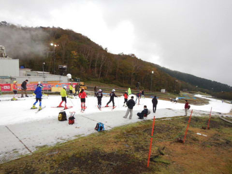
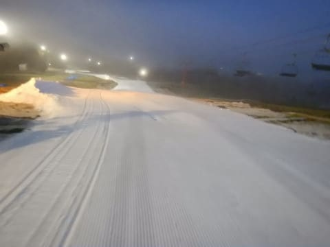

# 2019/10/27，2019/2020シーズンスタート！オープン3日目のイエティは…曇り時々晴れ，思ったほど混まなかったけど，雪は薄い…

📅 投稿日時: 2019-10-28 01:06:41

🏷️ カテゴリ: [2020スキー滑走日記](c282e9230de179e245c7334eabeb0a3b3.md)

ということで．

本日，行ってきましたよ～！！

今シーズンオープン3日目のイエティへ！

ついに…

待ちに待った，2020シーズンのスタートです！！！

ってなわけで．

朝8時のオープン直後にYetiへ乗り込みますが…

シーズン券の人が30分早く入場できるので．

自分たちが到着したころには，

もうゲレンデは，ピカピカシマシマでは

ないところがちょいと残念だけど．

でも，登りリフトにはまだほとんど

誰も乗っていない，あさイチ

ガラガラタイムでのスタート！

をををを！！

雪だ！（アイスクラッシュの氷だけど…）

雪だよ！！（くどいようだけど，アイスクラッシュだけど）

…6月29日の月山以来．

ほぼ4か月ぶりの雪だよ！！（だからアイスクラッシュだってば）

実に…実に，4か月ぶりのスキーです！！

いやー．

もう，4か月もスキーを履いてないので．

スキーってどんなだったか，

すっかり忘れちゃってるから．

1本目は大事に行こう…

と思っていたけど．

あさイチの，このクリアラップで

理性ぶっ飛び！！

数日前から，ゆっくりいろいろ確認しながら，

大事に滑ろうと決めていた1本目なのに．

うおおおお～！

いけーーーーっ！！！

とばかりにかっ飛ばしてしまい．

そして，朝イチはリフトもガラガラ

だったので．

もう．

実に4か月ぶり．

4か月，待ちに待ったスキーが

できるヨロコビに．

そして，こんなクリアラップを

滑れるヨロコビに．←スキーができるのが嬉しすぎて，コース幅が狭いことは気にならない

太陽も射してないため，雪も

溶けずに，滑りのいい感じの

ゲレンデを，感動の涙を流しながら

滑ってしまったのですが…

理性を吹き飛ばすほどの快感の

ガラガラコースだったのは，

わずかしばらくの間．

4-5本滑って，

1時間ほどたつと…

…ちょいと混んできましたね（涙）

てか．

結構混んできましたね…（泣）

9時半ごろには．

うーん．

好きなラインを通ることは，

もう不可能な感じ…（涙）

でも，まだ9時半ごろには，

リフト待ちも少なく．

人は多いものの，ゲレンデの

雪も割とフラットで，穴も

開いておらず．

そこそこ気持ちよく滑れて

いたのですが…

10時を過ぎると．

あら？

リフト待ち，伸びてきましたね…

そして，10時半には．

かなり列が伸びましたね…（泣）．

さらに，

今日は，11時ごろがリフト待ち

ピークだったのですが．

…なんだか，いつもならリフト乗り場前に

ごちゃっと固まるリフト待ちが，

今シーズンはなぜかゲレンデ側に列が

伸びていき…

なんだか，すごいことに

なってるんですが！！（涙）

これで，10分待ち弱くらいでしょうか…

さらに．

昼頃になると…

うむ？

曇っていた空が，

晴れてきましたよ？？

…しかし．

ゲレンデに日が射すということは．

気温が上がるということで…

曇っている間は，ウェアのジャケットを

着ていても暑くないほどの気温でしたが．

日が射すと，ジャケットを着ていると

ちょいと暑く感じるほどで．

…そのせいで．

ゲレンデの雪が溶けだし．

ところどころ，雪が薄くなってきた

ところが…（涙）

12時過ぎには．

穴がポッコリ開いた，ヤバそうな場所が

数か所発生していました…（泣）

まぁ，危険エリア数か所以外は，

まだマシで．

気温もそれほど上がりすぎなかったので，

ネットリと張り付く雪にならなかった

だけ，まだマシですが…

そして．

いつもなら，午後になるほど

混んでくるYetiですが．

今日はなぜか，昼休みにリフト待ちが

一気に減り…

その後，午後になっても，

午前中ほどリフトが混むことは無く．

（リフト乗り場前は，すごい雪が薄くなってましたが…）

この程度からちょっと伸びた程度の

待ち時間と，比較的すいてましたね…

とはいえ．

午後に向けて，

ゲレンデの穴はひどくなっていくばかりで…

え？

なんですか？

これは？？

かなりヤバい感じなんですけど…！？？

最後の方には，

このヤバいエリア．

もう，コース幅いっぱいに，

土が出ちゃって．

…これは．

傷がついても平気な板じゃないと，

辛いな…

他にも数か所，こんな感じの穴が

開いちゃって．

さらにコースも荒れ気味になって．

コース上の人が多いのもあって．

ちょっと厳しい感じでした…

とはいえ．

穴の開いたのは数か所で．

そこ以外は，午後になっても

まだ雪は結構まともで．

板も比較的滑ってくれて，

良かったかな…

ってなことで．

午後4時から1時間，いつも通りの

圧雪車のコース整備が入って．

午後5時からの再オープンの

シマシマバーンを狙って，

一番に並ぶわけですが…

…ゲレンデの穴を埋めるのに，

結構時間がかかったようで．

5時15分になっても，コースが

オープンせず…

オープンを待ちかねた人が，

大量に並んでました．

そして．

5時15分過ぎに，ゲレンデオープン！

先頭に並んでいた私は，当然

ポールポジションでゲレンデへ突入！

うはははははは！！

シマシマバーンだ！！

今シーズン初のシマシマバーンっ！！

それも，前に誰もいない，

最高のシマシマバーン，

いただき！！

あぁ…

長らく忘れていた，

シマシマの快感…

やはり，何物にも代えられない

快楽ですな…っ！！

と．

1本目は気持ちよく滑れたわけですが．

リフトに乗って，2本目に上がると…

もう，ゲレンデの人が結構増えていて．

…そして．

リフト待ちもそこそこありました（涙）

ってなことで．

残念ながら，気持ちよかったのは

1本だけ…（泣）

ナイター開始1時間も経つと，

ゲレンデも荒れ始め．

リフト乗り場近辺は，土が出始めて．

石ころも転がってました…（泣）．

ってなことで．

本日は，まだリフトが動いているけど，

明日は仕事なので，午後7時過ぎに退散という

大人の対応．

とはいえ．

朝8時から夜7時まで，途中1時間の

休憩をはさんだだけで，

滑走時間10時間．

…シーズン初日から，たっぷり

滑りました（笑）

ということで．

私の2019/2020シーズン，

無事，スタートしました～！！

## 💬 コメント一覧

### 💬 コメント by (しんちゃん)
**タイトル**: 祝！シーズンイン
**投稿日**: 2019-10-28 23:59:07

シーズンイン、おめでとうございます。

朝一番からナイターまで、シーズンイン開始早々、たっぷりすぎですね。そんな大人たちと一緒になって滑っていたスーパーキッズたちもすごいですよね。

圧雪後のシマシマバーン一本目はさぞかし気持ちよかったでしょうね。ポールポジションでシマシマバーンに滑走していった姿をこの目で見れたことを光栄に思います(笑)

### 💬 コメント by (Skier_S)
**タイトル**: ＞しんちゃんさま
**投稿日**: 2019-10-29 00:34:42

10月に長野からやってくる人たちもすごいですが．

みんなを見に来るだけのために，車を2時間飛ばして

有料道路代金を払ってやってくる人もすごいです(笑)．

もう，あのナイターポールポジションの1本は最高でしたよ～！！！

### 💬 コメント by (大阪のS)
**タイトル**: Unknown
**投稿日**: 2019-11-01 00:26:12

Sさま、シーズン開幕おめでとうございます。

これから毎週のイエティレポート、楽しみです。

GWに先シーズンを終えてから6ヶ月、ようやくここまできましたが、この間、毎朝の徒然スキーヤー日記だけが楽しみでした(ウソです。他にも趣味はあります)。

もちろん、ダイビング日記もとばさず全部、楽しく読んでいますよ！本格シーズンインまであと少し、この続きも楽しみにしています。

今シーズンも、志賀でお会いできるのを楽しみにしています。

### 💬 コメント by (Skier_S)
**タイトル**: ＞大阪のSさま
**投稿日**: 2019-11-01 01:03:34

お久しぶりです～！

11月はいろいろ予定があって大変そうなんですが，

なんとか毎週Yetiに行く予定なので，またレポート

楽しみにしててください！

今シーズンも志賀でお会いしましょう…

ってか，志賀オープン前にYetiいかがですか？

大阪からは大変ですが…（笑）

