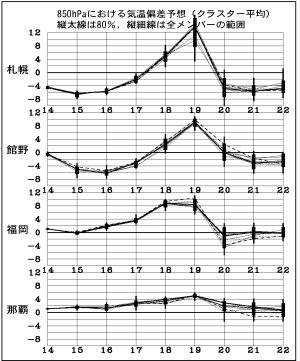
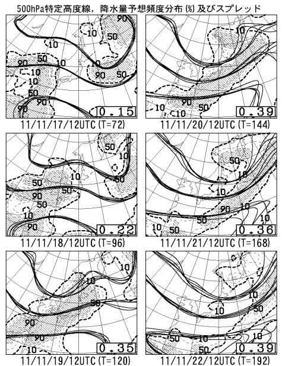
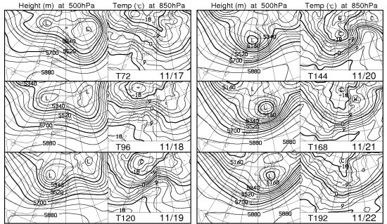

# スキー場では雪が降っているようだが

📅 投稿日時: 2011-11-16 00:29:57

🏷️ カテゴリ: [スキー天気予想](c6554f5c3c106093b511a8daae23757e8.md)

えー．本日．

かなり冷え込んでおり．

標高の高いスキー場では，雪になっているようですな．

で．

いくつかのスキー場では人工降雪機が動かせる気温まで冷え込み，

フル稼働でうごいているみたいですな．

志賀高原の[ホテル銀嶺さんのブログ](http://www.ginrei.co.jp/blog.htm)でも．

志賀高原が真っ白になった写真と，高天ヶ原のスノーマシンが動いている

状況が報告されてるし．

[かぐらのブログ](http://blog.princehotels.co.jp/ski/kagura/)でも．

人工降雪機 (かぐらのブログでは，人口降雪機って書いてあるけど…) が

フル稼働のようです．

やったー！

これで今週末は雪が積もる～！

…

…と．

喜ぶのは早いのだな．

……残念ながら．

確かに，16日くらいまでは冷えるのだ．

16日までは．

…しかし．

いつもの[高層天気図のページ](http://www.hbc.co.jp/pro-weather/)から，FZCX50を見てみると…

…

…

なんだか．

16日までは，例年より4度から6度低いけど，

この週末にかけての18，19日．

全国的に例年より10度くらい気温が上がりますな．

そして，降水域を見ると…

…19，20日．網掛けの部分が日本をすっぽり覆ってますね．

この週末．雨ですね．

…ということで．

19日土曜日は，山の上でも気温がありえないくらいあがって，

激しい雨で雪が溶けちゃいますね…

残念ながら(涙）．

せっかくの人工降雪機の雪も，跡形もなく消えちゃうかも…(泣）．

スプレッドも0.35～0.39と比較的小さい値なので，

予報は大きく外れなさそうです．

…しかし．

20日の夕方から夜にかけて，寒冷前線が通過した後は．

冬型になって冷えそう．

FXXN519の850hpaの0度線を見ると…

21日，22日は日本がすっぽり0度以下の領域に覆われているので．

そこそこ冷え込んでくれそうだなぁ…

この冷え込みに期待しましょう…
