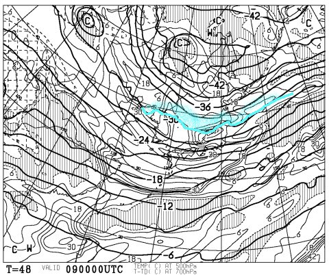
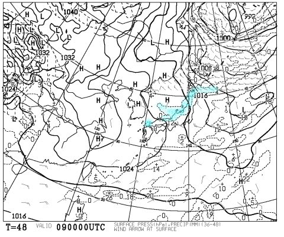
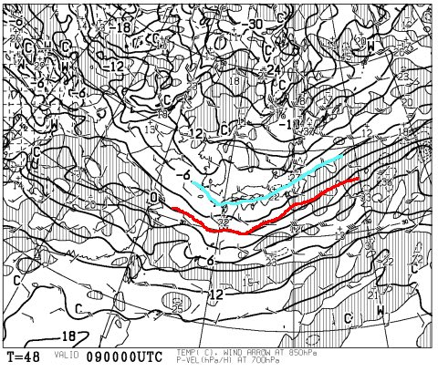
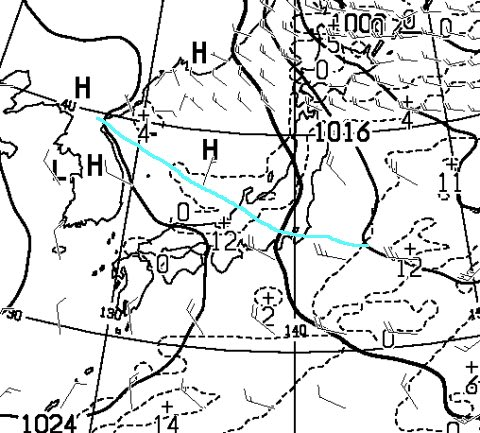
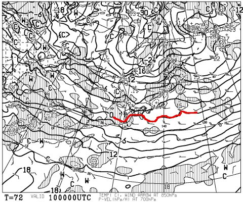
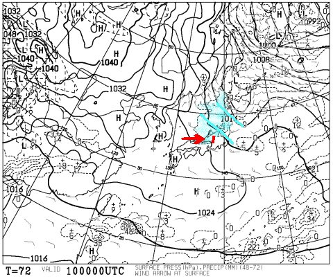
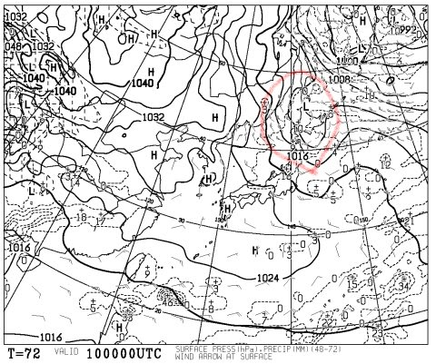
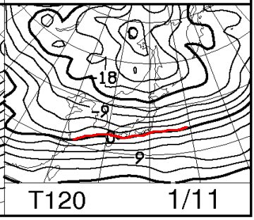
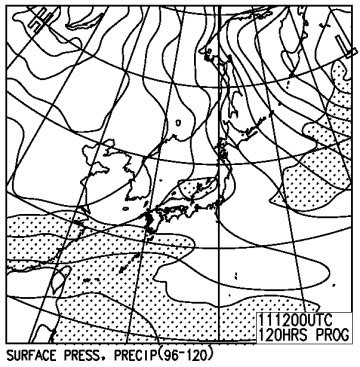

# この3連休の志賀高原の天気は…雪が舞う3日間だけど，積もるかな…？？

📅 投稿日時: 2016-01-08 00:48:43

🏷️ カテゴリ: [スキー天気予想](c6554f5c3c106093b511a8daae23757e8.md)

えー．

本日，志賀高原ではちょっと雪が降ったようですが．

[朝9時ごろの段階でわずか3cm](https://www.facebook.com/yakebitaiyama/photos/a.133097176785637.26773.116999658395389/916509378444409/?type=3&theater)．

その後も，そんなドサドサとは積もって

くれなかったようで…

一日で10cm積もったか…って感じのようですが．

[かぐらは，昼までに20cm位積もった](http://blog.princehotels.co.jp/ski/kagura/034491.php)ようで．

…うーん．やっぱり，日本海側は積もったのか…

ってことで，

一昨日の残念な予想，

木曜：そこそこ冷えて，日本海側は雪が降りそう．

　志賀はそれほど積もらない（涙）

というのが，当たってしまったようです…（残念）．

当たらなくていいのに…（泣）．

そして．

明日金曜も，引き続き海沿いに近いところでは

雪が降りそうですが．

…やっぱり志賀高原は，そんなに積もらなさそう…（泣）．

ただ．3連休初日，9日の天気図を見ると…

9日朝9時の500hpa図に，水色の線で示した-30℃線．

これは，そこそこの雪が降る目安なのですが…

こいつがすごい久しぶりに，志賀高原近辺まで下りてきてます！

で．

地上天気図は，こんな感じで，

日本海全域に水色の降水域が！

そして，赤字で描いた850hpa図の0℃線が，

日本の南まで下がっているどころか…

地上でも雪が降る目安，水色線で描いた-6℃線が，

北九州くらいまで下がってます！

…これは．

9日の朝，山陰から北九州も雪が降るかも…

ってことで．9日の朝は，志賀でも雪が積もる期待，大！

…と，言いたいところですが．

…この地上天気図．

心眼で見ると，水色の線で引いたところに，

専門的にいうところの地上シアーラインが見えて…

この線の北側なら北風，南側なら西風になっていて．

志賀がこの線の北側になれば北風で雪が積もり．

この線の南側になれば，西風でそれほど雪が降らない…

という，微妙な線が，志賀のすぐそばにいます．

だもんで．

現時点では，9日の天気は，

…運が良ければ，

志賀はシアーラインの北側になり，

朝は20cmくらいの積雪，

…運が悪ければ，シアーラインの南側になり，

数cmのわずかな積雪…

っていう，微妙な境界線にいます．

現時点で，9日の正確な積雪の予想はちと難しいです．

で．

次の日，

10日の日曜ですが．

850hpa図はこんな感じで，

赤く印した0℃線は，9日土曜より北上していて．

寒気は，9日より弱まっています…

で，地上天気図を見ると．

うーむ．

水色線で描いたように，等圧線が右下がり

トレンドなので．

風向きは，赤矢印で書いたような見事な西風パターン．

だもんで，水色で塗った降水域．

赤線の北アルプスに邪魔されて，それより東に

広がってません．

…これは，志賀高原では雪がほとんど降らず．

それどころか，晴れ間も見えるかも…

という天気になるパターンですね…

10日は，ドサドサ積雪の期待は薄いか…

ただ，この10日の地上天気図を見直すと．

赤く印したプチ低気圧が予想されてます．

この低気圧の発生位置，発達状況で，

まったく天気が変わりうるので．

…もしかすると，雪が降る可能性もゼロではなくて．

じつは，10日の天気も，正確な予想はまだ難しい段階．

…まぁ，天気図通りなら，曇り～晴れ，って感じなんですがね～．

で．3連休最終日の11日．

850hpaの-6℃線が志賀高原にかかる程度．

まぁ，激冷えってほとではなく，

この時期の志賀高原の平均的気温．

そして，地上天気図は…

まぁ，弱い冬型なので．

雪がぱらつく程度の天気でしょうか…

ただ，このままの等圧線パターンなら．

志賀高原は北風になって，それほどの冷えではなくても

意外と積雪がある可能性も！？？

ってことで．

まとめると．

土曜：朝は積雪あり．志賀への登り坂は雪道なので注意！

　おそらく，雪降りで始まる朝．

　前日からの積雪は10cm．運が良ければ20cm．

　気温は冷え冷え．終日-10℃クラス．寒いよ！！

　雪質自体は最高！…土が出てなければ．

　天気は…午前中，西風なら曇り時折晴れ間も，北風なら雪～曇り．

　どちらになるか微妙…

　どちらにしろ，午後は天気が回復していき，晴れ間も覗く．

　ゲレンデは午後に向かって，モサモサに荒れていく．

日曜：おそらく朝はそんなに積もってない．

　気温は平年並み．土曜ほど冷えない．

　でも，朝は-10℃近いので，雪質自体はいいはず．

　土やブッシュが出てなければ，朝イチは

　ピカピカ圧雪を気持ちよく飛ばせる

　最高の朝かも！

　天気は晴れ時々曇り，雪がちらつくタイミングも．

　日本海側は，ドサドサ降りそうな一日なんだけど…

月曜：まだよくわからないけど…運が良ければそこそこ

　雪が降る．運が悪ければ…チラチラ程度．

　気温はまぁまぁ冷える．朝は-10℃近い冷え．

　この日も雪質自体はよい．

　

…って感じでしょうか．

土曜と月曜．

ここでの積雪に期待なんですが…

まだ，そこそこ降ってくれるのか，チラチラで終わってしまうのか．

微妙なところ．

とりあえず．

いつものように．

これから雪が積もるように祈っておきますので．

土曜の朝に，20cm以上の積雪があったら．

それは私のおかげということでお願いします←何か勘違いしている

## 💬 コメント一覧

### 💬 コメント by (はなげ親分)
**タイトル**: 祈ります
**投稿日**: 2016-01-08 19:15:14

トップシーズンはくるのでしょうか？

新しい板はデビューできるのでしょうか？

今週末は、浮気をして遠征してきます。

再来週末の志賀高原に期待シテマス！

### 💬 コメント by (Skier_S)
**タイトル**: はなげ親分さま
**投稿日**: 2016-01-08 22:36:14

うーむ．

今週も，新しい板のデビューは微妙なところですね…

ホントに，今シーズンはデビューできないまま

終わったらどうしよう…（涙）．

再来週末，また志賀高原でお会いしましょう！

