# ファミリーキャンプとやらをやってみた，…千葉県ACフルーツ村　その5

📅 投稿日時: 2015-09-26 02:48:06

いやいやいやいや．

驚くことに．

昨日のあの写真で，どこのスキー場かドンピシャ正解

した人がいましたね～っ！！！

富良野スキー場でしばらく働いたことがある私でも，

あの写真で「富良野だ！」と正解する自信はなかったいうのに…

いや，世の中．

想像を絶するマニアはいるものだ…（感動）．

このBlogを続けていると．

自分が凡人に思えて仕方がない今日この頃．

皆様いかがお過ごしでしょうか．

…ってことで．

今日もキャンプ旅行記，続きます．

---

ってなわけで．

自然満喫度178%のカヤックツアーを終えた，

Skier_S一家でしたが．

自然を満喫したあとは．

ちょいと露天風呂のある温泉にでも行ってみますか…

と，

キャンプ場から車で5分ほどの，

ロマンの森共和国にある

「[白壁の湯](http://www.romannomori.co.jp/hotsprings/)」へ行ってみました…

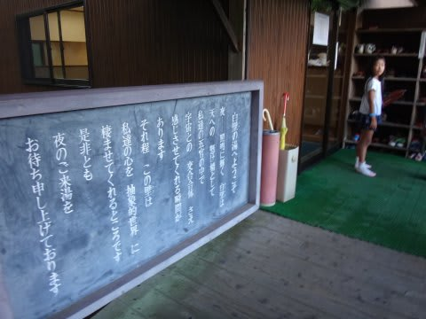

さすがに温泉の中の写真は撮れなかったですが（笑）．

露天風呂は，目隠し衝立で外が見えないような

えてしてありがちな風呂ではなく．

思いっきり外の景色が見えて，かなり開放感がある，

リアル露天風呂！

…ただ，800円と考えるとちょいと狭いかな～．

もう少し広くて安かったら，満点なんですが．

ってことで．

温泉からキャンプサイトへ帰ってくると，

もう午後5時近いじゃないですか…．

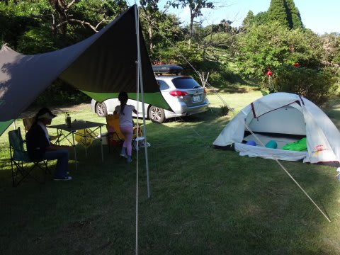

さてさて．

夕食の準備をしなくては…！

とはいえ．

今回の夕食は，何の芸もないBBQ．

もってきた材料を焼くだけなので．

準備と言えば，コンロをセットして，

炭火を起こす程度…

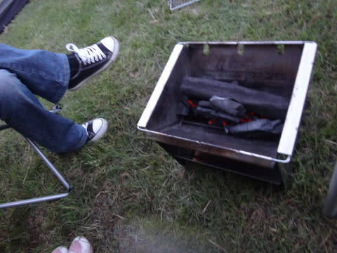

そして，炭火が起こってきたら…

我が家の定番．まず最初に…

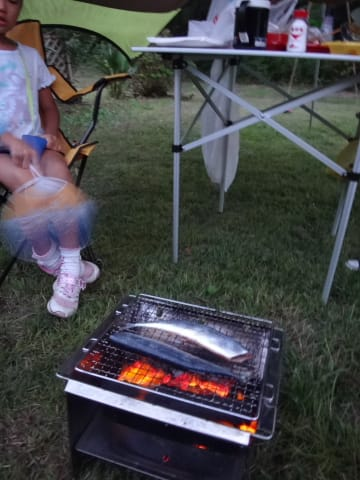

そう．サンマを投入っ！！！

いやー．

娘が大好きなので，我が家のBBQではサンマが外せないんだけど．

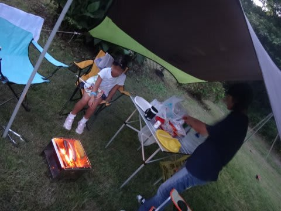

ホントに，炭火で焼いたサンマは．

もうこの上ない超美味な大ご馳走なので，

ぜひ皆さんお試しをっ！！

ガスで焼いたサンマと，全く別物．

全然味が違って，すごくおいしい！！

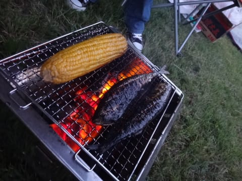

サンマ大好きな娘．

一人で，サンマ2匹食べちゃいました…

そして，サンマが終わったら．

ごく定番の肉系のBBQになっていきますが…

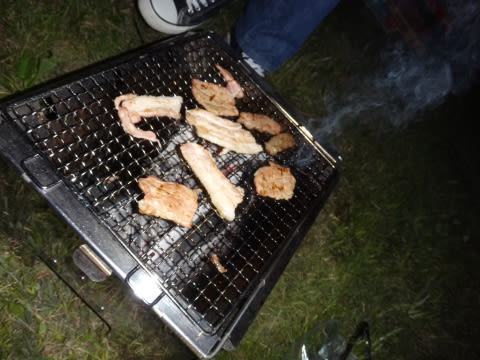

ふふふふ．

ここで，ジョルジュ・デュブッフの，マコン・ビラージュ投入！

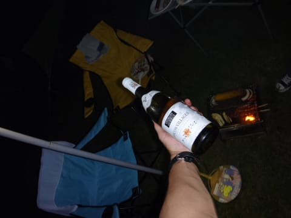

この白ワイン．

かなりコストパフォーマンスが高いな～．

完全に日が暮れた中．

ゆったりと星を見ながら，おいしいワインを飲んで，

のんびりと時間を過ごす…

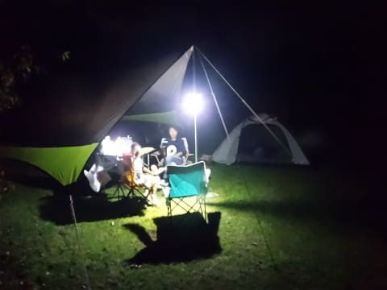

ああ．

なんてゼイタクなんでしょう…

＃ちなみに，タープの支柱にぶら下がっている照明は，

＃いつものダイビングに使うLED水中ライトに

＃スーパーの白いビニールを被せただけなんだけど…

＃キャンプ用のカンデラとかなくても，これで十分だな．

そして．

BBQが終わった後は．

デザートとして定番の，焼きマシュマロ．

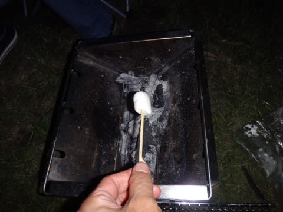

これが，うまく焼けると，

表面はパリパリ，中はトロトロ…

うむ．

初めてやってみたけど．

これは，美味いっ！

意外と，酸がしっかり出ているワインと良く合うなぁ…．

ああ…

なんてゼイタクな時間なんでしょう…

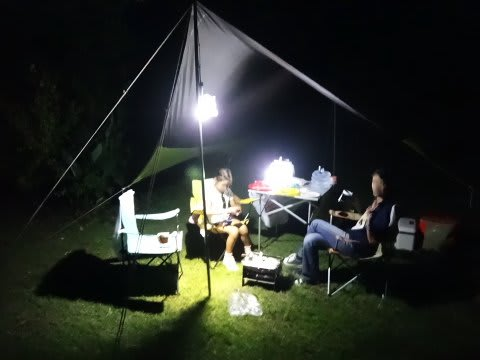

ライトを消して真っ暗にすると．

星がきれいに見えます…

ああ．

自然の中でゆったりとワインを飲んで星を眺める．

これは…ゼイタクだ．

ゼイタクだよっ！！！

＃キャンプ場は真っ暗で，見事に新月に当たったんだけど．

＃木更津方面からの明光が入り，フィリピンみたいに

＃天の川までくっきり見える星空でなかったのがちと

＃残念ではあったけど…

娘も星を見つつ，次から次へとマシュマロを焼いて

楽しんでます．

そうやって，楽しい時間を過ごしていると，あっという間に

夜9時が近づいてきて．

…娘はもう，寝る時間．

「テント，テント．テントで寝るの～！！」

という感じで．

おなか一杯になって，星空も満喫した娘．

テントに入って，シュラフにくるまって嬉しそうに

眠りについたのでした…

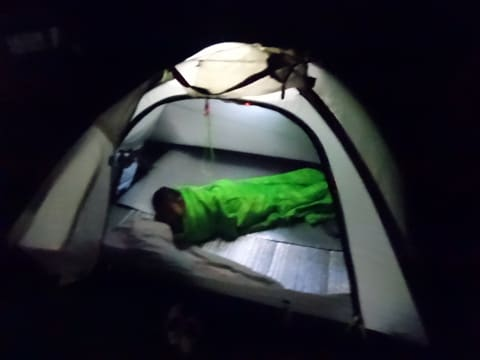

残された夫婦2人で．

それからしばらく，星空を眺めつつお酒を楽しむという，

大人タイムを過ごしましたが．

ガラガラだったキャンプ場．

周りのサイトも静まり返り．

静かな落ち着いた雰囲気の夜を過ごせて．

うむ．

娘にお願いされたので，しようがないなぁ，って感じで

やってきたキャンプだったけど．

実は，両親が一番，このゼイタクな時間を

楽しんでいるのかもしれないなぁ…

娘よ．

キャンプに誘ってくれて，ありがとう…

## 💬 コメント一覧

### 💬 コメント by (piyo@太田市)
**タイトル**: Unknown
**投稿日**: 2015-09-28 09:03:52

ん？

てかｓさんシルバーウィーク北海道に行って来たんですか？？

### 💬 コメント by (Skier_S)
**タイトル**: piyoさま
**投稿日**: 2015-09-29 00:43:30

はい…

行ってきました，北海道4泊5日．

スキー場は，富良野，中山峠，ルスツ，ニセコを

見てきました…（笑）

### 💬 コメント by (piyo@339)
**タイトル**: Unknown
**投稿日**: 2015-09-29 08:58:08

シーズンインまでの短い期間に北海道レポート頑張って入れ込んで下さい(^_^;)

### 💬 コメント by (マニア改めoga)
**タイトル**: Unknown
**投稿日**: 2015-09-29 12:48:44

昨シーズン、富良野6日、中山2日、ルスツ3日、ニセコ17日、ルスツ→ニセコ1日、滑っているので、どこの写真でも答えられたかと思います(笑)。

### 💬 コメント by (Skier_S)
**タイトル**: 北海道レポートは…やらないかな？
**投稿日**: 2015-09-30 01:54:20

＞piyoさま

うーーむ．

あんまり北海道は，創作意欲を掻き立てる

旅行ではなかったので…

レポートしないかと思います（^^;

もしかしたら，写真集みたいな1記事だけ

書くかもしれませんが…（笑）．

ホントに，書くことがあんまりなかったので…

>ogaさま

北海道在住ですか？

そうでなくてこの日数だと，すごいかと…

しかし，冬のスキー場に行っていても，

なかなか夏の写真では分からないかと…

北の峰は，もしかしたらわかる人はわかるかな～，

と思っていたけど．

DH第3を正解したのは驚きです．

富良野スキー場目の前で数か月間

働いていた私も分からなかったのに（笑）．

