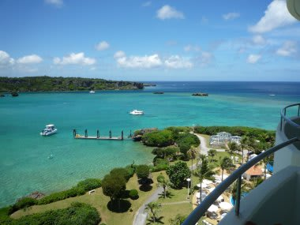
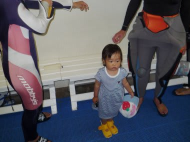
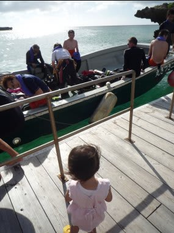
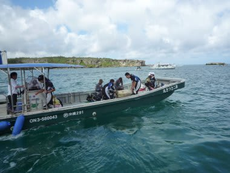
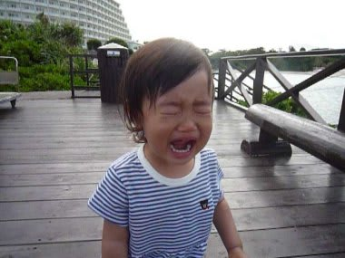

# 初の子連れダイビング旅行記＠2009年　その3　母親から離してみたら

📅 投稿日時: 2012-07-14 00:11:44

🏷️ カテゴリ: [ダイビング日記](ce3a7a8d424d112fce83ee85c81a0e344.md)

2日目の朝．

娘の「起きて～」攻撃で目が覚めます．

うーむ．今日も良い天気じゃのう．

今日はダイビング初日．

今後，無事に子連れダイビングができるのかどうか．

将来の運命がかかった，重大な一日です．

まずは優雅にモーニングビュッフェで朝食．

朝食もビュッフェ形式でとり放題なので，娘が食べられるフルーツ

やシリアルなどを食べさせることができ，

「子供が食べるものがあるのか？」という心配は，まず問題なし．

んで，朝食後はホテル内のダイビングショップへ．

1本目は，私が娘の面倒を見て，妻がダイビングへ向かうことに

なってます．

とりあえず，母親と離れたことのない娘．

母親が娘を置いて潜りに行って，果たして大丈夫か？

…という．

チャレンジの1本目．

コンプレッサーやら機材やらが大量におかれている一角で，

母親が訳のわからない服（ウェットスーツ）を着だして，

ちょっとびっくりしているわが娘．

その後，準備が終わった母親と一緒に桟橋へ向かい，船に乗り込む

母親たちを見送ります．

出航していく船から，「いってきまーす」と娘に元気に手を振る妻．

…子供を置いていくという心配はこれっぽっちもしてないようです．

というより，3年ぶりのダイビングでわくわくしているのが

よくわかる…

娘も船に向かって元気に「ばいばーい」とやってます．

母親においてかれたって心配はしてないようだな．

良かった…

と，しばらく船を見送って．

船が見えなくなったころ．

娘がぽつんと

「行っちゃった…」

とつぶやきました．

そして．

…いきなり．

いきなりギャン泣き！

「ママー，ママーっ！！」

うおおおお．

いきなりどうしたというのだっ！

さっきまで元気でバイバイしてたじゃないかっ！

…母親に置いていかれたのがショックだったのか？？？

このまま．

母親が戻ってくるまで1時間以上，ずーっと

泣き続けるのか！！？

(続く)
