# 2017年8月，小学生の子連れで座間味でダイビングその8…ダイビング初日，終了

📅 投稿日時: 2018-07-05 00:50:36

ということで．

…7月のこの時期まで，部屋にスキーウェアが

ぶら下がっているという，かなり季節感を

失わせる我が家でしたが．

先週，ようやくスキーウェアやら板やらの

道具を片づけ，家の中も夏モードになった

Skier_Sです．

…しかし，10月が近づくと，またスキー板の

ワクシングを始めたりするので．

家の中の夏モードも，わずか3か月で終わり

ですが…

ってなわけで．

夏モードのこのBlog.

今日も座間味旅行記です～！

---

ということで．

初日のラストダイブを終えて…

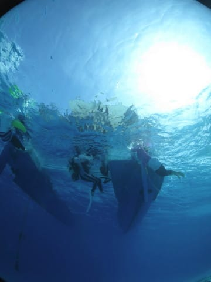

ボートの上に上がると．

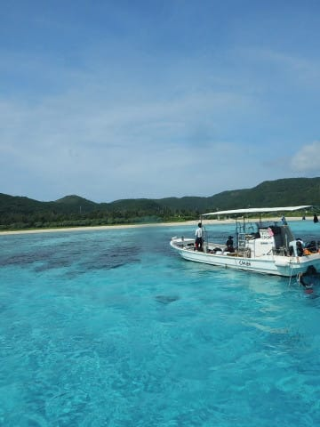

…今日は一日遊び疲れたのか．

子供たちはボートの上でお休み中でした…

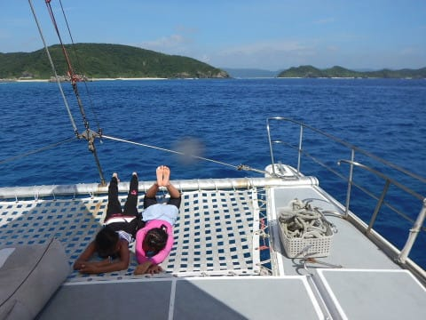

ってな感じで．

本日のダイビングは2本で終了なので，

これで港へ戻ります…

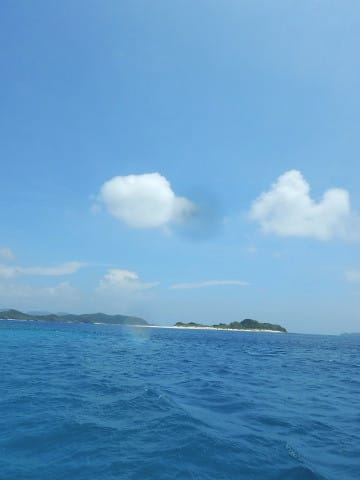

って言っても．

ポイントから港へは10分ほど．

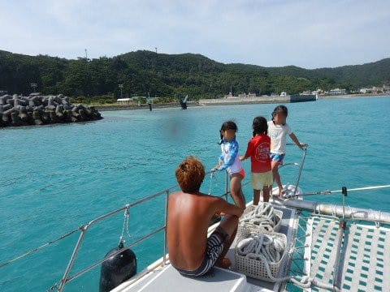

港へ到着したら…

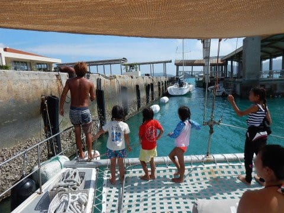

宿まで歩いて2分ほど．

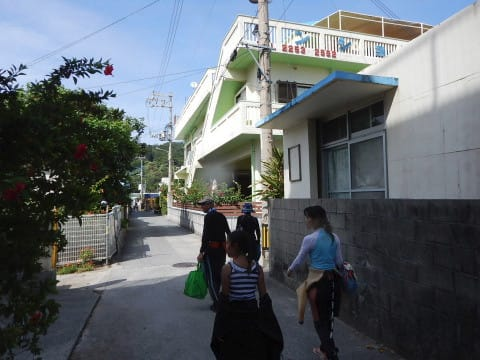

明日もダイビングなので．

器材は船に置きっぱなしですが．

星砂さんの玄関横に，機材洗い場があるので…

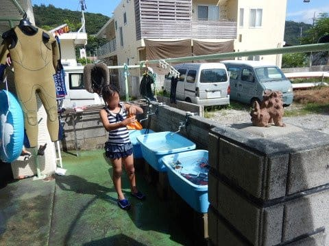

持ち帰ってきた，ウェットスーツと

カメラを洗って．

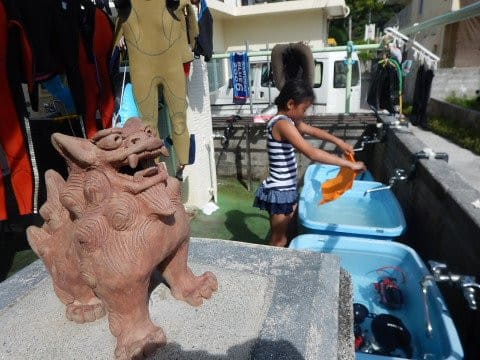

そして．星砂さんには，こんな感じで，

シャワーブースが3個並んでるので．

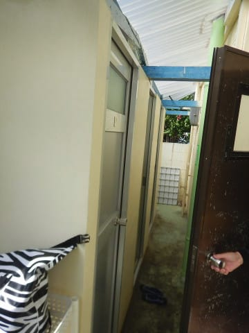

このシャワースペースで

塩を流してすっきりします…

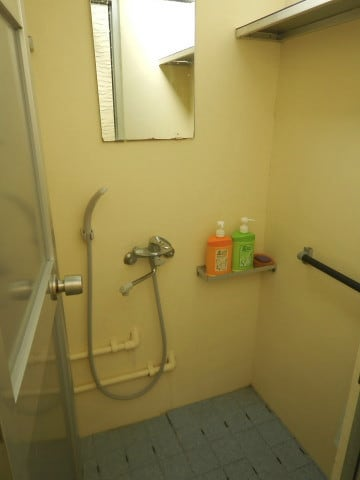

その後，夕食まで1時間ほどあるので．

ちょっと座間味の町中をお散歩しますが…

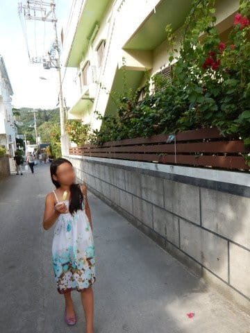

うーむ．

お散歩の目的地だった，

[娘のお気に入りのマンゴーかき氷のお店](ec796d3aa6dae79972bc14595c2bc5a1d.md)．

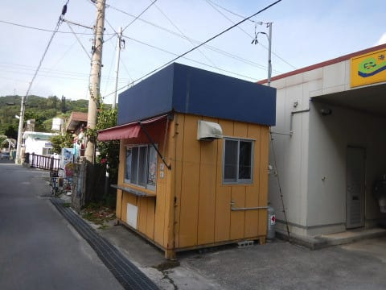

昨年一瞬復活したけど．

今年はまた営業してないみたいですね…（涙）

残念…

だもんで．

宿のそばの公園でちょっと遊んだら…

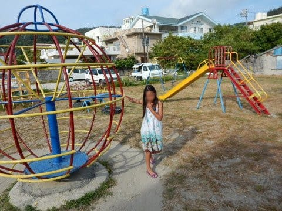

午後6時の夕食タイム！

沖縄の夏は，夜6時だとまだかなり明るいので．

なんだか夕食って感じじゃないですが…

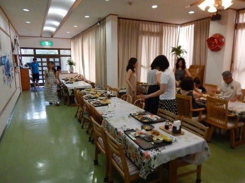

そして，いつも楽しみの星砂さんの夕食．

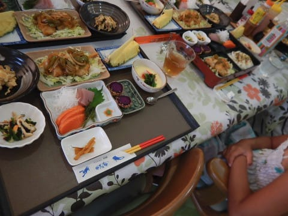

今日もおいしそう～！

宿代を考えると，かなりコストパフォーマンス

高いです…これ．

ってな感じで．

夕食をたらふく食べて．

ダイビングの写真を見つつ，ログづけをした後は．

夜9時過ぎには布団に入ってダウンという．

子供のような健康な時間に寝たのでした…

いやー．

しかし．

台風の吹き返しも収まって，海も穏やかで．

天気も良かったし．

いい一日だったなぁ～！！
