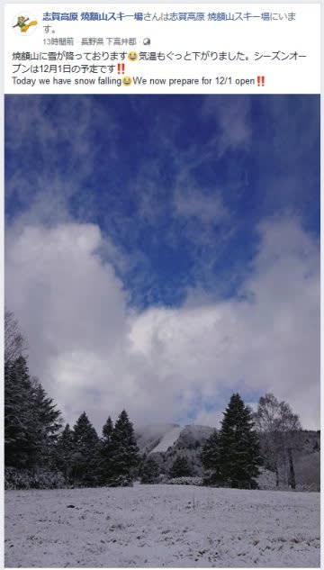
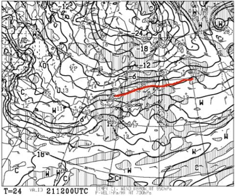
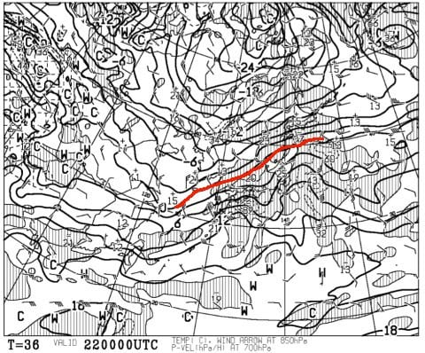
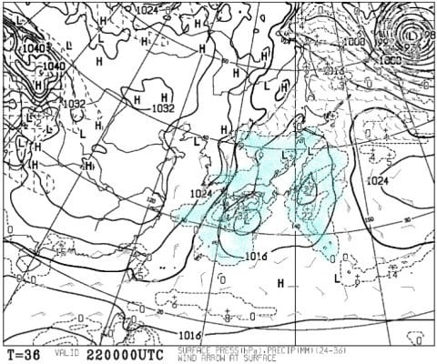
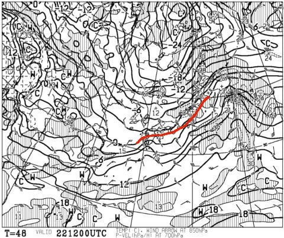
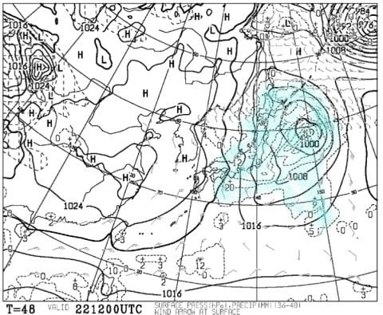
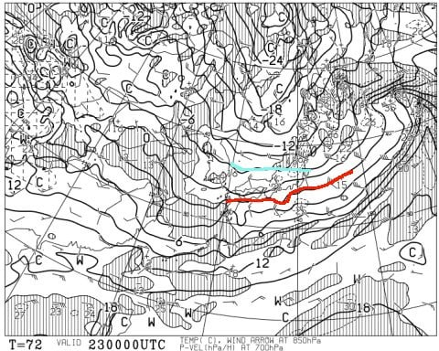
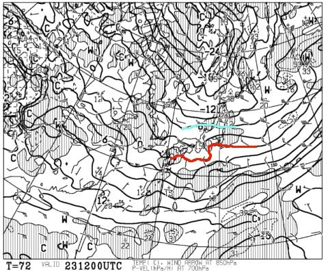
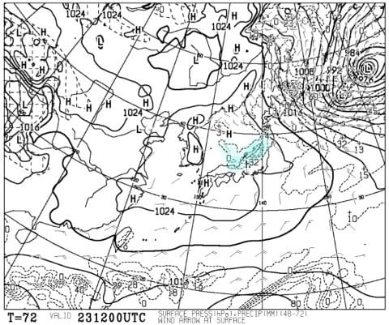

# この3連休までに雪は積もるのか？スキー場はオープンできるのか？天気図を読み解いてみた

📅 投稿日時: 2018-11-21 03:28:52

ということで．

わがホームゲレンデ，焼額も．

月曜夜～火曜朝の冷え込みで，わずかに

積雪があったようですが…

（[焼額山FB](https://www.facebook.com/yakebitaiyama/posts/1919477861480884)より）

ってなことで．

今，スキーヤーの関心の関心のすべては．

この週末の3連休までにもっと雪が積もって，

無事スキーができるのかどうか…？？？

…というところに集中していると思う今日この頃．

ってなわけなので．

今シーズン初の，スキー天気予想，行ってみよう！

さて．

まず，21日水曜の850hpa気温図ですが…

赤く塗った0℃線は，東北地方．

信州・新潟は+3℃線が掛かっているので．

うーむ．

21日水曜の昼間は，気温はプラス（泣）．

人工降雪機が動かせなさそう…（涙）

そして，22日木曜ですが．

朝9時の850hpa気温図は…

うーむ．赤く塗った0℃線はまだ東北地方．

志賀高原は+3℃線が近づいているレベルなので．

21日夜から22日朝にかけて，人工降雪機が

動かせない可能性が大です（泣）．

せめてもの救いは．

22日朝9時の地上天気図では，水色に塗った降水域が

志賀や新潟にかかっていないので．

雨にはならなさそうってことですね…

しかーーーし．

しかし．

木曜の夜9時の850hpa気温を見ると．

うむ？？赤い0℃線は信州より南に下がってます！

そして．地上天気図は…

うむ！見事に降水域がかかっているので．

雪です！

やっぱり22日木曜の午後は，雪が降りますっ！！

おそらく，降り始めは雨っぽいけど．

昼過ぎから雪になり，夜にかけて積もりそうですっ！！

で．

3連休初日，23日の金曜朝9時の850hpa気温は…

うおおおお！

0度線がかなり南に行っているどころか．

志賀高原に，水色に塗った-6℃線が近づいて

いるレベルです！

これは，志賀高原は朝は-10℃レベルの冷え込みですね．

夜9時になっても…

水色の-6℃線が近いレベルが続いているので．

23日の志賀高原は，昼間も-5℃程度の気合いの

入った冷え込み！！

23日は冷え冷え！

人工降雪機がガンガン動かせます！

で．22日夜9時～23日夜9時までの予想降水は．

うむ．見事な日本海側への吹き出しの雲が

かかっている，いかにも雪が降りそうなパターンですね…

新潟近辺には32という数字が見えるので．

24時間での降水量は32mm…積雪なら，32cmですね！！

22日の夜から23日夜にかけて，

新潟は30cm前後の積雪が期待できそう…！

…が．

見事な西風なので．

西風だと雪が積もらない志賀高原．

あんまり積もらなさそう…

運が悪いと10cm．

運が良ければ30cm行くかな…

ってな感じなので．

まとめると．

21日水曜　気温が高く人工降雪機動かせず．降水は無し．

22日木曜　朝は気温がプラス．21日からこの日の昼まで

　人工降雪機は動かせず．

　昼ごろに雨⇒午後に雪に変わり，ガンガン積もり出す．

　新潟は一晩中降り続きそうだけど…志賀は夜中に西風になり

　雪は止むかな

23日金曜　冷える．志賀は朝は-10℃近くに冷え込むか？

　新潟は朝まで雪が残るけど，志賀は晴れの朝．

　昼間も冷えるので，木曜昼からひたすら人工降雪機

　フル稼働可能！

24日土曜　この日も金曜ほどでないけど冷え込みは続く．

　信州は昼間も人工降雪機が動かせるレベル．

　新潟は雪がちらつくかもしれないけど．

　信州では雪は降らなさそうなので，人工降雪機頼み…

という感じですか…

22日昼過ぎから23日にかけて，

人工降雪機はフル稼働できるのだ！

あとは，22日の夜の天然雪がどのくらい積もるのか…

積雪が30cmほどありそうなかぐらは23日オープンかも？？

アサマ2000，熊の湯は…積雪10cmほどだろうから．

23日のオープンは厳しいか…

23日にガンガン人工降雪で雪を着けて，

24日からオープンしてくれるんじゃないかな…？？

とりあえず．

23日のオープンは，22日夜の積雪がどのくらいかに

かかっています！

運が良ければ，ガンガン積もって23日にオープン

するはず…っ！！

ということですので．

皆様におかれましては．

これから3連休にかけて．

日ごろの行いに気を付けていただきますよう，

お願い申し上げます…

## 💬 コメント一覧

### 💬 コメント by (まいる)
**タイトル**: やっと雪が
**投稿日**: 2018-11-21 12:09:47

Sさん、お疲れ様です

やっと、スキー場に雪が降って来るようですね

そろそろタイヤも履き替えなくてはなりません

そーそー、やっと車が納車されました。

BRより大きくなりましたけど、乗り心地、静粛性共に良いです。

### 💬 コメント by (Goku)
**タイトル**: あすの雪に期待！
**投稿日**: 2018-11-21 19:00:13

天然雪と降雪機の活躍で、きょう熊の湯はピステンが入ったようです。

入ったってことはそれなりに厚みができたということでしょうから、あすの天然雪があればオープン間違いなし？？？

### 💬 コメント by (はっち)
**タイトル**: 今週末の予定は…
**投稿日**: 2018-11-21 22:05:25

八方、野沢、栂池が早くも23日からの営業を断念する中、熊の湯だけが頑張ってくれているので、自然雪にも頑張ってもらいたいですね。

金曜は普通に仕事で、オープンしても激混みの予感なので、自分の本格的シーズンインはヤケビオープンぐらいからかな？

### 💬 コメント by (Skier_S)
**タイトル**: この3連休は，スキーに行くのは一日だけかな…
**投稿日**: 2018-11-22 02:28:33

＞まいるさま

納車おめでとうございます！

納車されたらすぐにスタッドレス交換ですか．

ノーマルタイヤほぼ新品のまま保管ですね(笑)．

しかし，やっとスキー場が白くなってきましたね～！

でも，積雪がまだまだ足りません…（涙）

＞Gokuさま

ピステンが入ってますね…確かに．

そんなに積雪があるように見えないんですが…

明日から23日にかけて，ドサドサ降るように

祈りましょう…

そして，踊りましょう！

＞はっちさま

この3連休，2日間滑る予定が一日だけになりそうです…

やっぱりアサマ2000がオープンしてくれないと．

しかし，気が付くとヤケビオープンも来週末．

本格シーズンインももうすぐに迫ってますね！

