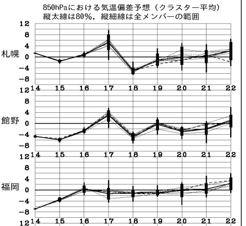
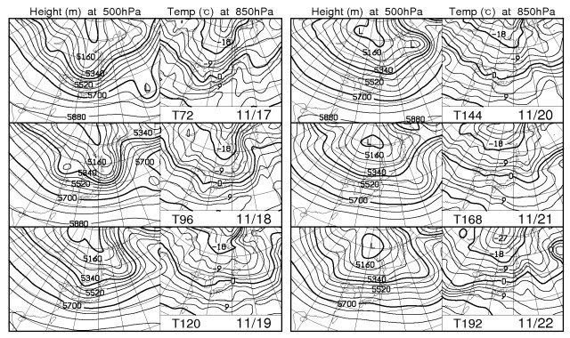

# スキーヤー向け今週末の天気…これから雪は積もるのか？

📅 投稿日時: 2012-11-16 00:58:57

あー．

さてさて．

今からちょうど一週間前ですか．

前回の[天気予想](ee101159aa3dffcfbe0134995f86caf0f.md)で

「14，15はむちゃくちゃ冷えるよ！　かなり積もるよ！」

と予告したとおり．

[志賀一の瀬](http://blog.goo.ne.jp/ginrei1/e/9213ce785ef6f5899889b0535237489c)も，

[熊の湯](http://ameblo.jp/kumakumanoyu/entry-11404255153.html)も

[かぐら](http://blog.princehotels.co.jp/ski/kagura/025772.php)も

[丸沼](http://www.facebook.com/photo.php?fbid=430584697003459&set=a.171383089590289.42386.171382162923715&type=1)も

[鹿沢](http://blog.livedoor.jp/kazawablog/archives/55547887.html)も

そのほか，いろんなスキー場が真っ白になってますね～．

鹿沢は，17日オープンが確定しましたね．

熊の湯は…微妙なようです．金曜の様子を見て判断するようですが．

それで，だ．

今週末の天気ですが．

…土曜は．

寒冷前線通過までは気温がかなり上昇しますね～．

長野県は午後3時ごろに前線通過でしょうか（もう少し遅いかも…今後の状況で変化）．

前線通過前は雨がかなりの勢いで降り始め．

雪をかなりの勢いで消滅させそうですが…

短時間の雨の後，雪に変わります．

うーん．雨がそれほどひどくならないうちに早くに雪に変わって，

積雪量が増える方向に行ってくれればいいんですが…

とりあえず，雪に変わってから，夜の間は降り続けるかな．

どっちにしろ，土曜は荒れ模様の天気．

風も強いでしょう．

日曜は…

冬型が入り，新潟，長野では雪が降り続けるかな．

長野の内陸部でも積もってくれるとうれしいんですけどね～．

この日は，降れば雪です．

ご安心を．

日曜に，鹿沢方面に行く人は，スタッドレス履いていったほうが

いいかも．

あー．日曜のYetiは天気が回復傾向．

もしかすると，午前中はにわか雨がぱらぱら残るかもしれませんが…

ということで．

この週末．

土曜の雨が微妙ですが．

運がよければ，前線通過後に積もるはずなので，

それを祈りましょう…

さてさて．

で．

週末以降．

来週は，雪が積もってくれるのか？？

3連休で，ちゃんとアサマ2000やかぐらはオープンするのか？？？

…ってところが，スキーヤーとしては気になるところ．

では，見てみましょう！

…

…

えー．

…

これは．

19日月曜からは，来週の木曜まで．

気温は平年並み．特別に冷える日も，あったまる日もないですね．

で．

山で雪になる目安の，850hpaの0度線は…

19～22日は，東北地方あたり．

うーん．もう少し南まで降りてきてほしいところ．

20日に，ぎりぎり信州まで降りてきてるけど…

うーむ．

さらに．来週は，ほとんど降水量がなさそう…

まぁ，20日に日本海側，海沿いのみ雪が降るかな～．

となると．

人工降雪が頼りの綱なのだが．

…この時期，平年並みの気温，となると．

志賀高原とか，よっぽど標高が高いところ以外．

昼間，人工降雪を打つのはつらい気温ですね～．

人工雪を打てるのは，夜だけ．

…

…

…

現時点で．

3連休に過大な期待を寄せない方がよさそう…

＃ただし，逆に言えば壊滅的な雨とか高温もないので，その点は安心かも
