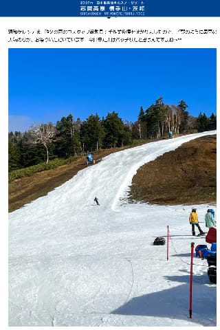

# 横手山，昨日の雨でもゲレンデの雪が無事残ったみたい

📅 投稿日時: 2022-11-15 00:49:35

🏷️ カテゴリ: [日記](cc4b5682fb7b8b144980957a978653fb0.md)

…本日．

朝早くに家を出て．

朝9時から某出張先についたら，そのまま

拉致されて．

食事する間もなく，最後の打ち合わせが

終わって解放されたのは夜10時前…

13時間，水コップ一杯分以外何も口にできず，

最後の方には空腹と疲れでヘロヘロになりながら

会議して，ホテルに戻ったのは夜11時過ぎ（涙）

とりあえず．

今日はもう寝る…

眠い．

でも．

これだけは書いておきたい．

昨日の夜のかなりの雨にも関わらず．

横手山のゲレンデ，無事雪がもったようで，

営業中止にならず，今日もオープン

しているようです…！

というか．

穴が開いてボロボロのゲレンデを

なんとかオープンしているのかと

思いきや．

予想以上にきれいなバーンですね！！

（[横手山スキー場ホームページ](https://yokoteyama2307.com/news/18762/)より)

すごい．

昨日の雨でもこれだけの雪が残るとは…

かなり硬めのしっかりした下地が作って

あって．

さらにスタッフがかなり人力でコース整備

したのかな…

この雨でもゲレンデを維持した横手山，

すごい！！！

…でも．

やっぱり営業はぎりぎりみたいで．

今後数日は，昼間の営業中も人工降雪機を

動かすと案内されてます…

ただ，14日の夜から16日にかけては

人工降雪機がずっと動かせそうな気温が

続くので，ゲレンデは回復するんじゃ

ないかな～…

さて．

熊の湯は今日から人工雪を打ち始めるようで．

残る5日でゲレンデを作るのは厳しいと

思うんだけど…19日の営業が間に合うのか？

ってなことで．

明日も朝早いので．

今日は早く寝ます…

おやすみなさい
