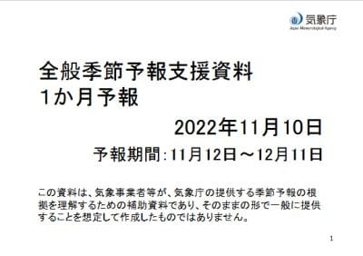
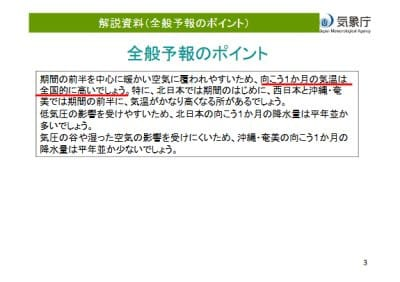
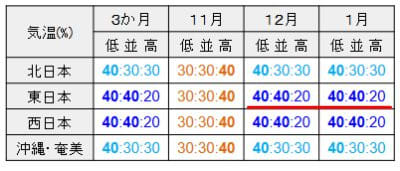
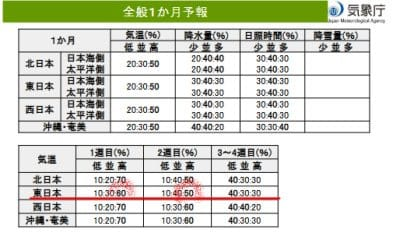
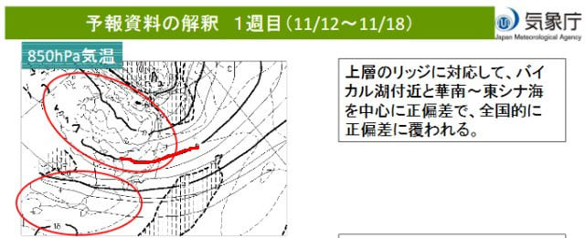
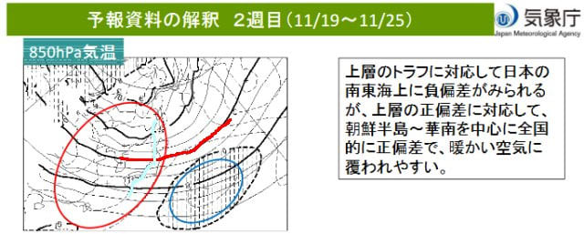
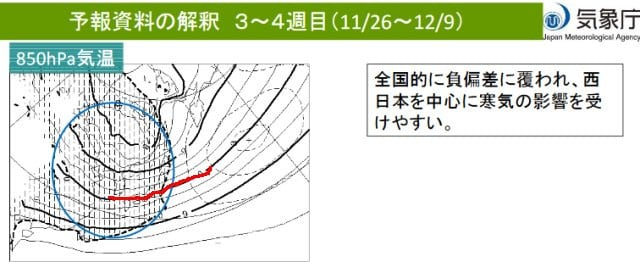

# 11月の一か月予想を見てみると…なに？？11月25日まではかなりの高温になるの…？(涙）

📅 投稿日時: 2022-11-12 00:51:51

🏷️ カテゴリ: [日記](cc4b5682fb7b8b144980957a978653fb0.md)

ってなことで．

仕事が終わったらこんな時間なのに．

明日朝5時に起きてイエティに行こう

というのは…大丈夫なんだろうか？

なのに．

さらにBlogの記事を書くという

この無謀さ…

自分でも，

Blogを書いてる暇があったら早く寝ろよ

と思う今日この頃．

皆様いかがお過ごしでしょうか（時候の挨拶）

というわけで．

昨日，気象庁が毎週木曜に発表する，

1か月予報が出たわけですが…

この予想を見ると…

11月の気温，全国的に高いでしょうって

なってます…！（ちょい涙）

まぁ，確かに．

1[0月25日に発表された3か月予報](e81250b968d06462f1cb9577261b284e9.md)でも，

11月は気温が高めって予想されてましたから…

11月は気温が高い確率が40％と，

気温が高くなりそうではあったんですよね…

（↓10月25日の3か月予報の気温予想）

さて．

どのくらい高くなりそうなのかな？？

と，見てみると．

…へ？？？

11/12～18日の第1週は気温が高い確率60％？？

11/19～25日の第2週でも気温が高い確率50％？

…これ，25日までほぼ冷えることは

なさそうってことじゃないですか…っ！！

と驚いて，詳細を見てみると…

11/12～18日の第1週の850hpa気温図は．

赤い0℃線が青森のあたりまで上がって

るし．

日本は全国的に，平年より気温が低い

網掛けエリアには入ってません（涙）

全国的に正偏差ということで．

週間予報を見ると15，16日の2日は

冷えるけど．

それ以外は気温がちょいと高めの

日が続きそう…

で．

11/19～25日の第2週の850hpa気温図を

見ると．

…これはひどい（泣）

この時期になっても，赤い0℃線は

東北地方近辺を漂ってるし．

さらには，平年比+2度の水色線が

志賀高原付近にかかってるので…

これ，この時期の積雪は期待できない

どころか．

人工降雪機も動かせないかも！？？

ヤバい．

このままだと，熊の湯の19日オープンは

危険かも…！？？？

そして，26日オープンの鹿沢や丸沼も

大丈夫か心配（涙）

ただ．

せめてもの救いは．

12月に入ると冷える

という3か月予想はずれてないのか．

12月上旬にかかる第3，4週，

11/26-12/9の期間は，平年より気温が

低いことを示す網掛けに日本がすっぽり

覆われてるし．

赤い0℃線は志賀高原より南，

…というより，本州の太平洋岸に

近いところまで下がっているのだ！！

…これなら．

焼額を初めとする，12月第1週オープンの

スキー場は大丈夫そうだよな…

ってなことで．

12月は安心できそうだけど，

11月下旬，25日ごろまで気温が高そうなので．

昨日も書いたけど，

11月下旬のスキー場オープンは，

ヤバいところも出てくる，スキーヤー殺し

の天気になるかも…

とりあえず．

今できるのは．

寒気の歌を歌いつつ，冷え冷え踊りを

踊り続けるくらいなので．

11月下旬に滑りに行こうと思っている

皆様におかれましては，

歌って踊り続けることをおススメして

おきます…

ってなことで．

明日はまたイエティで滑ってます～！
