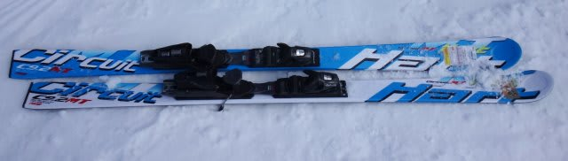
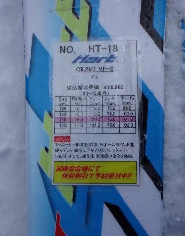

# 2015シーズンモデルのスキー試乗レポート19…HART編その２

📅 投稿日時: 2014-05-16 22:49:25

えー．

この週末は，土曜日帰りということで．

明日，かぐらへ出没します．

土曜の天気は…

まぁ，朝のうち雲は多そうですが．

リフトスタートまでには雨は上がっているはず．

うーむ．

雨上がりなので，それほどバーンは固くならないかな．

で，午前中のうちに，日が射し始めるはず…

んでも，風もあるので．ちと寒めに感じるかも．

ってわけで．

あと5時間で出発です～．

＃志賀に行く時より，ちょっと遅めの出発でいいのが救い…

ということで．

今日は試乗レポート，1機種だけ．

ハート編です．

どうぞ～

---

HART C9.2MT 168cm

基礎大回り用．

長さは168cmと短いですが，かなりサイドカーブはゆるく，

板なりに滑るとかなり縦めのロングターンで落ちていける

板です．

コアが固く，フレックスはネットリしたウェットな感じではなく，

ドライな感じ．

返りもドライで，たまった圧がビヨーンと返ってくる

板ではありません．

しっかり突っ張るような固い板で，迎え角を作っていくと

旋回力を発生していきます．

乗り手が操作して，迎え角を作っていけば，ミドル～小回りまで

いけるけど，エッジに乗っていけば板がたわんで

オートマチックに回る感じではないですね～．

自分で板の迎え角を作って，板が回るポジションを作っていく

板だと感じました．

かなりドライでフレックスが固いところといい，

サイドカーブは全然違うけど，履いた感触が

今シーズンのOGASAKA　TC-SGに近いかな～．
