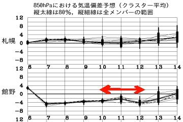
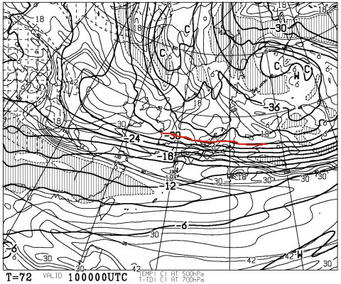
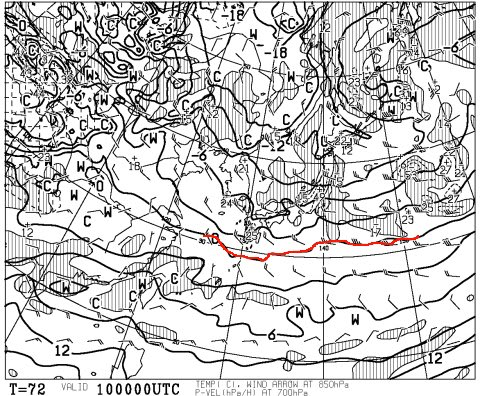
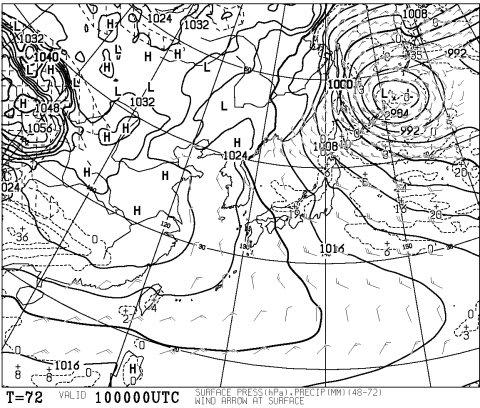
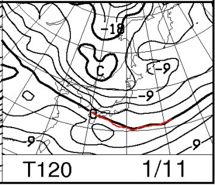
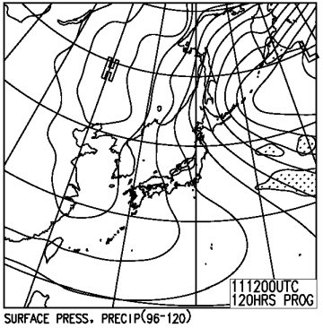
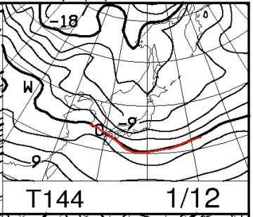
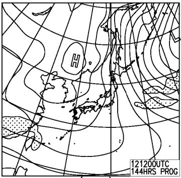

# この週末，1月3連休の志賀高原の天気は…？？

📅 投稿日時: 2015-01-08 00:15:14

🏷️ カテゴリ: [スキー天気予想](c6554f5c3c106093b511a8daae23757e8.md)

ということで．

正月休みが終わったばかりというのに．

今週末は，また3連休なわけで．

…当然，スキーヤーとしては，この週末の天気が気になるところ．

とりあえず，いつもの天気予想，行ってみますか～！

＃私はスキーに行けるか微妙だけど…

では，天気図を見てみましょうか～…

ふむ．

この3連休は，平年より数度気温が低い日が

続きそうで．

異常にあったまったり，冷えたりということは

なさそうな3日間だな．

3連休初日の10日の朝の天気図ですが…

ふむ．

500hpa図では，志賀高原まで，そこそこの雪の目安である

-30度の寒気が下りてきているし…

850hpa図では，0℃線ははるか南で，-6度線が志賀高原にかかっているので．

大体，朝は-10℃くらいかな．

そして，地上天気図は…

をを．見事な縦縞ですな．

なので．

10日の朝は，そこそこの新雪が積もってますね！

ディープパウダーってほどじゃないと思いますが．

20cm，うまくいけば30cmくらい積もってくれてるかな～

まぁ，天気図は縦じまで．

天気図に現れないプチ低気圧が信州上空を通過しそうなので．

終日曇ったり雪が舞ったり，って一日でしょう．

んで，

翌11日は，というと，ですね．

この日も，850hpaの0℃線ははるか南，

志賀高原は-6℃線がかかっているので．

まぁ，気温自体は10日と同じ程度．

朝はマイナス10℃クラスに冷え込みますね～．

そして，この日の地上天気図は…

ふーむ．

この日も，見事な縦縞ですね．

ってことで．

大体この日も，10日と同じような気温・天気かな…

そして3連休最終日，12日は…

ふむ．

850hpa図では，志賀高原はマイナス9℃線がかかってるので．

11日よりちょっと冷え込むかも…

で，地上天気図は．

11日のコピーかと思うほど，同じような縦縞ですね…

なので．

この日も，曇ったり雪が降ったりの一日で．

太陽は拝めないかな～．

なんだか．

3日とも，全く同じような，曇り～雪の天気になりそう…

ってことで．

まとめると．

10日：朝は20～30cmの新雪．ブーツパフ，運が良ければひざ下パフ．

　　圧雪コースは柔らかい圧雪の上に，数cm新雪が積もったかんじかな．

　　太陽は射さず，雪が降ったりやんだり．時折強く降る．

　　曇って視界も悪く，午後は新雪が蹴散らされ

　　コースが荒れていく．

　　気温は平年よりわずかに低いくらい．朝は-10℃，昼でも-5℃程度．

11日：朝はうっすら新雪が積もっているかな…現時点では，そんなに

　　深い新雪にはならないような感じ．

　　この日も基本は曇りで，雪が降ったりやんだり．

　　…風がもう少し西側に回れば，日が射すタイミングもあるかも…

　　雪は柔らかいので，午後はやっぱりゲレンデはあれていく．

12日：この日も朝はそこそこの新雪が積もってます．10～20cm程度かな．

　　やっぱりこの日も，基本的に曇りで，雪が降ったりやんだり．

　　風向きによっては，昼間もそこそこ雪が降り続けるので，

　　午後はこの日も凸凹したゲレンデになりそう…

うーむ．

正月休みのように，

雪がガンガン積もったパフパフパウダーか，

きれいな圧雪のすっきり晴れか…

という，はっきりした感じではなく．

中途半端に雪が降り続け，朝イチはピカピカ圧雪ではなく．

かといって，パフパフパウダーではなく．

曇りで視界は悪め…

という．

ちょっと残念な中途半端な感じの天気になりそうだけど．

まぁ，気温は冷えて雪質は良いだろうから．

標準的なトップシーズンの日々になりそうかな…

また，直前に詳細予想します．

＃そして，妻の回復は思ったより早い感じだし．

＃私も今週末，滑りに行けるといいなぁ…

## 💬 コメント一覧

### 💬 コメント by (フナ)
**タイトル**: Unknown
**投稿日**: 2015-01-08 19:11:50

年末年始あれだけ滑りながら読みごたえあるblogを更新できる体力！すごいです！！

私は31日から三泊四日で栂池高原に行ったのですが、途中バテて2日の午前中は宿で箱根駅伝を見てしまいました(^^;

奥様が無事回復できる事を祈っております(^∇^)

### 💬 コメント by (Skier_S)
**タイトル**: フナさま
**投稿日**: 2015-01-09 00:30:19

…実は．

この正月休み，ナイターで滑ったのはわずか

2日だけですので．

私としては，滑走量は少なかった方だったりします…

とりあえず，リフトが動いている間は

滑らないともったいない！

…という，貧乏性なものですから（笑）．

そして．

意地でもBlogを更新する自分．えらい！＜自分で自分を誉めておく

3連休は滑りに行くんですか～？

### 💬 コメント by (フナ)
**タイトル**: Unknown
**投稿日**: 2015-01-09 12:01:46

三連休、Sさんが滑りに行けないかもしれないとの事で隠していましたが(隠すほどの事ではない)２泊３日で栂池高原に行ってきます！

Sさんには及びませんが中々ストイックな友人がいるので付いていきます！

(私は一泊二日ぐらいでもイイかも、、、笑)

熟練の方は準備から早い！ゲレンデあるあるですね(笑)

ストイック過ぎてストイックでない人から引かれる！ストイックあるあるです(笑)

### 💬 コメント by (Skier_S)
**タイトル**: フナさま
**投稿日**: 2015-01-10 04:10:27

わざわざ隠してくださっていたとは（＾＾；

お気遣いありがとうございます…

3連休も栂池なのですね．

なかなかストイックな方って，リフトスタートから，

ナイターまで滑るんですよね！←そこまでの人はそうそういないって

ストイックすぎて，ストイックじゃない人と滑れなくなる…

ストイックあるあるです（笑）．

### 💬 コメント by (フナ)
**タイトル**: Unknown
**投稿日**: 2015-01-10 20:34:51

すいません！！ストイックを甘くみていましたっ。。。

大体いつもナイターまでは突入しておりません(TT)

今日も8:30~16時、、、普通か～(  ；∀；)

明日は6:30のアーリーモーニングから行く予定です！！(一応根性を見せる笑)

奥さん良くなってスキー行けるといいですね！

奥さんのために土曜休まれたようで安心しました(笑)家族円満でストイックいいですね♪

### 💬 コメント by (Skier_S)
**タイトル**: フナさま
**投稿日**: 2015-01-10 21:42:05

ナイターは基本です（笑）．

6:30～ナイターまで行ったら，

ストイックを超えて，「終わった人」になれます．

明日，アーリーモーニング楽しんでください～！

