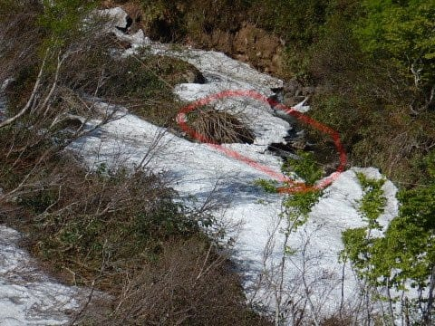
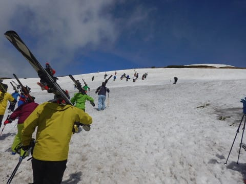

# 6月17日（日）月山で夏スキー！詳細その2…大斜面はまだコブ楽しめるよ！Tバーはかなり上に行っちゃった…

📅 投稿日時: 2018-06-21 01:04:33

ってなわけで．

本日は，昨日の続きの．

日曜月山詳細レポート続編に行くわけですが．

えー．

リフトを降りてからゲレンデに出るまでの苦労と…

延々トラバースのために…

リフト1本に30分かかるという末期状態の

月山ですので．

この日は．

リフト待ちはほぼ0と．

一日中ガラガラでした…

まぁ，この状態で10分とか20分の

リフト待ちがあったら．

さすがの私でも，

途中でくじけて帰っていたと思います…

とりあえず．

快適にリフトグルグル…

とはいかないゲレンデ状況ですし．

沢コースは，もうコースもかなり藪が

出てきているうえに…

水没…というより，

雪の下が川になっているので．

いつ踏み抜くか分からない…という危険な状態で，

立ち入り禁止となっており．

分かりにくいけど，赤く囲った部分．

下が川になっていて．

人が通ったら間違いなく踏み抜いて

水に落ちます…

とても滑れる状況じゃないですね（涙）

とはいうものの．

まだ大斜面は楽しめるコンディション

でしたね～！

リフトはそれほど混んでませんでしたが．

昼ごろの大斜面．

結構人が滑ってましたね～．

下の写真で，赤く囲んだ部分が一番細くて

ヤバそうなところですが．

それでも，幅はこのくらいあって．

それ以外の部分は，まだ幅もいっぱい，

ラインもたくさんあります．

リフト1サイクル30分かかるうち．

気持ちよく滑れるのはこの大斜面の

わずか5分間だけだけど．

この5分間のために，

リフトに10分，

リフトを降りてから大斜面まで10分，

大斜面が終わってからリフトに乗るまで

4-5分…

という，多大な時間と労力を必要としますが．

でも，結構いい感じのラインコブが

きれいに並んでいて．

この時期にこれだけ滑れれば，

満足なのだ！

それだけの労力を払う価値はあるのだ！←と，自分に必死に言い聞かせる

…で．

リフトより上のゲレンデ．

姥ヶ岳山頂に向かうTバーですが．

例年なら6月末にならないと出てこない，

赤く囲った部分の島．

これがもう出てきちゃったので…

いつもなら赤線部分に架かるTバーも

上にあがってしまい．

水色線部分に2本Tバーがかかる形となってました…

だもんで．

リフトを降りて，ゲレンデに出ても．

かなり登らないとTバーまではたどり

着きません…

私は軟弱者なので，Tバーまでは

登りませんでしたが．

Tバーまで行く人たちはかなり

大変そうでした…（完全他人事モード）

でも．

下から見ると，かなりこのTバー．

コース短いなぁ…

とはいえ．

昼ごろには，Tバーも結構混んでましたね～．

とりあえず．

私はといえば．

山頂のTバーには見向きもせず．

ひたすら大斜面を滑っていたわけですが…

午後には天気も良くなって，

かなり大斜面は気持ちよかったのですが．

でも．

昼を過ぎると．

朝の段階で，すでにヤバ気だった，

リフト乗り場につながる狭いところ．

ほとんど切れちゃってるように見えるん

ですが…！？？

てか．

実際に切れかけてるんですが！？？

そして．

朝はこんなだった，リフト手前部分．

昼過ぎには…

完全に雪が消えて，藪が

立ち上がってきちゃいました…（涙）

藪をかき分け歩いている人が

見えますが．

いや，半日でここまで雪が消えるとは…っ！！

もう，これは今日までです．

リフトに滑りこめるのは，今日で終わり．

月曜からは，リフトの乗り場よりかなり下に

滑りこんで，板を脱いで乗り場まで

ひいこら登るパターンになります…

とりあえず．

こんな状態になってきたからか．

夕方になると，大斜面の人も減っていきます…

人が少なくなった，夕方の大斜面を．

滑る！

滑るっ！！

ってな感じで．

日が傾く夕方4:15のリフトストップまで，

しっかりと滑り．

最後は晴天に恵まれた月山を，

ラストまで滑りつくしたのでした…

…てな感じで．

雪が少なかった今シーズン．

月山も，もうそろそろ終わりげな

感じです．

今週末までは大斜面が滑れそうだけど…

来週には，大斜面も切れちゃうかな．

うーむ．

雪が多かった昨シーズンは，7月第一週まで，

ギリギリ大斜面が滑れたんですけどね～…

ということで．

私も今回の月山をもって．

ついにシーズン終了ということにしました．

8か月半の長きに渡ったシーズンでしたが．

これにて終了です…（涙）．

あぁ…終わってみると，シーズンとは短いものよ…

## 💬 コメント一覧

### 💬 コメント by (Sora)
**タイトル**: ありがとうございました
**投稿日**: 2018-06-21 18:52:15

去年は色々お聞きして結局行かなった月山。ことしは行こうと決めていたのですが・・これは無理だ。滑るのではなくて、登るだけにすることにしました。裏の鶴岡の方から登るつもりですが、月山頂上方面はまだ冠雪しているようですか。?

ともかくも、長いシーズンの間、超人的に情報を提供くださりありがとうございました。しばらくゆっくりお休みください(^-^)。

### 💬 コメント by (つーちゃん)
**タイトル**: Unknown
**投稿日**: 2018-06-21 21:27:22

ご無沙汰しております。

スキーから解き放たれ平穏な日々を過ごしております(笑

こんな状態でも楽しいとか満足なんて言葉が出るんですね

本当に終わっ、いや変態素晴らしい方です！

コッソリたけのこ狩りの画像差し込んでもバレないかも、、、

### 💬 コメント by (新潟のスキーヤー)
**タイトル**: Unknown
**投稿日**: 2018-06-21 22:06:27

まずは、2017-2018シーズン

事故無く、無事に終わってお疲れ様でした！

Sさんの月山レポートを拝見して、

私もシーズンオフの決心がつきました！

毎年の事なんですが、スキーシーズンが終ると何か大きな荷が下りた心境です！

それなのに、カスタムフェアや試乗レポートが気になる今日この頃。

やはり…

私も…

終わってる人種に含まれるのでしょうか？笑

シーズンオフ後の物欲選手権も

楽しみにしております。

それでは…(^^)

### 💬 コメント by (しんちゃん)
**タイトル**: お疲れ様でした
**投稿日**: 2018-06-21 23:33:26

シーズン終了お疲れ様でした。

この時期、カスタムフェアが各地で行われますね。

ニューモデル試乗記や物欲選手権も期待しています。

プロジェクトX2も都度楽しみにしております。

そう考えると夏も話題がいっぱいですね。

### 💬 コメント by (Skier_S)
**タイトル**: シーズン終わりました…
**投稿日**: 2018-06-22 01:15:12

＞Soraさま

お久しぶりのコメント，ありがとうございます~！

いろいろあちらこちら行かれてるみたいですね…

この時期の月山は，

「スキーしないと死ぬ！」

「スキーのためなら歩こうが辛かろうが耐えられる！」

…という終わった人じゃないと，楽しめないかと…

普通の方にはあまりお勧めしません（笑）．

月山頂上への道は，まだかなり雪が残っています．

結構な距離，雪上を歩くことになるかと思います…

とりあえず，私のスキーシーズンも終わりましたが，

夏の間も山やら海やら，いろいろ活動してますので

引き続きよろしくお願いします~！

＞つーちゃんさま

をを！

志賀高原が終わってから，久しぶりですね～．

スキーから解き放たれた平和な日々ですか…．

スキーがあるうちは戦いの毎日なのですね（笑）．

私はスキーがあるうちは，シアワセな日々です…

たとえそれが，終わっているゲレンデ状態でも（笑）．

＞新潟のスキーヤーさま

ホントに怪我も事故もなく，2018シーズンを

無事に終えることができました…感謝です．

私も，シーズンが終わると．

ちょっとだけホッとします…

しかし．

シーズンが終わると，物欲選手権への誘いが

危険な時期になってきますね（笑）．

お互い，物欲に負けないようにしましょう！←そう言っているあなたが即負けそうだけど

＞しんちゃんさま

カスタムフェア，昔は行っていたのですが…

ここ2年ほど行ってないんですよ．

東京の6月のカスタムフェアの時期，

月山に行っちゃうことが多いし．

そもそもあそこに行っちゃうと物欲に

負けそうで…（笑）．

夏は海に行ってお金を使うのに，

これでスキー用品もいっぱい買っちゃった日には，

大変なことになります．←2週間で3セット板を買った人が言うセリフか？？？

