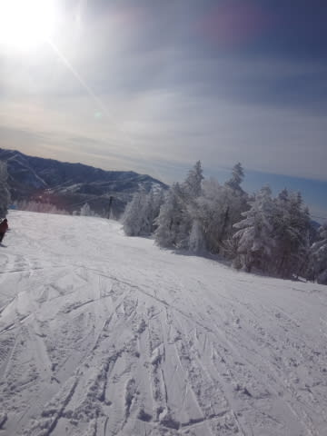
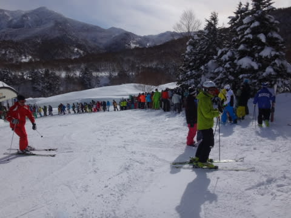
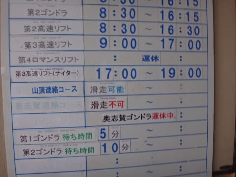
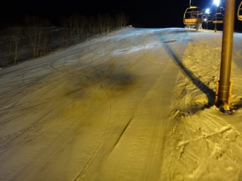

# 2月7日の志賀高原は…うははは！晴天ぴかぴかの一日だったのだ！

📅 投稿日時: 2015-02-07 23:51:05

🏷️ カテゴリ: [2015スキー滑走日記](c09ea645cfc085f86dfcd80f49599dd89.md)

本日の志賀高原ですが．

ふはははは．

かなり良かったのだっ！！！

えー．

まずは，朝．

志賀高原の登り道．

かなりつるつるのアイスバーン状態で…

路上に死に絶えた車，多数…

そのせいで，かなりののろのろ運転で．

…おかげで，焼額への到着が朝一ゴンドラの

営業開始5分後という失態を犯してしまった！

なんということだ…（ちょっとショック）

でも．なんだか．午前9時過ぎに上林チェーンベースに

ついた人は，車が動かないほどの渋滞になったみたいで…

1時間半くらいかかったようだから．

それに比べれば，マシか…

と，自分を慰めておこう．

んで．

ゴンドラに乗ると…

ををっ！

見事な晴天!!!

…は，早く山頂へ…急げ，急ぐんだ，第1ゴンドラっ！←晴天ぴかぴかゲレンデを見て我慢できない人

って感じで，山頂に着くと…

ぐはははは！いい天気だ！

気温はマイナス10度と，冷え冷えっ！

雪質も，最高！

こ，これは．

最高のシマシマバーンだっ！！！！！

ちょっと雪はやわらかめだけど，やわらかい雪にエッジが

深くしっかり食い込む，

超快楽お楽しみエンターテイメント100％満開大放出バーン！

いや，これ．

今シーズン一番かも！？

朝イチの人のいないうちは，

ひたすら自由落下，落下，落下～っ！！

…と，自由落下を楽しんでいると．

9時半ごろにはゲレンデの人が増え始め…

あれれれ？

10時前からゴンドラ待ちが伸び始め，

10時過ぎにはゴンドラ待ち10分くらいになってしまったんですが…（涙）

いつもよりかなり混んじゃってるんだけど．

なんでだろ…？

と，思っていたら．

あー．

奥志賀ゴンドラ，止まってるのね．

だもんで，奥志賀に行くはずの人が焼額に流れて，

混んでるのか…

ちょっと人口密度は増えてきて．

快感度合いは下がってきたものの…

でも，晴天ぴかぴかで．

雪質も，志賀トップシーズンのやわらかい雪質！

景色もいいし…

許す．

多少の混雑は，許す…！

と，思っていたら．

やっぱりいつものパターンで．

11時ごろにはゴンドラ待ちがなくなったよ～（喜）．

でも．

午後にはまた，ゴンドラ待ちがちょっと増えるタイミングもあり…

ゲレンデの人口密度も高めで…

ちょっとコースもバンピーになってきたかな～

とはいえ，コースを選べば人も少ないところもあり．

今日も，午後5時のリフトストップまで

ひたすら滑ったのでした～

…いや．

まだ，終わらない．

当然，ナイターへも繰り出して．

いやーーん．

シマシマっ！

こんなシマシマで，いいの？

ナイターがこんなやわらかい，快楽のシマシマで，

いいの？？？

…と，歓喜の雄たけびを上げつつ，

ナイターストップまで滑り続けたSkier_Sなのだった…

いやーーーー．

今日はちょっと混んだものの．

朝イチ晴天シマシマから，ナイターまで．

天気に恵まれて．

最高の一日だったなっ！！！！

## 💬 コメント一覧

### 💬 コメント by (Goku)
**タイトル**: Unknown
**投稿日**: 2015-02-08 09:02:44

昨日は今シーズンイチと言っていいほどのコンディションで幸せでしたね。

今頃はまた雄たけびを上げながらＧＳコースカッ飛んでるんでしょうね。羨まし～

それにしても、ナイターまで滑り切るその体力は凄すぎる。

### 💬 コメント by (いか)
**タイトル**: Unknown
**投稿日**: 2015-02-08 09:46:27

こちら八方も、昨日は神コンディションでしたー(^ ^)

朝イチリーゼンはだめなタイプのターン(というのか？)弧になっていました。

コブ、セントラル、たてっことなんでもできる、まさにハイシーズン！

今日のアーリー+朝イチ滑ったので、東京に仕事をしに戻っているところです…笑

### 💬 コメント by (すぎぃ)
**タイトル**: Unknown
**投稿日**: 2015-02-08 12:12:03

>営業開始5分後という失態を犯してしまった！

>なんということだ…（ちょっとショック）

なんて日だ(笑)　by小峠

### 💬 コメント by (Skier_S)
**タイトル**: 日曜午後は悪天候
**投稿日**: 2015-02-08 23:49:52

＞Gokuさま

土曜はお世話になりました～！

日曜朝も，最高でしたよ！

…でも，10時ごろには雲が増え，小雪が

舞い始めましたが…

で．

泊まりで滑りに来た日は，ナイターまで滑らないと

精神的に具合が悪くなるんです（笑）．

＞いかさま

八方も良かったですか～！

でも，アーリー＆朝イチで，東京戻りで仕事ですか？？？

ありえない行動のような気がするのは，

気のせいでしょうか！？？

＞すぎぃさま

いや．

ホントに．

なんて日だ，今日はなんて日だ！！

って叫んでました（嘘）．

