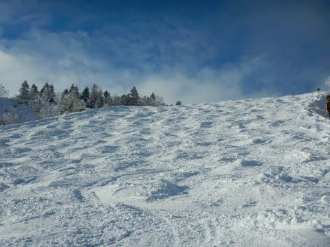

# 2020/2/1(土)の志賀高原スキー場は…朝は新雪20㎝！午前雪降り，午後は晴れていく冷え冷えTOPシーズンの一日！

📅 投稿日時: 2020-02-02 00:13:39

🏷️ カテゴリ: [2020スキー滑走日記](c282e9230de179e245c7334eabeb0a3b3.md)

ということで．

本日も志賀高原にやってきましたが．

…志賀高原は，一気にトップシーズンへ

突入しましたよ～っ！！！

いやーー．

終日冷え冷えで，雪はやわらかく．

いつもの1，2月の志賀高原が

戻ってきた感じでした…

とりあえず．

今日の朝イチは冷え冷えっ！！

…だもんで．

あさイチの志賀高原への登り坂．

上林チェーンチェックよりはるか手前．

中野市街の4車線道路が終わったあたりから，

道路はもうテュルンテュルンになっていて．

テュルンテュルン道路の生贄が…

上林から先は，この時期の標準的な

完全本格雪道でしたね…

例年，これが普通なはずで．

先週までが，雪が少なすぎでしたね(笑)．

ってな感じで．

やってきました，今日も焼額！

昨日から停めっぱなしの車の周りは，

この程度の積雪具合で．

うーん．20㎝程度かなぁ…

で．

いつも通りの朝イチゴンドラに並んで…

山頂にやってくるわけですが…

朝はおおむね予想通りの-10℃！

雪降りでスタートの本日ですが．

冷え冷えで，積雪20㎝ということで．

このくらいの積雪だと悩むところだけど．

ここで出さないと今シーズン出すチャンスないかも？？？

と．

太板君を今シーズン初出動！

圧雪コースは，圧雪上にせいぜい数㎝雪が乗っている

程度（涙）

だもんで．

まずは新雪狙いのオリンピックコースへ！！

オリンピックコースは…

うーーーむ．

もう少し雪が深いかと思いましたが．

かろうじてブーツパフですね…

でも．

ようやっと来た新雪！！

パフパフ！！！

私にとっては，今シーズン初の

パフパフ！！

…と，3-4本は楽しめましたが．

それ以降は単なるこぶ斜面化

していきました…(涙）

そして．

圧雪コースのGSコースも，

雪が柔らかいので，朝の早くから

ちょっと荒れ気味のこぶ斜面に

なり始め．

さらに，コース上の人がだんだん増えてきたので，

写真ではわかりにくいですが．

GSコースはあっという間に凸凹に．

パノラマーサウスコースも人が

多かったので．

あっという間に荒れ気味斜面に

なっていきました…（ちょい涙）

うーむ．

先週まで，雪はこんなに柔らかいいい雪じゃ

なかったけど．

やっぱり，柔らかい雪．それも降りたては，

あっという間に荒れていくなぁ…（涙）

でも．

コース上の人は多いながら．

今日はゴンドラはピークでも，ゲートの

外にまでちょっと人が並ぶかどうか．

リフトはほとんど待ちなしで乗れたし．

昼以降は，ゴンドラは搬器数台の待ちしかない

ガラガラになりました～！

うーむ．

午後はコースがあれたから，ちょっと

人が減ったのかな？

とはいえ．

昼になっても気温は-5℃程度と

冷え冷えで．

コース脇には，昼頃になってもまだ

ところどころパフパフが残っていて．

終日冷え冷えの最高雪質！！

あぁ…今シーズン，やっと冷え冷え

やわらかな雪で滑れた気がする…

そして．

午後1時ごろになると．

だんだん空が明るくなり始め…

なんと．

ゲレンデに日が射してきましたよ！？？

さらに．

午後2時過ぎには．

すっきり晴れ上がってきましたよ！？？

ゲレンデがすっきり見えるように

なってきましたよ！！！

…素晴らしい．

素晴らしいよ！

本来だと今日一日雪降りの天気の

予定だったのに．

日頃の行いが良い私のために，神様が

午後を晴れにしてくれたに違いない！！←それは，単に一日雪降りの予想を外したというのだよ．

さすがに午後は，GSコースも…

オリンピックコースも，

天気予想に書いた通り，全面かなりの

こぶ斜面になってしまっていたものの．

なぜか本日，唐松コースのみ，

それ程荒れておらず．

意外と夕方まで，結構フラットな斜面を

滑れました…

しかし．

それ以外のコースも，こぶ斜面に

なってはいるものの．

雪はやわらかいので，それほど

手ごわいコブではなく．

体に優しい（？）コブだったので．

久々のやわらかい雪を堪能しながら．

日が暮れるラストリフトまで．

ひたすら滑り倒したのでした…

いやーー．

久しぶりのトップシーズンの雪．

やっと本格シーズンが始まった

感じですね～．

「あぁ…雪って柔らかかったんだ」

ってことを．

今まで忘れていたなぁ…

いやーー．

やっぱりやわらか雪のシマシマはいいよなぁ…

…

…

ということで．

やってきました，焼額ナイター！！

18:30～21:00までのダイヤナイターが

3連休以外営業しなくなった今シーズン．

2300円も払って，一の瀬ファミリーの

のろいリフトで緩斜面を滑ってもなぁ…

と，ここ2週間ほど，ナイター参戦を

見送ってましたが．

もう，今日は我慢できない．

このやわらか雪のシマシマを滑らないと，

我慢できない！！！

と．

宿の夕食を30分以内で全力で掻き込み．

車で宿から焼額へ移動し．

18:00のリフト開始から30分遅れで

ナイター参戦！！

宿の夕食がゆっくり食べられず．

さらに焼額ナイターは20:00までなので．

ここまで苦労しても1時間半以下しか

滑れないので，いつもは参加を

見送ってるけど…（涙）

でも．

今日は，そこまでして来た甲斐が

あったというもの．

今シーズン夢にまで見た，

冷え冷えやわらかふわふわの，

最高のナイターでした～！！

あぁ…

やっぱり焼額ナイターはいい．

ダイヤもサンバレーも営業しなくなった

志賀高原のナイター．

今ではぶっちぎりで，フード付きクワッドが

滑れる焼額が最高に楽しいのですが．

…焼額ナイターが夜9時までやってくれれば．

宿の夕食を食べても余裕で参加できるから，

毎週来るんだけどなぁ…

惜しい．

実に，惜しい…

とりあえず．

この最高のナイターと同じやわらか最高シマシマ雪を，

明日朝イチは楽しめるはず！

明日は天気もよさそうだし．

最高の一日になりますよ～！！

## 💬 コメント一覧

### 💬 コメント by (せっちゃん)
**タイトル**: Unknown
**投稿日**: 2020-02-02 09:39:12

お疲れさまです。

ナイターも満喫されているご様子、天気予報を見るとまずまずの冷え込みと降雪で来週も楽しみです。

同行の先輩を口説き落として、土曜日は焼額入り承諾いただきました。

東館前に駐めるかは未定ですが、必ず第一ゴンドラに伺いますね！

メットからウェアーまで黒一色のYONEXボーダーです。

よろしくお願いします。

### 💬 コメント by (真美子)
**タイトル**: Unknown
**投稿日**: 2020-02-02 11:27:16

お会いすることなく、これで帰ります。

バス、電車を使って来ているので、仕方ないです。

ああ残念でした。

11時26分です。

### 💬 コメント by (やっさん)
**タイトル**: Unknown
**投稿日**: 2020-02-02 11:31:17

毎週お疲れ様です。

とうとうやってきました。日曜日から火曜日の予定で。いつもなら一ノ瀬で泊まるのですが、今回は温泉も良いかなと思い高天ヶ原で宿泊です。因みにどちらへお泊まりですか？是非一度ご一緒できれば嬉しいですね。

### 💬 コメント by (やっさん)
**タイトル**: Unknown
**投稿日**: 2020-02-02 11:31:39

毎週お疲れ様です。

とうとうやってきました。日曜日から火曜日の予定で。いつもなら一ノ瀬で泊まるのですが、今回は温泉も良いかなと思い高天ヶ原で宿泊です。因みにどちらへお泊まりですか？是非一度ご一緒できれば嬉しいですね。

### 💬 コメント by (西舘)
**タイトル**: Unknown
**投稿日**: 2020-02-02 18:54:18

ただいま帰りのしなのの中です。

本日は素敵な時間を頂きまして誠にありがとうございます。

Sさんはイメージ通りの方でした。

気さくな方で初めてお会いしたとは思えなくて色々とお尋ねしてしまって申し訳ありませんでした。

やっぱ人気者ですね、たっくさんの方々が声を掛けていくの。

ゴンドラ車内で、これ全員知り合いです、と言われた際には心底驚きました。

私、特派員に任命されるのかなと思ったのですよ。

みんなで情報出し合ってお天気の精度を高めているのかと。

早まってしまって恥ずかしいですね、どうぞメモはお捨ておきくださいませ～（恥

スーパーキッズ可愛いかったな～、S様と仲良しこよしですね♪

噂の滑りを生で見られて感無量でございます。

Sさんのハンディキャップのおかげで3本も御一緒して頂き、更にはアドバイスまで頂き…おかげで物欲センサーが反応しそうです。

上級者さんに自分の滑りを見て頂いたことが無いものですから。

楽しくて幸せで夢見心地の一時でした、いやぁ押し掛けて良かった、良かったよぅ。やるな私

また御一緒させてくださいませ

でもって私も来シーズンはシーズン券購入して今以上に通っちゃうよぉ～♪

(それ以前に来週の飛び石も、2月末の3連休も志賀入りするし、3月の予約もしようとしているのでした。)

先ずは来週の天気予報もよろしくお願いします！

### 💬 コメント by (Skier_S)
**タイトル**: 今日もゲレンデ状況は最高の一日でした
**投稿日**: 2020-02-03 01:52:30

＞せっちゃんさま

2月8日，焼額で滑っているので，もし見つけられたらお会いしましょう～！

あさイチから焼額入りですか？

＞真美子さま

あら…お会いできませんでしたか（涙）

朝から1ゴンと2高をひたすら回していましたが．

残念です…

これに懲りずに，また志賀高原にお越しください！

＞やっさんさま

日曜から火曜ですか…いいタイミングですね！

月曜は終日曇り，夜に雪が積もって火曜朝はうっすら

積雪がありそう．

トップシーズンのいいコンディションの3日間だと思いますよ～！

私は，泊りは一の瀬が多いです．

一井やオリンピックホテルに泊まってることが

多いですね…

＞西館さま

今日はお会いできて良かったです～！

どうやら私は，皆さんのイメージから大きくずれてないみたいで，

大体「予想通り」と言われます(笑)．

ちなみに，私のいないときにスキー場の情報をコメントか

メールやLINEでいただける方が特派員ですので，

ぜひ今後レポートお願いします．

では，来週以降もご一緒しましょう！

焼額で，朝礼メンバーがお待ちしています．

