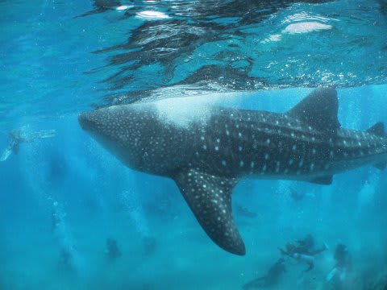
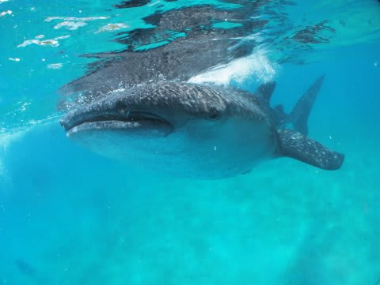
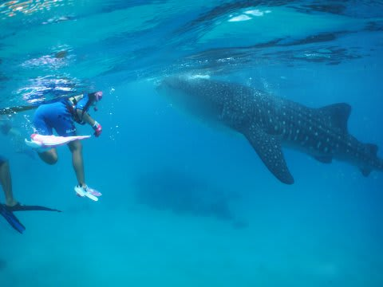
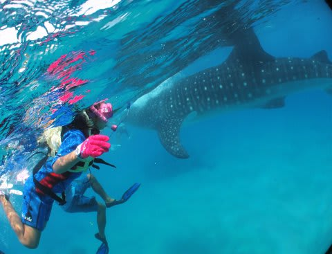
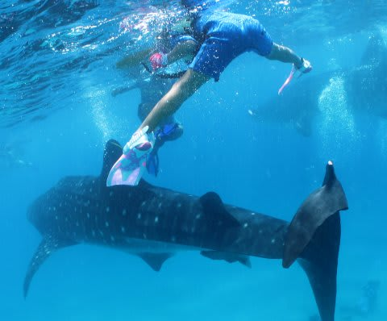
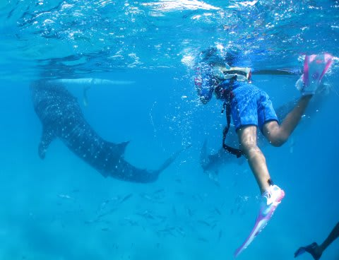

# 2013年11月　フィリピン・オスロブ　子連れでジンベエを見るぞっ！　エピローグ1

📅 投稿日時: 2014-08-13 01:01:37

ということで．

今回の旅行．

ジンベエを見たいっ！！

という一つの目的に絞った，

3泊4日のツアーだったわけで．

その目的は，すでに報告したように．

予想以上の迫力で，果たすことができたのでした…

今回訪問した，

フィリピンの，オスロブ．

まだあまり細かい情報がないようですが．

とりあえず．

レポートで感じてもらえた通り．

なんだか…すごい海でした．

シュノーケラーの間に紛れ込んで，こんなに

のんびり泳ぐジンベエを見たい放題…

…しかし．

こんなすごい海でも．

1年前までだったら．

行くのをためらっていたかもしれません．

…だって．

去年だったら，娘がこんなに上手く泳げないから．

私か妻か，どちらかが陸上に残って，

ジンベエを見ることなく，娘と留守番…

ってパターンになっちゃう．

だけど．

今年のタイ旅行で．

[驚くべき泳力](d20131125.md)を見せた，わが娘．

深い海や，岸が見えないような海でも平気で泳ぐ，

海の好きさ度合いと，幼稚園児と思えないこの泳力を考えて．

「ジンベエシュノーケリング，今年だったら，

　娘を連れても行けるかも…」

と，思い，今回の旅行の実施となったわけで．

…だけど．

現地に着くまでは．

「やっぱり無謀だったかな～」

と，ちょっと心配してたりもしたけど．

現地でも「幼稚園児OK!」ってことで快く受け入れてもらい．

さらに，娘も大喜びで泳ぎまわり．

娘にとって，忘れられない，いい思い出になったようです…

＃これだけインパクトのあるシュノーケリングを

＃忘れられたら，それはそれですごいけど

とりあえず．

今回の旅行．

親も大満足だったけど．

娘も，完全に，両親と同じように楽しんで．

…同じ趣味と嗜好をもった，家族3人．

娘と一緒に遊びに行く楽しみが．さらに，

いっぱい，いっぱい，増えていくなぁ…

と．

強く感じた，今回の旅行でした．

で．

妻の，

『突発性ジンベエを見たくてガマンできない病』

が，どうなったかというと．

まぁ，快方に向かっているようです．

が…

（続く）
