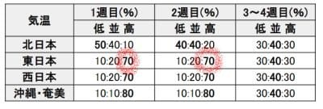

# 気象庁の1か月予報が，気温が低めの予想になった…そして2/11,12の週末の志賀高原の天気予想微修正＆14日以降は冷えるよ！

📅 投稿日時: 2023-02-10 01:35:39

🏷️ カテゴリ: [日記](cc4b5682fb7b8b144980957a978653fb0.md)

えー．

明日10日の朝，関東は雪

とニュースで盛んにやってますが．

関東の平地でそんな積もるほど雪が

降るかなぁ…

と思っているSkier_Sです．

最初は積もっても，すぐ雨になって’

溶けちゃいそう…

ってなことで．

本日もおこみん特派員から写真が送られて

きましたが…

この日は朝から雪降り！

で．

駐車場は積雪5cmほどだったらしく．

うむ．積雪量は予想通りか…

と思っていたら．

コースでは非圧雪バーンは15cm，

圧雪バーンの上にも5cmほどの積雪が

あったようで…

予想より積雪が多かったみたいです！

（新雪に埋もれるおこみん)

あさイチの山頂は-13℃と，概ね

予想通り！

そして，午前中はずっと雪降りだった

みたいですが，雲の隙間から

青空も見えるタイミングもあり…

昼ごろには薄日も射すタイミングも

あったようですが．

昨日予想した，午後にすっきり晴れる

ということはなかったようで…

午後の予想は外したか（涙）

で．

本日の最新の天気図を見ると．

10日の低気圧通過の状況が変わっていて．

そして，11日の予想気温も変わり

ました…！

だもんで，昨日の予想をちょっと修正．

10日(金)：朝からちょいと重めの雪が

　降り始める．

　あさイチの気温は-6℃程度だけど，

　昼間に向かって気温は結構上がる．

　ちょうどリフト営業開始頃から

　降り始めるので，あさイチの積雪は

　ほとんど無し．

　この日は一日降り続け，朝から

　夕方までに，志賀にしては重めの雪が

　10～20cmほど積もりそう．

　夜も降り続ける

　

11日(土)：朝まで雪が降り続ける．

　朝までの積雪は20cmほど．

　あさイチの気温は-5℃と高め．

　志賀にしては重めの雪がしっかり

　圧雪された上にうっすら積雪で，

　滑りいいかも．

　昼前には雲が切れていき，晴れて

　いきそう．

　そして，朝より気温が冷えていき…

　晴れてそこそこ冷えた，意外と

　いいコンディションになるかも？

　

12日(日)：朝イチの気温は-5℃程度？

　あさイチから晴れ！終日晴れ．

　あさイチは締まったいい感じ

　だけど，昼間は気温も0℃を超え，

　強い日差しで，ゲレンデ表面の雪は

　しっとり緩んだ3月の雪になっていく．

　おそらく終日晴れて日差しが強い，

　2月と思えない暖かい晴れの一日

って感じでしょうか…

で．

先日の記事にも書きましたが．

14日以降は冷えます！！

激烈に冷えます！！

14，15，16日ともに，水色の-9℃線が

志賀高原にかかるか，志賀高原の南

なので…

かなり冷えますね．

15日は，-15℃を下回る激冷え雪降りに

なりそう…！

しかし．

10～13日の，平年比+4～6℃の高温

の直後に，

14～15日の，平年比-4～8℃の低温

が続くって…

極端なんですが！？？

もう少し平均的な気温が続いて欲しい

ところ…

そして．

本日木曜は，気象庁の一か月予報の発表日なので．

いつも通り，[FCXX92](https://www.sunny-spot.net/chart/FCXX92.pdf)をみるわけですが…

あれ？？

確か，[一週間前の予想](e45a8faf92b1deee5ac7dad9529eee659.md)では．

第1週，第2週とも高温の確率が70％と．

スキーヤーを悲しみのズンドコに

突き落としたはずなのに…

（先週の予想）

今週の予想を見ると．

これから1か月の予想が，

低温の確率が40％と，冷えそうな予想に

なってるし…

それより，先週の予想で高温の確率が70％と

予想された2週目に当たる，

今回の予想の1週目．

平年並みが50％と，気温がそこまで

上がらなさそうな予想に変わってますよ？？

とりあえず，これからそんなに高温に

ならなさそうな予想は嬉しいけど．

気象庁の1か月予報は結構コロコロ

変わるので，1か月予報であまり一喜一憂

しない方が良さそう…

…っていうか．

最近では，2週目以降の予想は大きく

変わることが多いので．

もしかすると，低温になりそうな3-4週目の

予想も，来週になったら逆になるのかも…！？？

だとすると，気象庁さんには，ぜひ

長期は暖かくなるという予報を出して

ほしいな！…←違うから

## 💬 コメント一覧

### 💬 コメント by (レインボー75)
**タイトル**: Unknown
**投稿日**: 2023-02-10 14:55:59

金曜日の志賀高原情報

ずっと雪が降り続けるなか、強風南風(横風)でニゴン運休。いちごんかニ高へ瞬間移動した人が正解で、ニゴンに賭けた私らは8時45分四ロマ始動の敗北者。

すぐにいちごんからオリンピックへ。これが下から雪吹雪が向かってくる凄まじい体験に。こんな時に時速100キロ越えの女性が生息する焼額山はすごすぎます。

ゲレンデはどこも滑りやすいはずなんですが奥ゴンなども運休で、人が同じところに密集したため、気持ちよく滑ることができない。

ダイヤモンドの志賀高原サンドでワイワイやって早めの終了。

こんな日にスキーしてる私らはおかしすぎます。仕事してるエス様がまともかと。

### 💬 コメント by (ota0602purotecuto)
**タイトル**: Unknown
**投稿日**: 2023-02-10 19:09:29

お疲れ様でございます。また、顔出します😊👍‼️

### 💬 コメント by (Skier_S)
**タイトル**: 今週末は滑りに行けず
**投稿日**: 2023-02-11 03:17:52

＞レインボー75さま

時速100km越え…あの方ですね（笑）

アゲインストの強風で100kmは凄すぎる．

＞ota0602purotecutoさま

初めまして～！コメントありがとうございます．

また立ち寄ってやってください…

