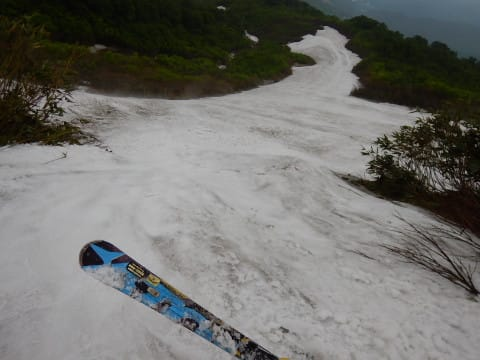

# 7月1日（土）月山速報！…朝のうちに雨は止んだけど，大斜面も藪漕ぎに（涙），もう終わりげな雰囲気…

📅 投稿日時: 2017-07-01 22:34:47

ということで．

本日，月山まで今シーズンラストスキーに

来ているわけですが．

朝早くは雨が降ったものの．

意外と朝10時以降，雨は降らずにもちました…！！

ってことで．

本日の月山ですが．

朝の山形道では雨に降られたものの．

朝10時に月山に到着した時点では…

をを！雨が止んだよ！

路面が乾きだしてるよ！

…ただし．

山頂はガスがかかってますが…（涙）

んで．

7月になったので，これまで500円かかっていた

駐車料金は無料になり．

その代わり，入山料一人当たり200円が必要になってます…

（この小屋で一人200円ずつ支払い）

で．

リフト小屋に行くまでの道の横．

この2週間で，驚くほど雪が減りましたね～！！

本日，沢コースも終了し．

リフトまで滑り込めないようになってしまったので．

リフト券は特別料金になってます～！

一日券が3300円！

あ，午前券，午後券はなくなってます．

リフト乗り場へ行くと…

天気が悪い予報だったので．

リフトは，怖いくらい誰も

乗ってませんね…

そして，山頂に出ると．

予想通りのガスなんですけど…（泣）

月山リフトは最終形態化していますので．

リフトを降りてから，ゲレンデに出るまで数分間．

こういう足場の悪い岩場を登って…

リフト降り場からここまで歩かないと，

ゲレンデに出られない仕様になってます．

ええ．

この時期の月山の仕様ですので，

あきらめてください．

そして，トラバースコースを延々大斜面へ向かいますが．

大斜面，ほとんど人が滑ってないのですが…

だもんで，雪が踏まれておらず，

ガリガリで滑りにくいのですが…（泣）

大斜面は一部，ボトルネック状になっており．

一番狭い部分はこんな感じ．

幅2m，板の長さよりちょっと広いくらい

しかありません．

いやーーー！

2週間前から，一気に雪が減ったなぁ…（悲）

そして．

大斜面終了後．

リフト乗り場に向かうところが…

ええ？

藪漕ぎ！？？

藪漕ぎをせねばならんのですか！！？？

…先週まで，リフトに滑り込めたというのに…

それから一週間で，コース上で藪漕ぎが

入ろうとは…！！

こんな足場の悪い，急なガレガレ岩場を，

10m弱歩く感じでしょうか…（涙）

この写真の右端が，ほとんどの人が通る

足場が岩場の藪漕ぎコースですが．

この，岩場を避けたちょっと左側．

この人が立っている部分を通っていけば，

岩場でない分歩きやすいですが…

その代わり，まさに笹薮をかき分けていかねば

なりません（泣）．

いや．

3日前まで沢コースが滑れたってことだったので．

まさか，大斜面に藪漕ぎが入っていようとは…

そして，藪漕ぎを通り抜けた後も．

当然，リフトに滑り込めず．

このリフト下に到着するので，

ここからこんなところを，

ひいこら歩いて登っていかないと

いけません（涙）

…ってな感じで．

本日の月山．

もう，ほぼ終了モードです．

楽しくない，完全修行モードです．

・滑らないと死ぬ

・死んでたけど，滑ると生き返る

・雪がある限り滑ることが宿命づけられている

という，何か運命を背負っている方以外，

やめた方が賢明かと…

しかし．

もう来週は，リフトを滑って降りるのは

不可能ですね～（残念）

先週までの状況だと，

もう少し行けそうかと思ったんだけどな～

あ，山頂のTバーは，この写真の左右の2本，

営業してましたが…

かなり上の方に移動しました．

リフトを降りて，ゲレンデに出てから．

かなり登らないと，Tバー乗り場に行けない

感じになってます…

＃Tバーの営業は午後2時まででした．

ってことで．

最終形態の月山ですが．

雨の予報の本日．

意外と午前10時以降は全く降らず．

山頂はガスってたものの．

大斜面から下は，視界も明けてて．

人も少なく，ガラガラで．

…そして，午後3時以降は薄日も差すような天気で．

まぁ，修行と割り切れば．

7月までリフトで滑れたので，良しとしましょうか…

ってことで，明日．

シーズンラスト滑走をしてきます～！

＃一部の方に，日帰りとお伝えしましたが…

＃急きょ1泊日になりました
