# 2022/2/5(土)の志賀高原焼額山スキー場レポート…終日雪降り＆激寒の，根性の無いスキーヤーはふるい落とされる一日

📅 投稿日時: 2022-02-06 00:25:24

えー．

本日の志賀高原スキー場ですが．

予想通り，終日かなりの雪降りで，

根性がないスキーヤーふるい落とし機能ｘ

フル発動

の一日でした…

なんてたってまず，朝の上信越自動車道は，

いつもなら信州中野から先のチェーン規制

なのに．今日は長野ICからチェーン規制が

かかっているし．

志賀高原の登り坂の手前，中野市街からすでに

かなりの積雪路…

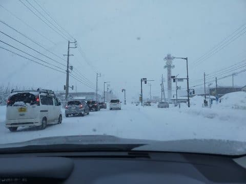

当然，志賀高原の登りはかなりの本格

雪道でした…！

ってなことで．

いつも通り，通常営業開始8:30のゴンドラで

山頂に登ると…

山頂の気温は-13℃と，冷えてます！！

しかし…予想の15℃よりちょっと高かった(涙)

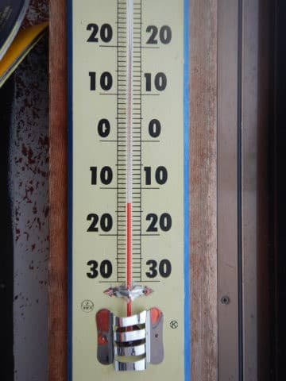

でも，あさイチから予想通り雪が降り続け

ている日で…

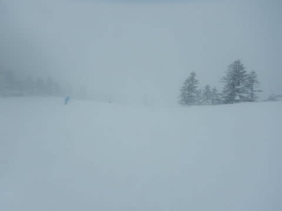

あさイチのコース脇の積雪は，予想の30cmが

大体当たって，30~40cm！

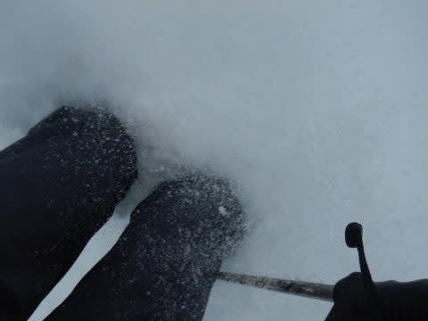

圧雪コースも，圧雪をかけた時間が早かった

コースは，圧雪の上に10㎝以上積雪があります！！

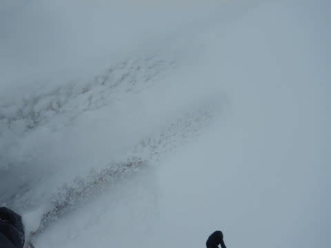

なんだか，圧雪コースでもブーツパフ～

脛パフくらいのパウダーで滑ってる感じ！

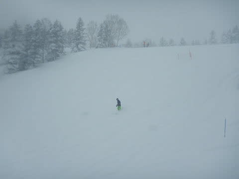

こういう日は．

当然，まずは新雪が楽しめるオリンピックコース

へ向かうのだ！！

オリンピックコースは…

ところによって深さが全然違ったけど．

基本的には膝パフくらい！！

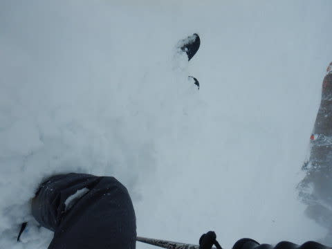

うほほほほ！！

膝パフだぁっ！！

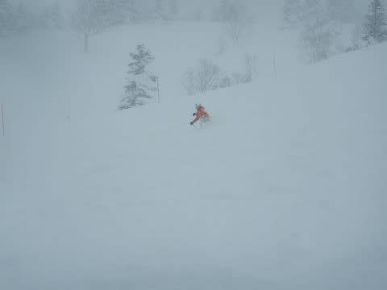

…でも．

激軽パウダーじゃなく，今日もちょっと重めの

パウダーでした…（ちょい涙）

でも，雪だまりに突っ込むと減速はするものの

激重というほどではなく，底付きする程度の

軽さをもったパウダー．

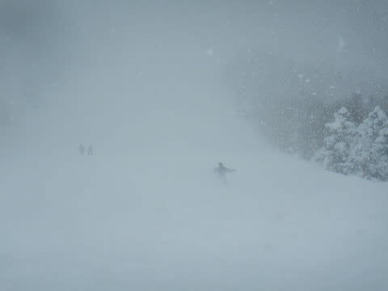

うーん．

気温が冷えたからもう少し軽いかと思ったけど…

とはいえ，久しぶりの膝パフパウダーを

いただきました～！

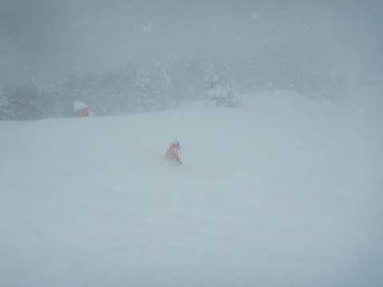

ってな感じで，オリンピックコースを太板で

グルグルしていると…

朝10時に今シーズン復活の新雪コース，

ヤケビウォールがオープンということで，

早速行ってみました～！！

（ここがヤケビウォール入口）

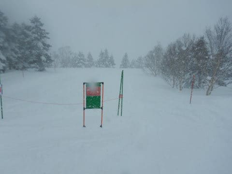

太板を履いていくと，

重めの雪なので浮力が強くて，

膝ぐらいまでしか埋まりませんが…

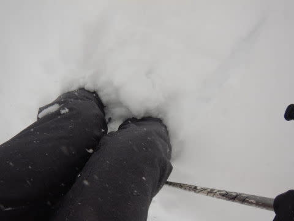

ストックを刺してみると，新雪自体は

もっと深いみたいです…！！

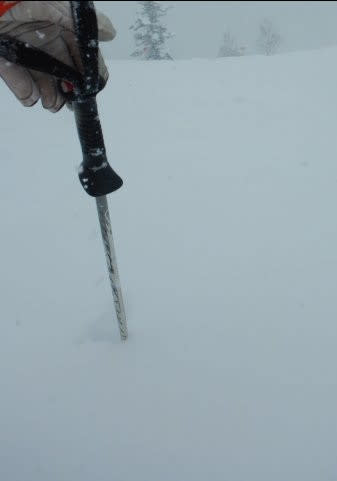

でも．

滑ってみると．

新雪の下に，硬めのカリカリしたコブが

埋まっていて，結構怖い…！

残念ながら，ちょいと楽しくない感じでした（涙）

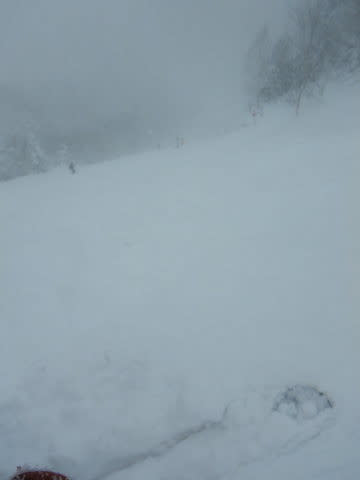

だもんで．

他のコースを滑りましたが…

今日は終日雪降りってのもあり．

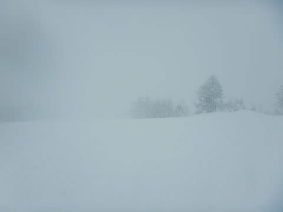

さらに，昼間の最高気温も-，朝とほぼ同じ

マイナス13℃という，激冷えの一日．

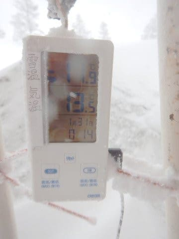

そのせいか，ゴンドラはピークでもゲートを

超えるかどうかという混雑が1回あった程度で．

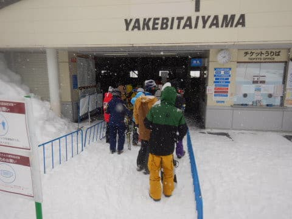

根性の無いスキーヤーが次々ふるい落とされて

いったからか，11時以降はゴンドラもガラガラ！！

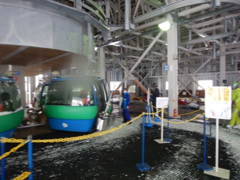

当然のごとく，ゲレンデも人が少なくガラガラ

だったため…

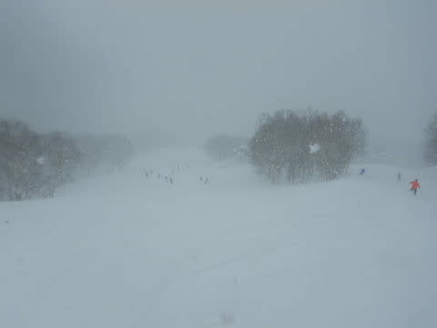

圧雪コースにかなりの勢いで雪が積もっていく

上に，バーンがあんまり踏まれないので…

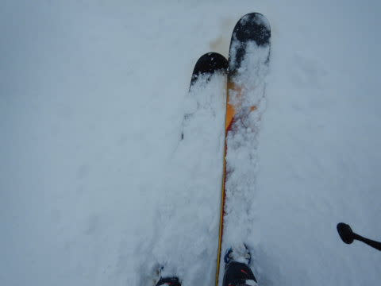

わざわざ新雪コースを滑らなくても，

圧雪コースもあっという間に新雪10㎝の

コースとなっていく感じでした…

（この写真，圧雪コースですよ！！）

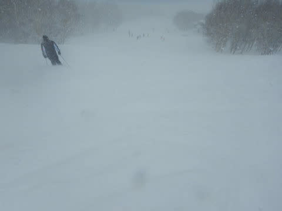

ってな感じで．

コースはガラガラながらも．

かなりの雪降りで寒い上，視界も悪く．

圧雪コース上も新雪がモサモサ積もっていく

状況という，

根性の無いスキーヤーふるい落とし

というより，今日も

選ばれし民のみ生き残っている

というようなコンディションの中．

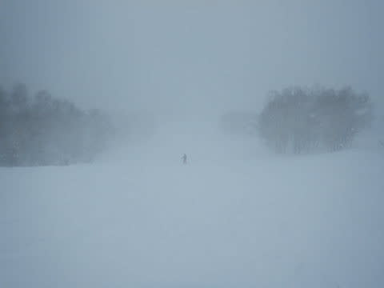

今日も営業終了まで，休憩なしで滑り続けて

しまったのでした…

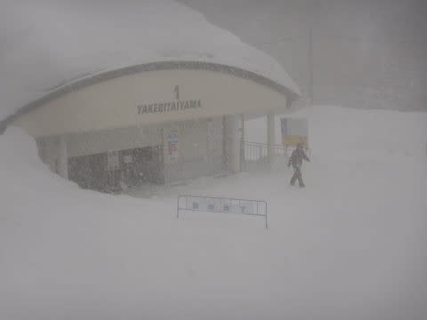

そして．

車に戻ると…

今日の昼間だけで，こんなに積もったのか…（涙）

こりゃ，終日エンドレスパウダーデーだったわけだ．

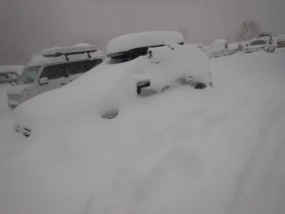

…で．

こんな悪天候にもかかわらず．

え？

今日も焼額はナイターやるの？？？

一の瀬は悪天候のためナイター営業中止らしいけど，

焼額はナイター営業？？？

となると．

本日，[こんなもの](e86b1575b4b2bc1dbddf321eeff457652.md)を買ってしまった

私としては．

ナイターに行かずばなるまい！！！

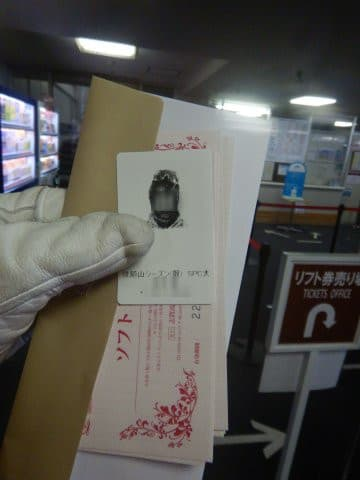

ということで．

今日も雪降りの中，ナイター参戦ですっ！！

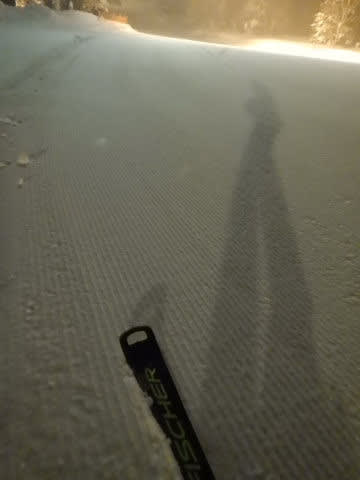

圧雪をかけたタイミングで，シマシマが残ってる

ところと，新雪が上に乗ってるところが

ありましたが…

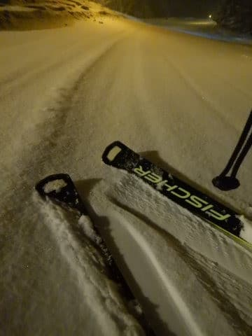

でも．

焼額ナイター．

圧雪かけたてのノートラックバーンを

滑れるのがいいのだ！！

誰も滑ってないシュプールが一本も

つい得ないバーンを，

ナイターでも滑れるのだ！！！

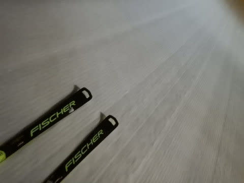

と，18時の営業開始から20時まで，ナイターの間も

ひたすら休まず滑り続けてしまったのでした…

…だって．

滑ってる間も新雪が積もっていって，

営業終了時でもこんな感じで…

気持ちよかったんだもん．

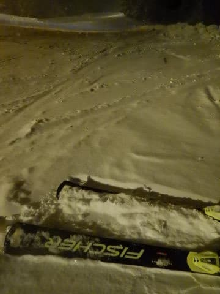

ってなことで．

普通の人にはつらかったと思う本日も，

私にとってはひたすら楽しかったのですが…

明日は，今日より降ります．

すごいことになりそうです！！

朝の営業開始が遅れるほど積もりそう…

そして，日中もかなりの勢いで降り続け．

終日全面パウダーデーになりますよ～！！

…明日は，新雪や悪天候がダメな人は避けた方が

いいです…

というより，志賀高原の登り坂，除雪が

間に合うのかな…

とりあえず．

明日無事にゲレンデに到着できて．

ゴンドラ・リフトが普通に営業できる

ことを祈って，これから寝ます…

おやすみなさい…

## 💬 コメント一覧

### 💬 コメント by (ヒータロゥ)
**タイトル**: Unknown
**投稿日**: 2022-02-06 05:04:00

昨日の道路は上りもキツかったですが、それ以上に下りに神経使いました（今シーズン事故になりませんでしたが１回転スピンしているのもありまして）。本日は所要があり山に行きませんがライブカメラ見る限り昨日以上の困難さが予想されますね。皆様お気をつけくださいませ。

Sさん、2ndシーズン券いっちゃいましたか。Sさんならナイター＋早朝で完全にもと取れますもんね。昔のように３月から早朝やってくれれば2nd考えるんですが。今年は東館がＧＷまで営業なので早朝は1ゴン側ですよね。1ゴン側ほうが楽しいので期待してます。トップシーズンはもちろんサイコーですが春の早朝も大好きです（会社で４月に6時半から滑ってると言うとちょっと変人扱いされている感ありますね）。

### 💬 コメント by (新米パパ)
**タイトル**: Unknown
**投稿日**: 2022-02-06 10:00:46

さすが選ばれし民！

みるからにやばそうな志賀高原ですね。

子連れですんで、昨日は湯の丸で滑りましたが、時より陽がさしておりました、が、激寒でしたね。

湯の丸はボーダーが増えましたねー。

昨日は娘のレッスンの先生が全国技術選の3位の方でしたが、なんかとんでもないものを見た気がしました。

とても、参考にすらなりませんね、異次元でした。

### 💬 コメント by (真美子)
**タイトル**: Unknown
**投稿日**: 2022-02-06 17:19:23

5日もそうでしたが、6日今日は更に雪が降りホワイトアウト状態。

ファーストトラックで雪に埋もれ、パトロールを呼びました。

パトロールさんが着く前には自力で、雪から出られましたが、方向がわからなく、不安で一緒に滑ってもらいました。

が、ボーゲン状態で転び、股関節を痛め、スノーモービル出番となりました。

### 💬 コメント by (ダウンヒル)
**タイトル**: Unknown
**投稿日**: 2022-02-06 21:33:57

お疲れ様です。

S様の天気予報のお陰で、昨日今日と着るもん増やしてやり過ごせたダウンヒルです...いつも天気予報していただき、ありがとうございます。

ところで...朝も早よからナイターまで滑り通すS様のエネルギー源って...

原子力？ロボビタンＡ？ですか!？

### 💬 コメント by (Skier_S)
**タイトル**: むちゃくちゃ積もった週末
**投稿日**: 2022-02-07 01:36:49

＞ヒータロゥさま

土曜の下り，かなりデンジャラスでしたね～…

今日もなかなかの雪道でした！

今年の春営業は1ゴンという噂なので，私も期待しています…

＞新米パパさま

湯の丸だったんですね．

私もデモレッスンとかで技術選優勝クラスの方に教わったことが数度ありますが，

やはり凄すぎて参考になりませんでした…

あの人たちは，基本的な体の作りから我々と違いますから．

間接の構造とか，人類と異なる構造をしているとしか思えません…

＞真美子さま

あら…今日もかなり視界が悪かったですけど，パトロールさんの

お世話になっちゃいましたか…

股関節，もともと痛めていた方をさらにやっちゃったのですか？

無理せず，ケガの快復に務めてください…

また志賀高原への復活お待ちしています．

＞ダウンヒルさま

今日は最後ご一緒ありがとうございました～！！

朝からナイターまで滑りとおすエネルギー源は…

おそらく「貧乏性」というやつです(笑)．

せっかく高いお金と時間かけて志賀まで来たんだし，

滑らないともったない…

という，貧乏人根性がエネルギーかも(笑)

### 💬 コメント by (ikkun)
**タイトル**: Unknown
**投稿日**: 2022-02-07 06:36:16

新潟……朝晩雪と闘っていますが……朝雪下ろしした分 夕方には膝上でした(泣)  やはり住む場所では無いと思われる  ちなみに昨日夕方帰る時軽トラのtireは簡単に埋もれてましたよ(・・;)

### 💬 コメント by (Skier_S)
**タイトル**: ＞ikkunさま
**投稿日**: 2022-02-09 00:52:56

これだけ積もると雪搔き大変ですね…

スキー場も雪が多すぎてリフト乗り場・降り場の除雪とか

屋根の雪下ろしとか大変みたいです…

