# 2022/1/1，2022年初日の志賀高原・焼額山スキー場は…朝は激烈雪降りで積雪50cm以上！午後は雪が弱まるも1ゴン激混み（涙）

📅 投稿日時: 2022-01-02 00:05:43

なんだか，世の中は2022年という世界に

突入したらしいじゃないですか！！

いつの間に！！

…いつも通り志賀高原に滞在している

私には，何かが変わった感が全くなく．

「年が変わった？あ，そう」

という感じなんですが．

…とりあえず，年が変わったようなので．

あけましておめでとうございます

と，恒例の挨拶をしておきます…

ってなことで，2022年がやってきたわけですが．

このBlogは何も変わらず．

いつも通りの志賀高原レポートです！

まず，本日の朝．

志賀高原は50cmを超える激烈積雪！

前日から泊まっている車は，完全に

オブジェ化してるんですけど…！！

これはすごい…

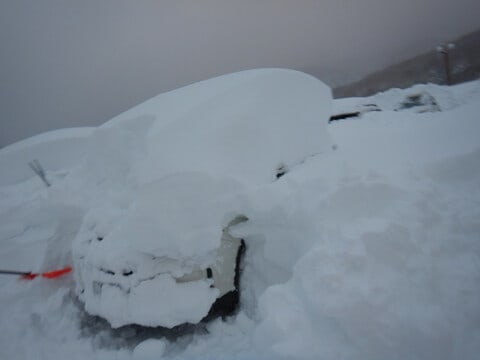

あまりにも激しい積雪で道路の

除雪が間に合わず，シャトルバスですら

運休するような状態なので．

当然，楽しみにしていたニューイヤー

ファーストトラックも営業中止で…

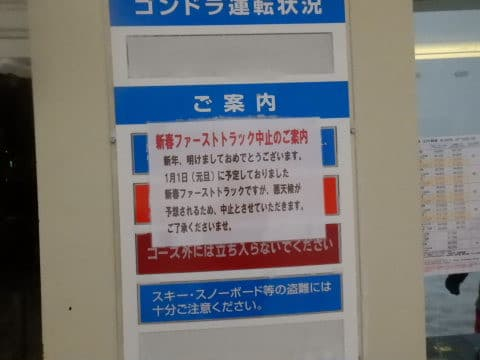

焼額は第2ゴンドラ，第3高速が運休．

第1ゴンドラも，営業予定が30分遅れて

9時スタートでした…

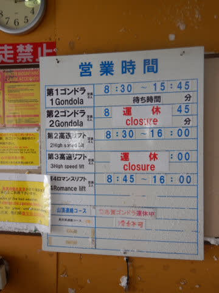

ちなみに，奥志賀は終日全滅，

一の瀬エリアは一の瀬のペアリフト以外

全滅という，激烈積雪＆吹雪で始まった朝

でした…

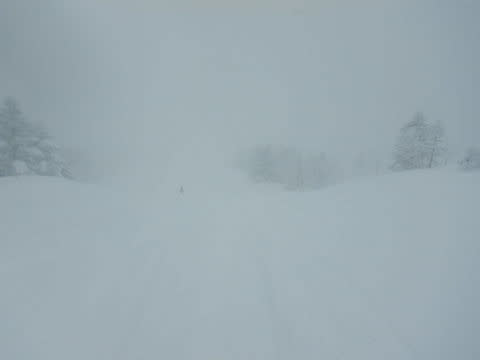

営業開始が30分遅れた焼額第1ゴンドラで

山頂へ上がると…

山頂気温は-16℃！

いい感じで冷えてます…

…っつーか，寒いよ！！

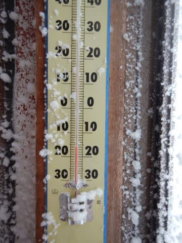

そして，圧雪コースも圧雪後に積もった

雪でブーツパフになっていて…

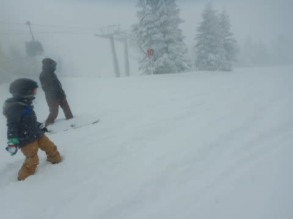

それも，すごい軽い雪のブーツパフ！！

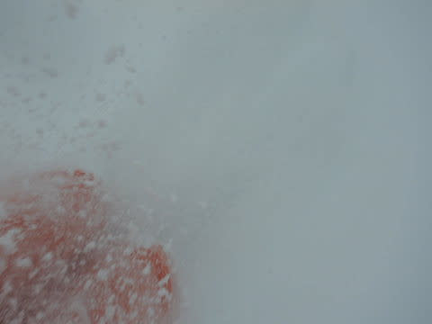

…新雪の外れ年だった去年は，

非圧雪コースでもこのくらいのパウダー

しか楽しめなかったのに…

今日は圧雪コースでもこれだよ？？

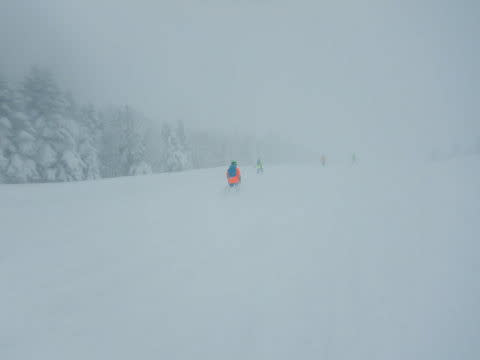

これは当然，非圧雪のコースを楽しみに

行くぞ！！

と，オリンピックコースへ向かうと…

あまりにも雪が深すぎて危険なので，

コースクローズ（涙）

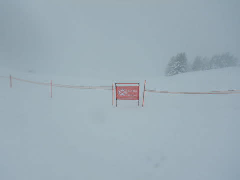

でも，圧雪コースでもブーツパフの

パウダーを楽しめるので，いいのだ！！

圧雪コースなのに，激しい雪煙を上げ

ながらの滑走です！！

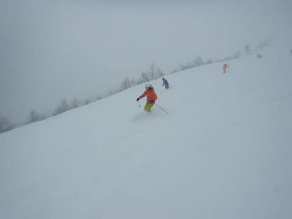

そして．

シャトルバスも運行しておらず．

一の瀬との連絡リフトも止まっているうえ，

朝は道路が積雪でかなり厳しい状態に

なっていたようで．

焼額までたどり着けた人はごく

一握りの人たちだけで…

イチゴンは午前中，ずっとガラガラ！！

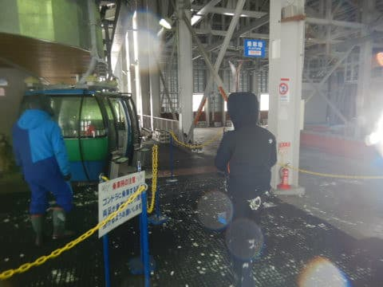

午前中はコースも人が少なかったので，

コース脇は誰も踏んでいない新雪が

いっぱいで…

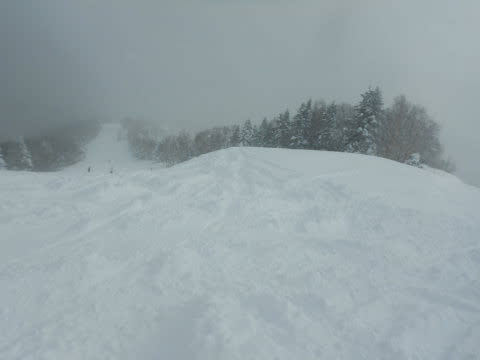

膝～太ももパフがいたるところに！！

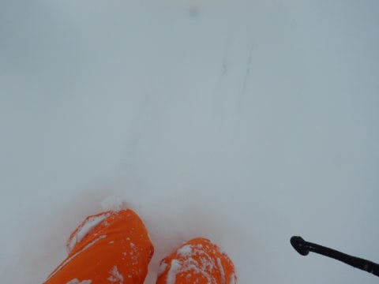

そして，昼過ぎには一瞬空が明るくなる

時もあり…

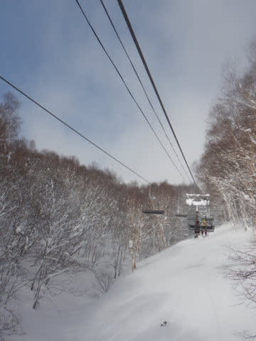

「見えるようになればオープンします！」

と，パトロールさんが言っていたオリンピック

コースも，昼頃の知らぬ間にオープン！！

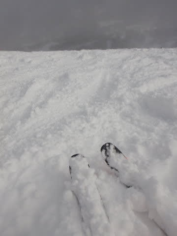

オープンとなれば当然飛び込むわけですが…

知らぬ間にオープンしていたため，

ちょっと出遅れて．

すでにかなり踏まれてます…（涙）

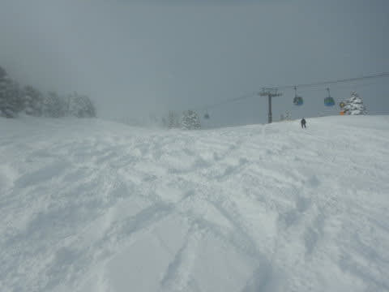

でも．

太ももパフ！！

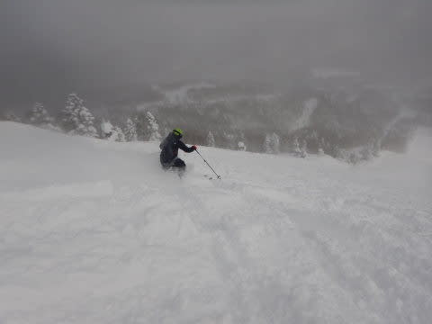

かなりいい感じの，浮力が感じられる

浮遊感パウダー！！

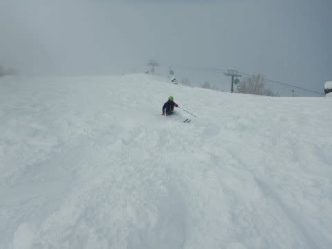

午後になってから，まだこんなパウダーを

滑れるとは，シアワセ…！！

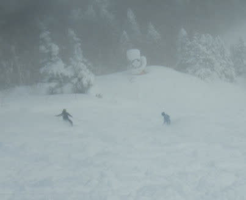

と，気持ちよく，ガラガラゴンドラで

オリンピックコースを回していたら．

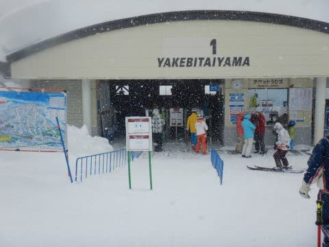

天候の回復とともに，一の瀬ダイヤと

山の神が動き，一の瀬と焼額がつながった

ようで．

一気に一の瀬方面から人が流れてきたため，

午後2時過ぎには，ゴンドラ待ちが

急速に伸び…

午後2時から3時半までは，ゴンドラ20分

待ちになっちゃったんですけど（涙）

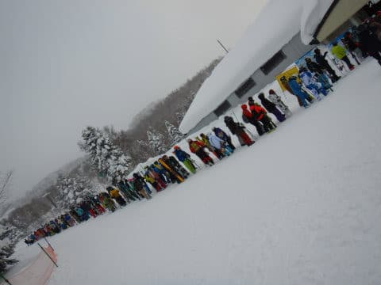

だもんで．

ゴンドラでオリンピックコースはあきらめ

ましたが…

今日は非圧雪コースじゃなくても，

コースのそこかしこに非圧雪部分が

残っているのだ！！

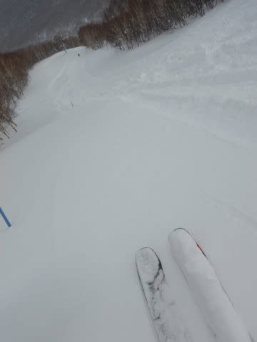

そこまでは待ちがひどくない第2高速リフト

をグルグル滑りましたが…

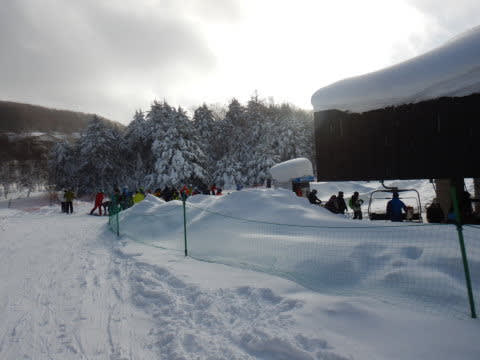

やっぱり，コース上の人は多かったですね…（涙）

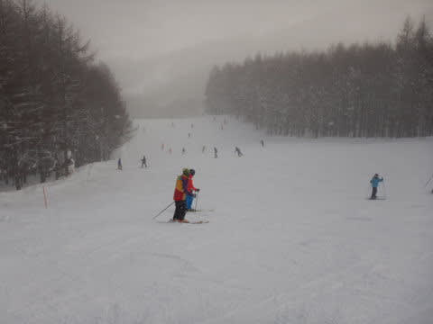

ってなことで．

ゴンドラはがら空きだけど，前が

見にくいほどの吹雪の午前

と，

天気は穏やかになり，時折雪が舞う程度，

日がうっすら射すタイミングもあれど，

ゴンドラ激混みの午後

という両極端な天気の一日を，

今日もリフトスタートからストップまで，

ひたすら滑り倒したのでした…

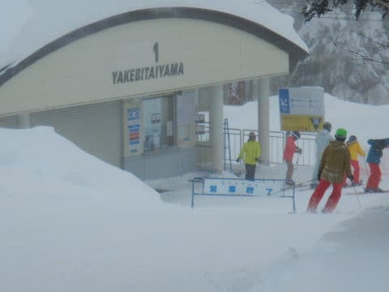

いやーー．

でも，今日はパウダー大当たりの日でした．

終日ひたすらパウダー滑り続けました．

…ちなみに．

朝の積雪＆悪天候のため，一の瀬は

ペアリフトしか動かず，ペアリフトが

20分以上待ちになったとか…

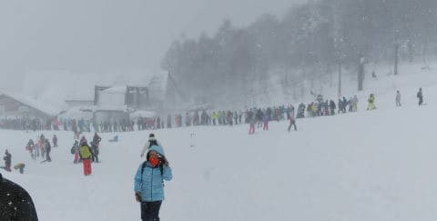

午後になって，天候が回復して

ダイヤモンドが動き出しても，

ここも15分待ちだったり，すごかった

ようです…

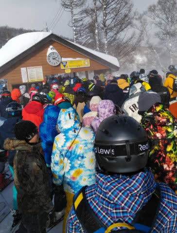

雪が積もってパウダーが楽しめるのは

嬉しいけど，あまり降りすぎるのも

考えものだな…

と思った，2022年の元日だったのでした…

PS.明日の焼額，駐車場やいろんな場所の除雪に

　人出を割くため，第3高速が動かないようです…（涙）

　ホントに雪の降り方が極端すぎる…
