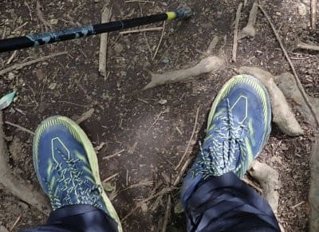

# 山歩き用にHOKA ONE ONEのSPEEDGOAT MID GTXを試してみた…後半

📅 投稿日時: 2022-06-28 02:23:05

🏷️ カテゴリ: [日記](cc4b5682fb7b8b144980957a978653fb0.md)

実は．

土曜は深夜1時半過ぎまで仕事を

していたのに．

先週も一週間在宅勤務で出張もなく，

家から一歩も出ない1週間だったので，

「ぐおおおお～！外に行きたい！

　体を動かさないと死ぬ！！」

と．

急激な発作（?）を起こし．

思い立ったかのように山歩きを

することに決めて．

日曜も異常高温になる予報だったので，

「暑くならない午前中に行って

　帰ってこないと…！」

と，睡眠時間1時間半で明け方4時過ぎに

家を出て．

小仏から奥高尾の陣馬山まで，

往復16kmほど山歩きしてきたのでした…

しかし．

日曜．ヤバいほど暑かった…

そして．

良い子は睡眠時間1時間半で

山歩きしちゃいけません（笑）

日曜帰宅してから仕事の続き

できるよな…

と思ってたけど．

1時間半睡眠のあと，酷暑の中

運動し続けた疲れのため，

帰宅してから死んだように寝てました…

ってなことで．

日曜も新しい靴が大活躍だったのですが．

今日は[昨日の記事](e8ed26550fe8244ab29595105f7fa0ea8.md)の続きで，

山歩き用に買った，HOKA ONE ONEの

SPEEDGOAT MID GTXのインプレッション，

後編です…！

というわけで．

まずは，Vibramメガグリップソールの

強烈なグリップに感動したわけですが…

この靴でやっぱり気になるのは，厚底効果．

この靴独特の，柔らかい分厚いソールは

一体どうなのよ…？

が気になる人が多いかと．

で，実際履いてみると．

まずは厚底だから実現できる，つま先から

かかとにかけてのソールのそり返りで，

歩いた時の足運びが楽！

さらに，厚底のクッション効果．

最初はちょっとびっくりしたけど…

これはいい！！！

この靴で一番気に入ったのは，この柔らかさ．

この柔らかさ，癖になります！！

ソールが柔らかい靴って，登山に

向かないのでは？

と思うところですが．

この優しいクッション性は病みつき…！！

下りで膝が痛くなることがある私ですが．

この靴は下りでのショックが厚底効果で

かなり和らげられるので…

膝にすごい優しい感じ！

ソールが柔らかいからといって，

足元がぐらぐらするわけではなく．

しっかり足裏感覚があり，

足首がぐらつくことなく

強い衝撃を柔らかく受け止めてくれる，

このやさしさ…

この衝撃吸収性で，下りでの膝への

衝撃がかなり弱まります！

そして，足裏への衝撃も優しいので…

足裏が痛くなることもないよ！！

だもんで．

下りはなんだか走りたくなってきちゃいますね．

さすがトレランシューズベースなだけあって，

走るときの足運びがすごい自然．

強烈なグリップでブレーキも

よく効くので，

今まで下りでスピードを上げた場合には，

滑るのが怖くて，必死に滑りを止めようと

こらえていた感じで下っていたものが，

もう，自然に楽に重力に任せて

降りて行ける感じ．

下りの体力消耗が全然違う！

さらに靴のアッパーもガチガチ登山靴に

比べれば柔らかく，

下りでつま先が靴の先にガンガン当たって，

つま先が痛くなる…

という，登山靴でありがちなことは

全く無いです．

だもんで．

これまでの靴だと，

登りはコースタイムの半分くらいなのに，

下りはコースタイムの7割くらいの時間

だったものが…

今回は下りもかなり早くなり，下りでも

だいたいコースタイムの半分で降りられる

ようになってきました！

湯の丸山の記録を見ても，上り下りに

休憩を合わせた合計タイムで，

だいたい標準コースタイムの半分強の

時間で行って帰って来てますね．

このコース，ヤマレコの標準コースタイム

では6時間37分らしいので，移動時間（山行）

2時間27分だと，結構早いかな．

そして．

この日曜に行ってきた陣馬山．

この陣馬山も，標準コースタイムだと

7時間23分のところ…

3時間27分で往復．休憩時間入れても

4時間12分でした…！

前の靴で行ったときの記録を見てみると，

4時間38分，休憩事件含めると5時間18分

だったので．

それから1時間ほど縮めてますね…！

これ，ほとんど靴が良くなったから．

圧倒的に下りが速くなった効果だと

思います…

特に，景信山から小仏までの急な下りが

続くところ．

前の靴だとスリップが怖くて慎重に歩き

24分ほどかかっているところ．

新しい靴だと，グリップがしっかりしていて

安心して降りられるので，14分で通過して

います…

いや．

ホントにこの靴，下りが楽なんですよ…

ってなことで．

375グラムと異常に軽量で，

登りはすごい楽だし．

さらに強烈なグリップと柔らかい

ソールのおかげで，下りも怖くなくて膝に

優しいし．

ゴアテックスで防水性をもちながらも，

靴下が汗だくになるようなこともなくて．

透湿性も十分で快適性も高かったし．

岩場は硬いソールの方がいいのでは？

と思ったけど．

柔らかいソールでも，厚さがあるので

岩がゴツゴツして痛いってことはないし．

おそらく鎖場の岩登りでも，強力な

グリップで安心して登れそう．

いや．

日帰りの山歩き程度なら，

この靴，結構無敵かも…
