# 2021/4/10(土)の志賀高原スキー場は…久々超冷え冷え最高の朝！午後は緩んだけど3月よりいいかも？？

📅 投稿日時: 2021-04-11 03:10:23

本日，予告通り志賀高原で滑ってました～！！

…が．

早朝スキーに参加するのに朝2時起きで家を出て．

ラスリフまで滑って酒飲んだら死んだように寝て

しまってました…(泣）

だもんで．

こんな時間に起きてクイック更新！！

えー．

本日．

良かったです．

以上．

…で締めてもいいくらい．

ここしばらくにない最高な感じでした…

まず．

朝．

1時間半睡眠で家を2時過ぎに出て，

6:30からの焼額早朝に参戦！！

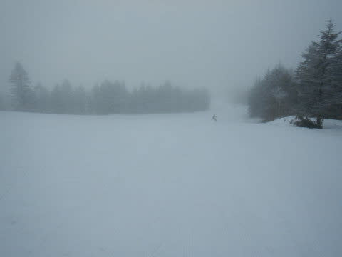

早朝開始時は，山頂付近は

ちょっとガスが出てたけど…

でも，気温は朝から-7℃と

冷え冷え！！！

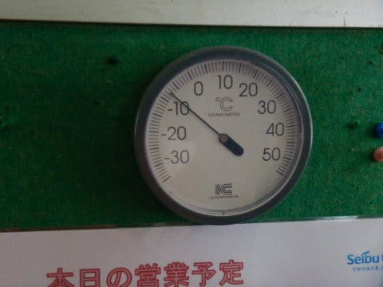

最低気温は-10℃まで下がったらしく．

早朝バーンは硬いバーンが好きな人には

たまらない，エッジがいい感じで噛む

カリカリしたスピードが出るシマシマ

バーン！！

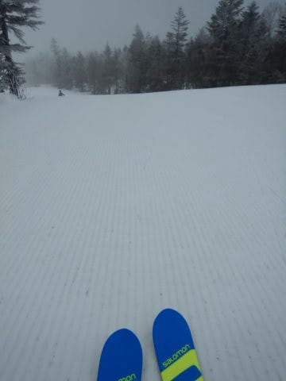

いい感じでスピードが出るし．

ガラガラだし．

早朝は最高だ～っ！！！！

…と思ってたら，天気も晴れ始め．

それなのに，真冬の冷え込みで

バーンはしっかり締まって

いい感じのまま！！

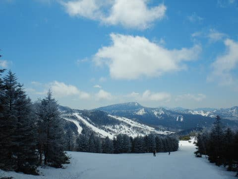

午前中，ゴンドラがちょっと待つタイミングも

あったものの…

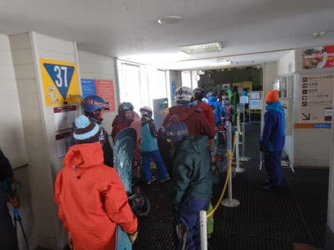

午前中の間はずっと，晴天ながらも

締まったいい感じのバーンが滑れる

という，3月の週末よりもずっと

いい感じのコンディション！

いや…3月より4月の今日の方が

コンディションいいんですけど？？

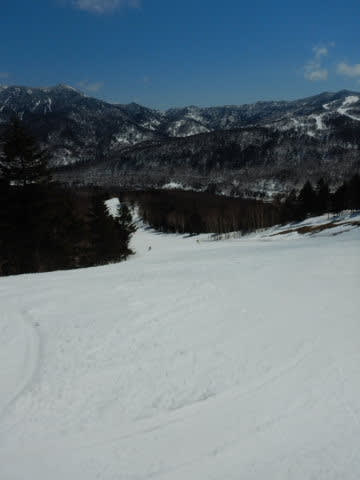

さすがに午後はちょっと荒れ始めた

ものの．

それでも，午後までずっと大回り板を

履いてかっ飛ばせる程度のフラットさで，

ゲレンデもガラガラの好き放題

やりたい放題！

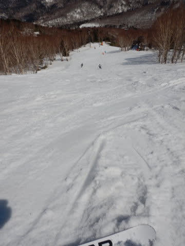

焼額はゴンドラ1本しかやってないから，

人が奥志賀や一の瀬に流れたのか．

午後はゴンドラも飛び乗りだし．

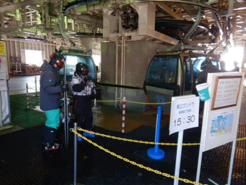

いや…

良かった…

…さすがに夕方になると，気温がプラスに

上がり．

バーンもちょっと荒れてきたけど…

結局，最後まで大回り板を履いて

滑り続けられるレベルの，

シアワセな一日でした～！！

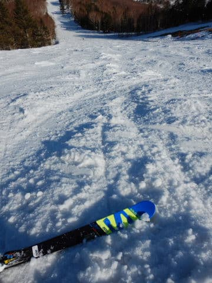

…そして．

焼額は15:30で営業終了なので．

焼額終了後は，16:30まで営業している

一の瀬へ瞬間移動！！

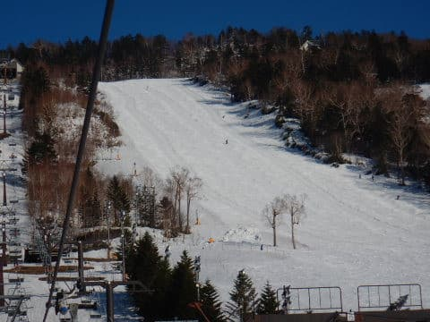

一の瀬正面バーンは，かなり

荒れ荒れで小回りレーンが

出来上がってました…(涙)

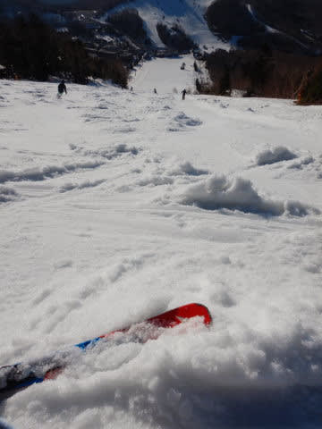

でも，今日は早朝からラストまで，

晴天の中たっぷり楽しめた，いい一日でした！！！

いやーー．

良かった…

…けど．

雪が減ったなぁ…

一の瀬正面バーンも雪が薄く，

早くもところどころブッシュが出始めて

来たし．

これ，GWまでもたなさそうな感じ…(泣）

## 💬 コメント一覧

### 💬 コメント by (m&t m)
**タイトル**: Unknown
**投稿日**: 2021-04-11 10:41:58

Sさん、我々も奥志賀参戦しました。今日は楽しかった!

ゆっくり出発だったので、９時到着でしたが、ラスリフ４時まで。

びっくりしたのが、空きを探すのが大変な位の混雑！

ホームアサマの常連さんを見かけたり、関西圏からのボーダーが沢山いて、春スキーは全国から集まって来るのですね。

YASの皆様にはご挨拶出来ませんでしたが、今シーズンはありがとうございました。m(_ _)t

とりあえず今シーズン終了です。(奇跡の冷え込みでＧＷ復活？)

### 💬 コメント by (レインボー73)
**タイトル**: Unknown
**投稿日**: 2021-04-11 15:44:57

日曜日の志賀高原情報

道の駅やまのうちを過ぎて橋をくぐる辺りは、２車線になってスピードが出てしまうと思うのですが、今朝7時30分過ぎにはレーダーの準備をしていましたよ。皆様の頭にインプットしておいてくださいね。怖い怖い！春の交通安全運動中ですからね。

朝の上林１℃　蓮池４℃　山頂０℃。日本晴れです。

朝のファーストのおかげで、平常スタートの最初から、快樂バーンを楽しめました。

でもそれも数本だけ。明日でラストなので、最後はいい状態でだけ滑って、いい思い出を残そうと、５本で終了。

帰りには、十分な売上？があったのか、取締りは引き払っていました。こんなことで大枚はたくくらいなら、スキー道具にお金を費やしたい。

### 💬 コメント by (かず)
**タイトル**: Unknown
**投稿日**: 2021-04-11 18:40:56

明日ヤケビです！土日奥志賀でした  昨日上に泊まってみましたが  日帰り温泉の脱衣場寒いし 駐車場でモンキーが車内に入りそうになるし、ほんとあと1秒スライドドアが閉まるの遅かったら入られてました…もうごりごりです…笑

### 💬 コメント by (ゴン太＠SALLOT CLUB)
**タイトル**: シーズンオフ？
**投稿日**: 2021-04-11 20:50:38

我が家は先週末で今シーズンの滑走を終え、本日日曜日、ブーツを新調しにエキップさんに行ってきました。

鈴木社長から解析、説明、アドバイスを頂き、無事、相方共々、発注出来たのですが、レクチャーと同じくらい驚いたのは鈴木社長の御年齢。見た目や店内での身のこなし等々、若過ぎさんです。志賀高原は、やっぱり竜宮城なのだと再認識しました。

あと、この場をお借りして、エキップさんについて、色々、教えて頂いた皆様、有り難うございました。

### 💬 コメント by (Gokuraku Skier)
**タイトル**: 最高な朝一
**投稿日**: 2021-04-11 21:05:17

久しぶりに土日とも晴れた志賀高原でした。

土曜日のパノラマ~サウスは本当に最高でした♪

あれがあるから志賀高原の春スキーはやめられないんですよね～

ゴン太さん、さっそく行かれたのですね。

来シーズンが今から楽しみですね(^^♪

### 💬 コメント by (しんちゃん)
**タイトル**: 奇跡の週末
**投稿日**: 2021-04-12 01:30:53

この週末、楽しかったです。皆様大変お世話になりました～!!

早朝営業、最高のコンディションでした。

4月末のＧＷまで、何とか雪がもってほしいなぁ。

### 💬 コメント by (Skier_S)
**タイトル**: 今週末は良かった…
**投稿日**: 2021-04-12 02:01:35

＞m&t mさま

今シーズンもお疲れ様でした！

奥志賀混んでたんですね…

焼額はガラガラでしたよ！

これで終わりと言わずに，またGWに復活を！

(今年はGWの雪がヤバそうだけど…)

＞レインボー73さま

明日でついに今シーズンも終わりですね．

この週末もお世話になりました！

次にお会いできるのは来シーズンですが…

また来シーズンお会いできるのを心待ちにしておりますので，

よろしくお願いします！！

＞かずさま

え？日月で参戦ですか？？

一番冷えた土曜に参戦できなかったのはもったいない感じですが…

でも，日帰り温泉はダメでしたか．

残念…

＞ゴン太さま

ついにエキップさんに行かれましたか！

いや．ホントに良いですから．

どこのメーカーのブーツを選んだのか，ちょっと気になりますが，

またコメントにレポートしてください！

ブーツ作ったら，すぐに雪上で履きたくなりますよ(笑)．

でも，ホントに滑り変わりますので…

＞Gokuraku Skierさま

この週末もお疲れ様でした～！！

土曜は良かったですね…

ってか，土日とも早朝は最高でしたよ！(笑)．

＞しんちゃんさま

週末，お疲れ様でした～！

早朝は良かったですね…

ホントにGWまで雪がもってほしいところです…

### 💬 コメント by (ikkun)
**タイトル**: Unknown
**投稿日**: 2021-04-12 12:57:10

お疲れですた(笑) 久しぶりの週末お天気おめでとうございます🎉(笑) やはり志賀高原ですね🎵 てか野沢温泉もどこからでも来るスキー場なんだなあと改めて思いますよ(・・;)  試乗会仲間？勝手にですが(笑)話をすると大体返して頂けるので独りでもと負け惜しみでした(笑)

