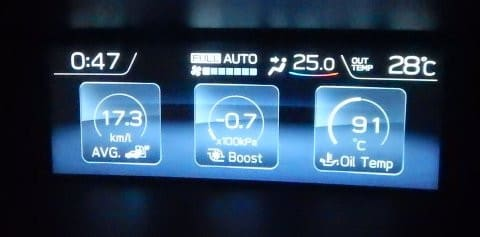
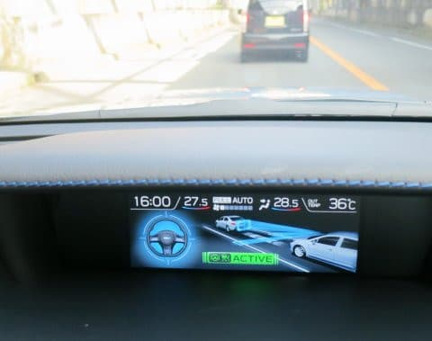
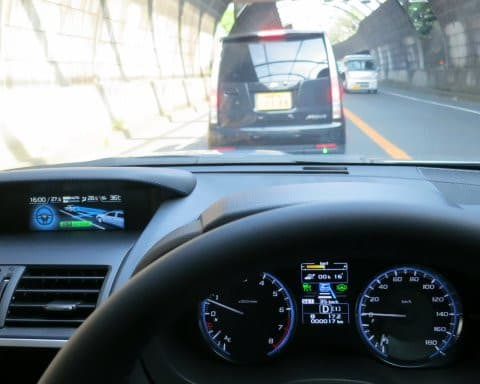
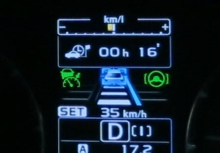
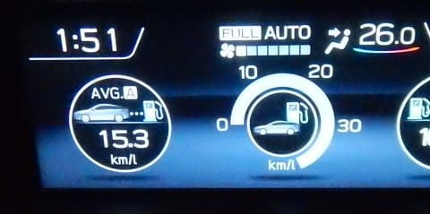

# LEVORGのアイサイトツーリングアシストを使ってみた

📅 投稿日時: 2018-08-15 02:12:17

🏷️ カテゴリ: [車](cba0e8330b3f2ded7c1addfacc75d4547.md)

ってな感じで．

昨日はお盆休み（？）で一日休載しましたが．

前回の続き，LEVORG D型以降に搭載された，

アイサイト ツーリングアシストを使ってみての

感想をば，行ってみましょうか…

そうそう．

この週末，片道500km走ったうち．

片道の高速道路部分，400kmの燃費ですが．

うーむ．

リッター17.3kmか…

もう少しこの車に慣れれば延ばせるかもしれませんが．

今の私のエコラン実力では，これが限界かな…

で．

今回．

帰りは快調だったんですが．

行きは高速道路の2時間渋滞に捕まって

しまったんですね～…

…こんな時に実力を発揮するのが．

そう．

アイサイトツーリングアシストっ！！

すごいトロトロ運転の渋滞だったのですが．

ステアリングも自動で操作されて，

ひたすら前の車について行ってくれるという…

あぁ…

なんて楽なんでしょう．

完全停止してしまった後も，停止保持してくれるので．

ブレーキを踏む必要は無く．

前の車の発進時の，

「先行車，発進しました」

というアナウンスとともに，ボタンを押せば

またひたすら前の車について行ってくれます…

もう，渋滞はむちゃくちゃ楽です．

渋滞のためにある車じゃないのか？？これ！？？

…ただ．

ステアリングアシスト．

ステアリングを持っていても．

保持力が弱いと，

「ステアリングを操作してください」

とすぐに警告画面がでて，ちょっとステアリングに

軽く力を加えてあげないといけないのが

めんどくさい…

とはいえ．

それさえ気を使ってやれば．

時速0km～135kmまで，前車にひたすらついて行って

くれるし．

そして，ブレーキや加速の制御もBRレガシィの

アイサイトVer.2よりかなり洗練された感じ…

どうも，Ver.3から先行車のブレーキランプを

見るようになったというのが効いているようで，

前の車の動きを見切ったようなタイミングで

上手くブレーキをかけてくれて．

ガッツンブレーキや急ブレーキになることが

ほとんどなくなっていたのがすごい…

もう，かなり安心してアイサイト様に運転を任せられます．

同乗していた家族も，アイサイトが運転しているか，

私が運転しているかを見分けられないレベルだったので．

かなりのモノだと思います…

で．

あまりにも渋滞がひどく．

今回は途中で高速を降りて，郊外の道路を走ったりも

したのですが．

ほとんど信号もなく，ひたすら車が流れて行って．

それほどの急カーブも無いような道路だと…

アイサイトツーリングアシスト，使えます．

驚くほど使えます．

こんな感じで，左側に白線が無く．

右側のオレンジ線しか認識できない

ようなシチュエーションでも…

（表示でも，右側のオレンジ線しか認識できていない

　ことを示している）

しっかり前の車についていって，アクセルも

ブレーキも，ステアリングも運転者が操作する必要なく．

ひたすら勝手に走ってくれます．

かなりの急カーブじゃなければ，ステアリングアシストも

動作停止することなく動作し続け．

郊外の緩やかなカーブが続くような道では，

ステアリングアシストが完全にその実力を

発揮してくれます．

…これ，ほぼ自動運転じゃないか！

すげーーー．

ほとんどカーブが無くて，車線幅が広い高速道路より，

むしろ信号が少ない郊外の道路を走った時に，

アイサイトツーリングアシストの実力を思い知らされ

ました…

で．

渋滞に2時間近く捕まり．

郊外の下道を100kmほど走っての燃費は…

リッター15kmほど．

…まぁ，これだけ走れば許せるレベルか…

とりあえず．

今回，片道500km，往復1000kmほど走ってみましたが．

渋滞しても疲れ知らずだし．

郊外道路はほぼ自動運転だし．

BRレガシィで走った時よりも疲れずに，

走りきれた感があります…

アイサイトツーリングアシスト．

…かなり使える．

これは，使える…

## 💬 コメント一覧

### 💬 コメント by (ノムノム)
**タイトル**: Unknown
**投稿日**: 2018-08-15 17:15:37

Sさん

こんにちは。早速、新機能を使いこなしてますね。

確かに渋滞の時は本当に頼りになります。ただ。慣れてくると眠気が…。気を付けないといけませんね。

燃費は大体当方も似た感じですね。前車はBM9レガシィ(2.5ターボ)でしたが、これよりも1割くらい悪かったので、年々燃費も改善されているかと思います。

### 💬 コメント by (Goku)
**タイトル**: いいな～
**投稿日**: 2018-08-15 19:10:16

アイサイトツーリングアシストいいですね。

今日のゴルフ帰り、市街地の渋滞にはまったので「く！こんな時新型フォレスターだったら…」

疲れた足でブレーキを踏み続けるのが苦痛でした。

あ～私も早くツーリングアシスト使ってみたい～

### 💬 コメント by (michi)
**タイトル**: Unknown
**投稿日**: 2018-08-15 21:05:55

燃費、良いですね。

うちのレヴォ、そんな燃費はなかなか出ません。

この休みも約500キロ走って12.6キロ。

アップダウンの多い道や山道有りですが高速も200キロくらい走ってるのに、、、

アイサイトはVER2と3で機能差が結構あるんですね。私も一般道でも使いまくりです。楽だし、安全ですから(^^)

### 💬 コメント by (Skier_S)
**タイトル**: 長距離が楽な車です…
**投稿日**: 2018-08-16 03:12:55

＞ノムノムさま

いやーー．アイサイトVer.2でも渋滞は楽でしたが．

ツーリングアシストで，さらに楽になりましたね～…

ホントに頼りになります…

FA20は，かなり燃費を意識した設計だということなので，

やはりEJ25ターボよりは燃費が良くなっているのですね…

＞Gokuさま

渋滞のときは楽ですよ～．

アイサイトが無くても，AVHでブレーキを踏まなくても

停止保持してくれるだけでも全然違います．

フォレスターが納車されたらツーリングアシストの

ラクチン運転を楽しんでください～！

＞michiさま

ここ数日で，市街地走行のリニアトロニックの

制御パターンが読めてきました…

エンジン＆リニアトロニックの制御を読み切って，

加速モードに入れないように運転し続ければ，

市街地でもリッター10kmは超えられます．

交通量が少な目なら，街中でもリッター12km楽勝です．

エンジン＆リニアトロニックの制御パターンは，

もう少し検証してみて確証が持てたら，また記事にしますね～！

アイサイトは，Ver．2とツーリングアシストだと

かなり差がある感じです…

Ver.2では前車ブレーキランプと信号は見てませんが，

Ver.3では前車ブレーキランプと赤信号の情報が制御に

ばりばり使われてます～！

### 💬 コメント by (いか)
**タイトル**: Unknown
**投稿日**: 2018-08-17 23:06:15

高速燃費で17km超えはかなりの燃費運転ですね！

私は15kmまではギリギリ行かないことが多いです。

燃費だけ考えると、ゼロ発進のところだけは自分でやるといい気がしますね〜

(そして、私も納車8ヶ月弱で18500kmと過走行まっしぐらです、、、)

### 💬 コメント by (Skier_S)
**タイトル**: いかさま
**投稿日**: 2018-08-18 01:57:44

17km越えは，アベレージ時速90km前後で結構我慢して

走って，ようやく行けるレベルなので．

さすがに100kmオーバーで普通に走ると行けないレベルです…

しかし，8か月弱で18500kmですか！

順調に過走行まっしぐらですね．

我が家と同じく，中古で売ることは考えず，

乗りつぶすしかないパターンですか…

とりあえず．

この車の2Lはかなり危険な中毒性を持ってそうな感じですね（笑）

