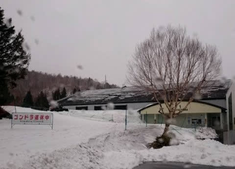

# 本日4月18日(土)の志賀高原は早朝は雪！でも，暴風雨でリフトはほぼ運休…そしてこの4月は奇跡の4月だったようです

📅 投稿日時: 2020-04-19 04:10:14

えー．

本日の志賀高原．

雨の予想だったのが，早朝は予想外に

雪だったようですね…！！

うーーーん．

どう見ても雪になる予想図じゃ

無かったんだけどなぁ…

ただ，この雪は，午前中のうちに

雨に変わったようです…

で．

ここは予想通り，ものすごい風だったらしく．

当然のごとく，焼額は第1ゴンドラも…

第2ゴンドラも運休でした．

ただ，第4ロマンスは動いたようですね…

…ってか．

この状況で志賀高原まで様子を見に行った

特派員の方の執念を感じます．

普通なら志賀まで登ろうと思わない

ところかと(笑)．

で，この激烈な風で吹き付ける雨の中，

志賀高原で動いたのは，

一の瀬ファミリーペアと，

焼額第4ロマンスの，

ペアリフトの2本だけ…

([志賀高原索道協会ホームページ](https://www.shigakogen-ski.com/live-lift-status/list)より）

その他の横手，熊の湯，奥志賀の

リフトは全滅でした…

([志賀高原索道協会ホームページ](https://www.shigakogen-ski.com/live-lift-status/list)より）

ただ，午後になって焼額の第2高速が

動いたという情報もありますが…

…たしか，第2高速は2週間ほど前に止めた

はずだったんですけど，唐松コースには

圧雪が掛けてあったんですかね？？

あるいは午前中に必死で圧雪したんでしょうか…？？

ちなみに，午後は標高の高いところはみぞれっぽい

雪だったみたいで．

なんと．

蓮池では，午後1時過ぎに雪が積もってました！！

([北信建設事務所道路気象情報ページ](http://hokushin.pref-nagano-roadcamera.jp/)より）

絶対雨だと思っていた本日，

まさか雪が積もるとは…っ！！

でも，やはり雨か雪が微妙な

天気が続いたようで，現在の蓮池のカメラを見ると，

雪は解けちゃってるようです…（涙）

でも，3号トンネルはまだ雪が残ってますね…

わずかな標高差で雪が残るか解けるかの

境目だったみたいで．

微妙な一日だったようです…

ってなことで．

本日の天気予想は．

　朝から雨です．一日雨です．←微妙…

　時折強く降ります．←一応，当たり

　そして，風も強いです．　←当たり

　ゴンドラは動かないかもしれません．　←予想より強く，リフトすら動かず…

　気温は朝から+5℃程度とかなり高く，　←1ゴン麓で+2℃程度なので，かなり外した…（泣）

　高温の雨で雪は激しく

　解けていきます（涙）　←一時的に雪が積もるほどだったので，それほど解けてなさそう

ということで．

大まかな予想は当たったようですが．

細部はかなり外したようです…（涙）

まぁ．

ひどい荒天で滑れたもんじゃない

という予想だったんだから．

当たりだよね．

うん．

当たりだよ…←自分を慰めてる

…ってなことで．

昨日の段階で唯一営業終了を宣言していなかった

奥志賀高原スキー場も，19日(日)で営業終了と

案内が本日出たので．

横手山のGW後の営業再開の可能性を除けば，

明日19日で，志賀高原が全山営業終了に

なってしまいました…（涙）．

1月や2月の頃には，

雪不足のため，4月中旬で滑れなくなっ

ちゃうんじゃないか…？？

と思っていた志賀高原．

確かに4月中旬で滑れなくなっちゃったけど．

まさか，こんな形で終わろうとは…(止まらぬ涙）

今シーズン，奇跡の4月となってくれて，

GWまで雪がもちそうだったのに．

まさかこんな風にシーズンが終わりを

迎えるとは，誰が予想したでしょうか…(激涙）

いや．

ホントに．

1か月長期予想を振り返ると．

1月は，寒い時でも平年より2度高く，

最高で平年比+6℃まで上がるひどい1月で．

平年より低い日が無かったという…（泣）

さらに，2月予想も，赤く印したように

平年比+6℃～+2℃の日が続く…という，

全く冷えない予想で．

そして2月が終わると，

2月の実績はほぼ1月段階での予想通り（涙）

平年比+8℃～+2℃の高温の日々が続き，

毎週雨にたたられる2月で．

さらに，3月の予想も，中旬に一瞬平年並みに

近づくものの，平年より寒くなりそうな

日が無い…とひどい予想だったわけで．

で．3月が終わると…

確かに3月中旬に一瞬平年並みまで

冷えた以外，前半は平年比+4℃，

後半は平年比+2℃前後という感じ（涙）

とはいえ，3月後半には1月，2月のような

平年比+6℃とか+8℃のひどい高温に

なる日は一日もなく．

「これなら何とか行けるか…」

と，かすかな希望が見え始め．

そして，せいぜい平年比-1～2℃とは

いえ，4月は平年より気温が低い

日々が続きそう…！！！

という，わずかながら期待をもたせる

予想だったわけですが．

実際に4月半ばになってみると…

なんと．

赤く印したように，4月前半の実績は

平年比-4℃ほどの冷え冷えデーが続き，

後半の予想も同様に，水色の平年比-4℃の

冷え冷えがやってくる予想だったというのに…

いやーー．

今年はホントは奇跡の4月で，

GWまで雪がもちそうな感じに

なってきていたのに，惜しい…(涙）

まぁ．

GWは滑れなくなりましたが．

今はGW以降に期待っ！！！

GW以降の復活を信じてるからっ！！←信じてないと絶望で死んじゃいそう

## 💬 コメント一覧

### 💬 コメント by (大阪626)
**タイトル**: Unknown
**投稿日**: 2020-04-19 06:33:54

大陸側の経済活動が気象にも少なからず影響してたのかなぁってのは考えすぎ？でしょうかねぇ。

### 💬 コメント by (ヒータロゥ)
**タイトル**: Unknown
**投稿日**: 2020-04-19 13:21:00

本日、ヤケビに滑り納めしてきました。あいにくの天気で修行状態でしたが、来れない方々に比べれば納得がいく終わり方ではありました。帰りの車中で娘が呟いたSさんの名言「スキーシーズンとはなんと短いものよ」。まさにそんな心境です。

今シーズンはヤケビの朝礼メンバーの数人とお知り合いになれました。来シーズンはヤケビ中心で行こうと思っておりますので、すでに挨拶させていただいた方も、これからの方もよろしくお願いします。

来シーズンは雪も豊富な良きシーズンでありますように！

### 💬 コメント by (地元民(ほぼ麓))
**タイトル**: Unknown
**投稿日**: 2020-04-19 21:28:05

土曜日の大雨。横手山、渋峠はもちろん雪で、50cm近い新雪が降ったそうです。吹きだまりは,その倍はありますね。その前も50～100センチの新雪だったらしいので、４月の残雪量としては記録的なんじゃないですか。

里も気温あがらなくて、桜、まだ咲いてます。開花から既に20日近く経ってます。

### 💬 コメント by (Skier_S)
**タイトル**: 志賀高原が終わってしまった…
**投稿日**: 2020-04-20 04:36:24

＞大阪626さま

うーむ．

ちょっと考えすぎな気もしますが…

どうでしょう？？

＞ヒータロゥさま

いや．

スキーシーズンは短いんです．ホントに．

だから，雪がある間は無理をしてでも雪面に立たないと

勿体ないのです…

…今シーズンは雪があるのに雪面に立てない日々が続きましたが(涙)_

来シーズンはぜひヤケビ中心でお越しください．

そして，また集団爆走（？）にご参加を！！

＞地元民（ほぼ麓）さま

え！！

土曜日横手山そんなに積もったんですか…

終わるの勿体ないですね(涙)

しかし，まだ桜咲いてるんですね…

この4月，2月より冷えてるんじゃないですか？

奇跡の4月でしたよね…

