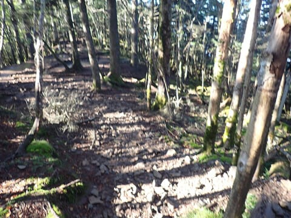

# 2023年9月，今度は大菩薩嶺へ行ってみた，その2…大菩薩嶺は景色が見えるところじゃなかったけど，その先はいい景色が続く！

📅 投稿日時: 2024-08-07 04:04:51

🏷️ カテゴリ: [登山・旅行](c1d637a11a25b457ac978d197adbdafc5.md)

なんだか，長岡花火大会の記事．

予想以上に多くの人が読んでくれて．

いまだに多くの人が見に来ている

ようなのですが…

どうもスキー場レポートより人気が

あったので，このBlogの存在意義が

問われている今日この頃．

皆様におかれましてはご健勝のことと

存じます（時候の挨拶）．

やっぱり，長岡花火大会はそれだけ

読者を集めるほどの，すごい花火大会って

ことなのか…

あるいは．

このBlogを花火大会Blogにして，夏は

スキー場レポートのかわりに，毎週末全国の

花火大会をさすらってレポートを書くと，

すごい読者が集まるのかも？？

徒然花火大会日記

うーん．

あんまり読者を集めそうなタイトルじゃないな…

やっぱりやめておこう…

という前フリの後は本題へ．

昨日の続き，大菩薩嶺の登山レポートです！

ーーー

ってなことで．

朝日が射す中，そこそこの斜度の

木立の中を進むこと，丸川峠から

約1時間ほど．

なんだか，ちょっと木が切り取られたような，

わずかな広場が見えてきましたが…

ここでGarminさんに，大菩薩嶺に着いたよ，

という表示が…！

え？？

ここが大菩薩嶺なの？？

あら…ホントにここが山頂なんですね．

見晴らしも全くないし，木漏れ日が

射す林の中の山頂ですね…

とりあえず，丸川峠分岐駐車場から

2時間1分で大菩薩嶺に到着です～！

一応，三角点もあったので．

記念にタッチしてきましたが…

周りを見ても，これが山頂なのか…

という感じの，景色も何もない感じの

ところなので．

ここでの滞在は5分程度として．

7時7分に，大菩薩峠へ向かってスタート！

ここから大菩薩峠へは，基本下り坂．

最初のうちは山頂と同じ，林の中を降りて

行きますが…

山頂から5分ほど．

雷岩というポイントに着いたら…

なんと．一気に目の前がすっきり開けます…！

をを！

いい景色…！！

そして…

はるか向こうには，はっきりと富士山も見えるし．

南アルプス方面も見えますね…！！

で，これが雷岩なのかな？

岩の上に登って，景色を眺めますが…

いや．

大菩薩嶺までは全く見晴らしがなかったので

ちょっと退屈だったけど…

この景色を見れるなら，にここまできた

甲斐はあったな…！！

といういい景色！！

ここからはずっと，こういういい景色を

眺めながら…

こんな感じの道を，とっとこ降りていきます．

南側にはずっと富士山も見えてるし．

東側は朝日が昇って，雲海が見えてるし．

こんないい景色の中，この写真の

左側から伸びている尾根筋に沿って

登山道が続いてます…

道幅も広くて歩きやすいし．

このルート，いいね！

（[続く](e8ea0803ff1ffa35ff3f1f471898723ff.md)）
