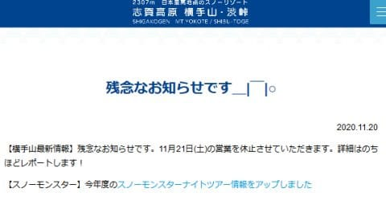
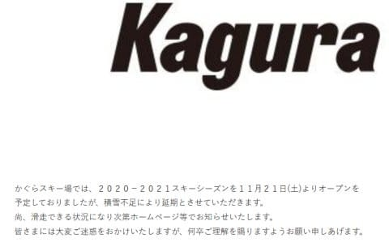
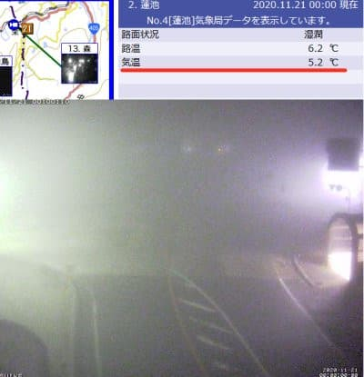
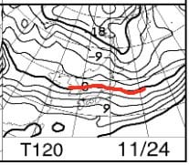
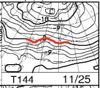
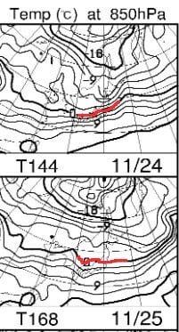
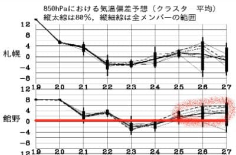

# 明日はYeti に行ってます…で，23日は予想通り冷えそうだけど，その後24，25日がダメになってきた（涙）

📅 投稿日時: 2020-11-21 00:42:35

えー．

大変残念なことに，

横手山が21日の営業を諦めたようで．

（[横手山ホームページ](https://yokoteyama2307.com/topics/11199/)より）

そして，当然の如くかぐらもオープンを

諦めたので．

（[かぐらスキー場ホームページ](https://www.princehotels.co.jp/ski/kagura/informations/2021winter_openennki/)より）

…鹿沢もアサマ2000も湯の丸もオープンを

諦めた今週末．

結局，滑れる首都圏エリアのスキー場は，

軽井沢とYetiのみとなりました…（涙）

まぁ，20日から21日に日付が変わる0時現在の

志賀高原の気温が，まだ+5.2℃と，

とても人工降雪機を動かせる状態じゃないので，

さもありなん…

という感じですが．

（[北信建設事務所道路気象状況カメラ](http://hokushin.pref-nagano-roadcamera.jp/)より）

この気温は，朝方に一気に冷え始め，

21日午前中は志賀高原では天然雪もうっすら

積もるほどで，午前中は人工降雪機を

動かせそうなんですが…

午後は気温が上がって，人工降雪は

厳しいかな（涙）

だもんで．

私は明日，Yetiで滑ってます～！

…と，ここまではしかたないとして，だ．

本日，いつもの日課の天気図を見てみると…

昨日の予想通り，

22日は人工降雪が無理，

23日は冷えて人工雪が打てそう

って感じだったんだけど…

24日の予想図を見ると…

え？昨日の予想図だと，赤い0℃線は

志賀高原にかかってなかった？？

そして，25日の予想図は…

ええええ！0℃線，東北北部まで

上がってるよ！！

…昨日時点での24，25日予想はこんな

だったはずなんですけど…！！

これと比べると，

全然悪化してるじゃん（止まらぬ涙）

…そして．

さらに25日以降は…

…

…

（死亡）

26，27日は，また平年比で4℃くらい

気温が高くなるかもしれないと

いうのか…っ！！（泣）

うーむ．

なんだか来週も，気温が冷える

気配が無くなってきました…

28，29日の週末もヤバいか…？？

だめだ…

ダメだ．

神が，まだ踊り足りないと言っているのか…！？？

あるいは…

どこかで誰かが，

強烈なパワーを秘めた，

温まれホカホカ踊り

を踊ってるんじゃなかろうか…？？

昨日から今日の，25日の天気図の悪化を

見るにつけ．

この温まれホカホカ踊りの踊り手，

かなりの凄腕と考えざるを得まい…

どんな手を使ってでも，この凄腕の

温まれホカホカ踊りの踊り手

を抹消するか，

脅して冷え冷え踊りに踊りを変えさせるか

しないと，

スキー場に平和は訪れなさそうだな…

## 💬 コメント一覧

### 💬 コメント by (アリス)
**タイトル**: 冷え冷え
**投稿日**: 2020-11-21 12:13:08

Skier_S様

今度、私にも冷え冷え踊りをご指導お願いします。

何としても積雪を期待したいです。

SさんもGokuさんもニューマテリアルのデビューを心待ちにしていらっしゃるかと察しいたします。

### 💬 コメント by (レインボー73)
**タイトル**: Unknown
**投稿日**: 2020-11-21 22:36:41

ええーっ！

週明けもやばそうってこと？

家屋の全塗装工事を途中できりあげて、月曜に湯田中入りの予定が、この記事でたった今、気持ちが変わりました。

全塗装をしてからにします。

ありがとね。

### 💬 コメント by (Skier_S)
**タイトル**: 来週までには冷えてほしい…
**投稿日**: 2020-11-22 03:30:05

＞アリスさま

冷え冷え踊りをぜひ全力で踊り続けてください…

早く志賀高原で滑りたいです（涙）

12月第1週，焼額ゴンドラが滑れるといいなぁ…

と思っています

＞レインボー73さま

週明け，横手は24日か25日にオープンするかな…？

と思っています．

3連休中のオープンは無理っぽいです．

ただ，24日にオープンできる可能性は30%，

25日にオープンできる可能性は70％くらいかな？

と予想しています．

また明日以降，予想を更新していきます！

