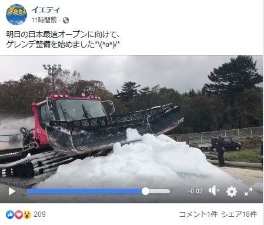
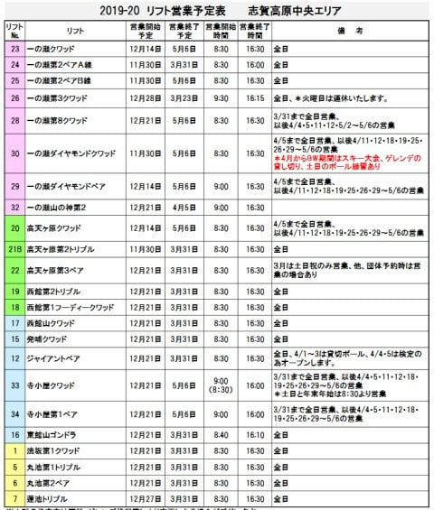
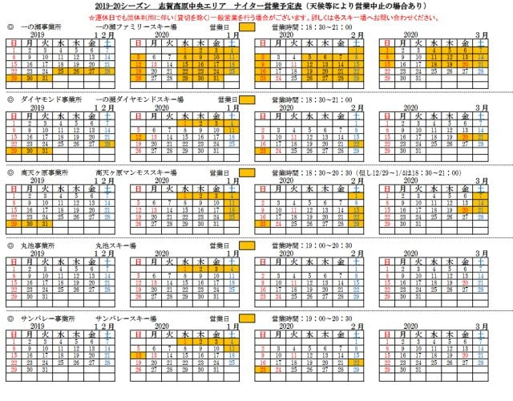

# 今シーズンの志賀高原，ダイヤモンドスキー場のナイターがほとんど営業しないの？？サンバレーも正月だけ？？（涙）

📅 投稿日時: 2019-10-25 01:23:28

ついに，明日．

イエティがオープンします～！

ついに，2020シーズンがスタートです！！

イエティのFacebookを見てみると．

ゲレンデ準備も順調に進んでいるようですね…

（[Yeti FB](https://www.facebook.com/YetiSnowtown/posts/2511823015573726)より）

ただ．

オープン日の明日，金曜日は．

昼間すごいどしゃ降りになりそうなので．

ちゃんと営業できるのか，心配…

おそらく実質的なオープンは土曜になりそうですね．

土曜は天気が回復しそうな感じで，いい感じに

楽しめるんじゃないでしょうか．

…でも．

私は土曜に用事があるので．

日曜にYetiに出没予定です．

あぁ…私のシーズンインまで，あと3日っ！！！

という，楽しみが控えているところで．

昨日，志賀高原中央エリアのホームページを

見てみたところ．

志賀高原中央エリアの今シーズンのリフト

運行予定表が出てました～！

ってことで．

さっそく見てみましょう…

（[志賀高原中央エリアホームページ，19-20リフト営業予定表](http://shigakogen.co.jp/wp-content/uploads/2019/10/19-20%E3%83%AA%E3%83%95%E3%83%88%E9%81%8B%E8%A1%8C.pdf)より）

ふむ．

営業開始時期は概ね去年と変わらず．

一の瀬ペア，ダイヤモンド，高天ヶ原トリプルは

11/30,12/1の週末から営業開始を

狙っているようですね．

上手くいけば，焼額より1週間早い

オープンですね…

一の瀬クワッド，高天ヶ原クワッドは

12/14の週末からの営業予定．

…雪が積もればもう少し早く営業できそうですが，

最近は大体12月中旬まで人工雪をしっかりつけて，

それからオープンってのがパターン化

してきましたね…

それ以外はおおむね12月21日からの

営業開始です．

一の瀬山の神も，21日からの営業なので．

…12/7，12/14の週末は，焼額と

一の瀬方面の行き来ができませんね…

そして．

営業終了時期も，大体例年通り．

GWまで営業する，一の瀬ファミリー＆タンネ＆ダイヤ，

高天ヶ原，寺子屋が5月6日まで．

ただ，タンネの森，ダイヤモンド，高天ヶ原，

寺子屋は，4月に入ると週末＆GWのみの営業で，

平日は動きません…．

それ以外は，概ね3月31日で終了と．

大体ここ数年と同じパターンですね．

…で．

一の瀬山の神は4/5で終わり（涙）．

4月に入った後は，

一の瀬と焼額＆奥志賀方面の

行き来はできなくなるようです…（泣）

昨シーズンは一体何があったのか，

営業しないはずの4月に入っても

山の神を動かしてくれていたので．

今シーズンも臨時で営業して

くれることを期待したいところ…

ってなことで．

次はナイター営業予定表を見ますが…

（[志賀高原中央エリア　19-20ナイター営業カレンダー](http://shigakogen.co.jp/wp-content/uploads/2019/10/19-20%E5%90%84%E3%82%B9%E3%82%AD%E3%83%BC%E5%A0%B4%E3%81%AE%E3%83%8A%E3%82%A4%E3%82%BF%E3%83%BC%E5%96%B6%E6%A5%AD%E3%82%AB%E3%83%AC%E3%83%B3%E3%83%80%E3%83%BC.pdf)より）

うげげげげ！！！

こっちは大きく変わってる！！！！！

なんと．

私がほぼ毎週のように通っている，

ダイヤモンドのナイター．

今シーズンは年末年始と1月，2月，3月の

3連休だけしか営業しないの！？？？

うぎゃーーーー！！！

なんてこった…っ！！！

そして．

サンバレーのナイターも…

正月と1月，2月の3連休のみしか

営業しないようです…（激涙）

…

なんてこった…！！！！

その代り，高天ヶ原が2/8の週末を除き，

3/21の週末まで毎週末営業するようです…

高天ヶ原に泊まっている人には朗報かも．

…でも．

高天ヶ原で動くのは，緩斜面でリフトが遅い

トリプルのみ．

ダイヤやサンバレーの，気持ちいい

中斜面の高速リフトの代わりには，

ほど遠い感じです…（涙）

あぁ…中央エリア．

なぜ，高速リフトのナイターを

みんな止めちゃうの…？？（激泣）

で．

一の瀬ファミリーは12/25～3/21まで

月，火を除く毎日，

丸池は正月のみ…

というところは昨年通りです．

うーーーむ．

一の瀬ファミリーも，高天ヶ原も．

鈍足リフトで緩斜面だし．

これで昨年より200円値上がりしたナイター券を

買ってまで行くかというと，

悩ましいところ…

焼額のナイターが9時までやってくれれば，

全く何も悩まず焼額に行くんだけど．

焼額のナイターが昨シーズンと同じ

8時までだとすると．

宿の夕食を食べると，1時間ちょいしか

滑れない…（涙）

これで2000円は厳しい…

ううううう―――む．

今シーズン，ナイターどうしよう…

ナイター行かないで我慢するのか…

でも．

トップシーズンに昼間だけしか滑らず，

ナイター滑らないと，滑り足りなくて

死んじゃいそうだし．

これは，厳しい…（あふれ出る涙）

あぁ…

今シーズンも，志賀高原には

いいニュースが無いなぁ…（零れ落ちる涙）．

## 💬 コメント一覧

### 💬 コメント by (FCAMEL)
**タイトル**: システム共通化によるBIG2活用法
**投稿日**: 2019-10-25 09:50:32

Sさんお久しぶりです。

FCAMELです。

早々にいろいろな情報ありがとうございます。

今シーズンもよろしくお願いします。

私もシーズン券の高騰に打ちひしがれている身ですが、

唯一朗報といえるのが今シーズン野沢のシステム更新により

両スキー場のシステムが共通化されること。

（索道協会、野沢温泉双方に確認）

そのためBIG2　今までのようにいちいち券を提示して

一日券や二日券に交換する必要がなくなったようです。

（一枚のチケットでそのまま両スキー場滑走可）

そうであれば6,000円差のBIG2を買って

安いシーズン券を二枚買ったと思って

自分を慰めるしかありません

（金額的にはさらに痛い、、泣）

これにより朝は志賀高原滑走、

昼ヤケビから超ロングツアーコースで野沢を目指し

到着後そのまま野沢山頂部をぐるぐる滑り、

野沢に一泊。翌日逆をやって志賀に戻る

地獄の滑走プランが解禁されます！

是非ご一緒に！

### 💬 コメント by (若杉勲72)
**タイトル**: Unknown
**投稿日**: 2019-10-25 09:56:35

今シーズンからこの名前でお願いいたします。なぜか年々名前だけは一つずつ成長していきます。志賀はサービス低下なのに値上げは痛いですね。焼額山専用券の超早割との差がつきすぎで不愉快です。焼額山名誉住民であるエスさんこそ、焼額山専用券にして浮いたお金でナイターを楽しむってのはいかがでしょうか。私ら三人組は野沢との共通券です。今年は熊のプレオープンからを考えています。よろしくお願いいたします。

### 💬 コメント by (Skier_S)
**タイトル**: いいニュースが欲しい…
**投稿日**: 2019-10-26 04:05:34

＞FCAMELさま

お久しぶりです～！！

そうなんですか！！

野沢も志賀と同じキーカードになるんですね！

そのまま使えるのは便利ですが…

朝志賀を滑って，ロングツアーで野沢まで抜けて

さらに野沢を滑って，翌日また戻ってくるってのは，

普通はやらないかと（笑）．

とりあえず，今シーズンもよろしくお願いします～！

＞若杉さま

志賀高原，毎年シーズン券が値上がりするのは痛いですよね…

サービスが良くなって値上がりなら納得も行きますが，

コースもリフトも減って，営業日数も減ってサービスを絞ったのに

値上がりってのは痛い…

しかし，その中で野沢共通券買われたのですね…！

今シーズンは，焼額山シーズン券も考えたのですが，

やっぱり時々奥志賀や違うスキー場も滑りに行きたくなるので，

全山共通にしました…

また今シーズンもよろしくお願いします！

